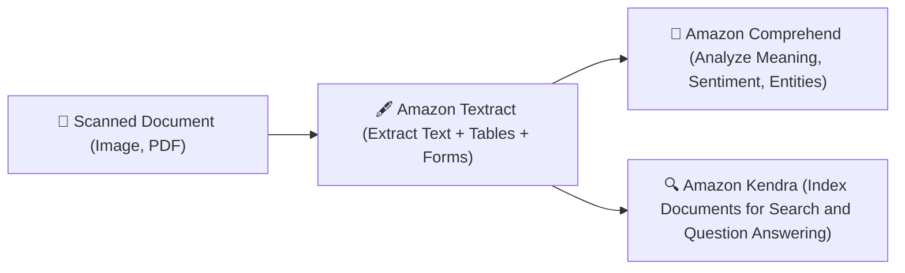

# 📄🤖 **Amazon Textract vs Amazon Comprehend vs Amazon Kendra**

_Which AWS Service Should You Use for Document and Text Analysis?_

---

## 🌟 **High-Level Purpose**

| Service                  | Core Focus                                                                                                 |
| :----------------------- | :--------------------------------------------------------------------------------------------------------- |
| 📄 **Amazon Textract**   | **Extract raw text and structure** (forms, tables) from scanned documents and images.                      |
| 🧠 **Amazon Comprehend** | **Understand the meaning** of natural language text — extract entities, key phrases, topics, sentiment.    |
| 🔍 **Amazon Kendra**     | **Build intelligent search experiences** across large document repositories with natural language queries. |

✅ In simple terms:

- **Textract = Get the text out (digitization).**
- **Comprehend = Understand what the text means (analysis).**
- **Kendra = Help users search across lots of documents smartly (search engine).**

---

## 🛠️ **Core Capabilities Comparison**

| Feature                       | Amazon Textract                                       | Amazon Comprehend                                       | Amazon Kendra                                    |
| :---------------------------- | :---------------------------------------------------- | :------------------------------------------------------ | ------------------------------------------------ |
| 📄 **Input Type**             | Scanned images (PDFs, photos, forms)                  | Plain text (after digitization)                         | Digitized document repositories                  |
| 🧾 **Primary Output**         | Text, Tables, Key-Value pairs                         | Entities, key phrases, sentiment, language, topics      | Search indexes, ranked documents, direct answers |
| 🔍 **Main Function**          | Digitize documents and extract structure              | Analyze and understand text meaning                     | Build powerful search experiences over documents |
| 🤖 **ML Techniques Used**     | Optical Character Recognition (OCR) + Layout Analysis | Natural Language Processing (NLP) + Text Classification | Machine Learning + Information Retrieval         |
| 🎯 **Typical Workflow Stage** | First step — digitize data                            | Second step — analyze meaning                           | Third step — search/query knowledge              |

---

## 🛠️ **Workflow Diagram**

✅ Often **Textract → Comprehend → Kendra** used **together** for full document automation!

---

## 🎯 **Real-World Example: Processing Company Contracts**

| Stage     | Tool           | What Happens                                                                                                                     |
| :-------- | :------------- | :------------------------------------------------------------------------------------------------------------------------------- |
| 🖋️ Step 1 | **Textract**   | Extract contract clauses, tables, and parties' names from scanned PDF contracts.                                                 |
| 🧠 Step 2 | **Comprehend** | Identify legal terms, obligations, due dates, and sentiment (positive/negative terms).                                           |
| 🔍 Step 3 | **Kendra**     | Allow employees to search across all contracts, asking questions like "Which contracts expire in June?" or "Find NDA templates." |

✅ **All 3 services work together beautifully** depending on your needs!

---

## 🔥 **When to Use Each Service Alone**

| Need                                                                  | Best Service          |
| :-------------------------------------------------------------------- | :-------------------- |
| 📃 Extract text and structure from a scanned or printed document      | **Amazon Textract**   |
| 🧠 Analyze raw text to find meaning (entities, sentiment, key topics) | **Amazon Comprehend** |
| 🔍 Enable smart search across many documents                          | **Amazon Kendra**     |

✅

- If **you start with images** ➔ Textract first.
- If **you already have plain text** ➔ Comprehend for meaning.
- If **you want smart search** ➔ Kendra for discovery.

---

## 📢 **Final Smart Summary**

| ✅                    |                                                                       |
| :-------------------- | :-------------------------------------------------------------------- |
| **Amazon Textract**   | Turns scanned docs into structured, machine-readable text.            |
| **Amazon Comprehend** | Understands what the text is about (entities, insights, sentiment).   |
| **Amazon Kendra**     | Helps users ask questions and search across document knowledge bases. |

🔗 They often **complement each other** rather than replace each other.

---

## 🏆 **Smart Pro Tip**

> 🧠 **Best practice for document automation:**  
> `Textract ➔ Comprehend ➔ Kendra` ➔  
> **Extract ➔ Understand ➔ Search & Explore**

✅ This **three-step combination** gives you a **full Intelligent Document Processing (IDP)** solution on AWS!
