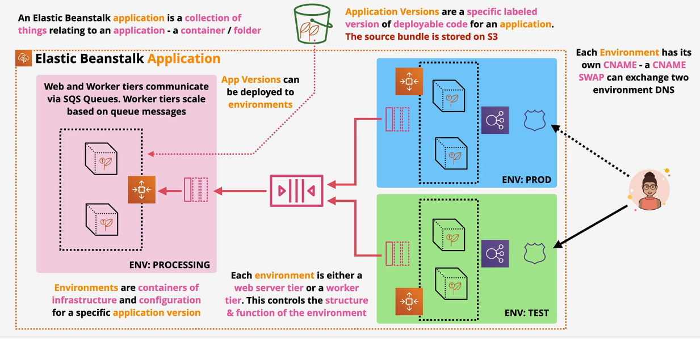
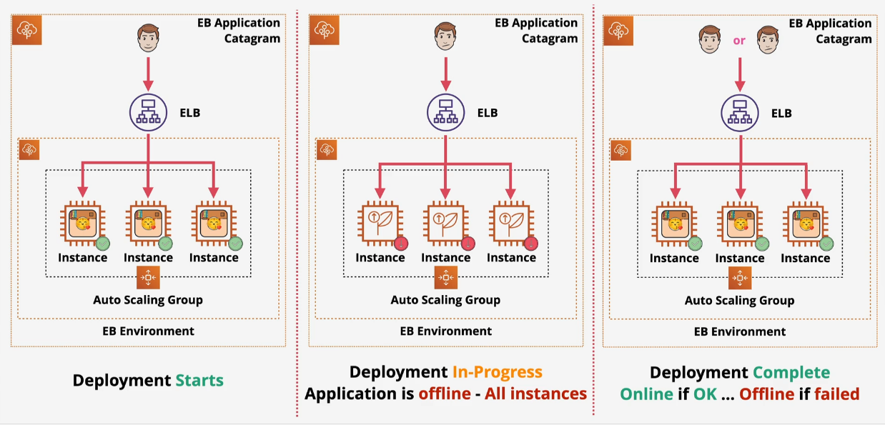
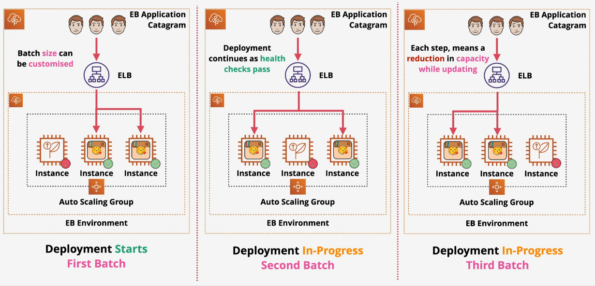
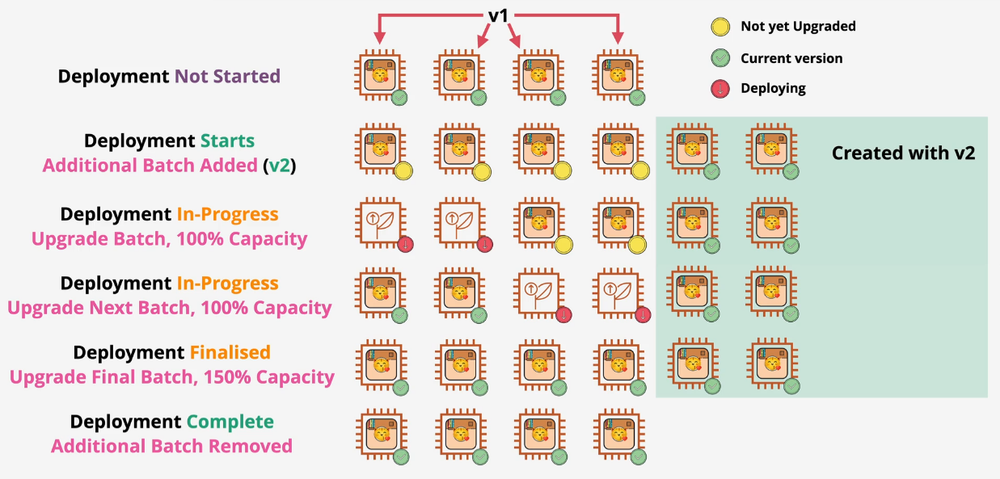
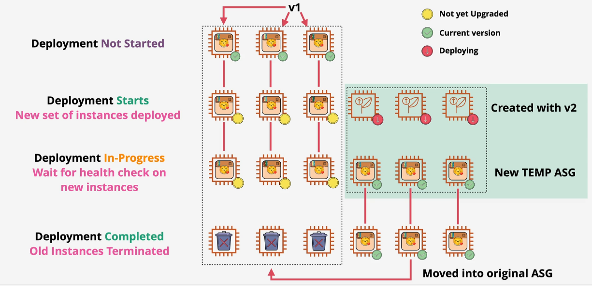
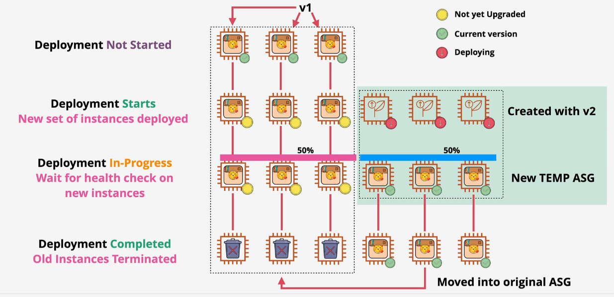
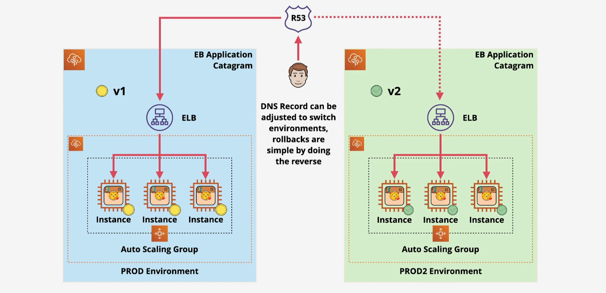
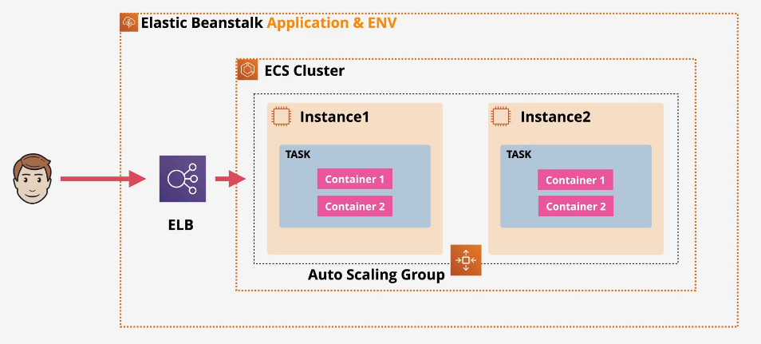

# 🚀 **AWS Elastic Beanstalk (EB) — Complete Guide for Developers**

> Think of EB as your **“Dev’s Shortcut”** to deploying apps on AWS — without handling infrastructure the hard way!

<div align="center">
    
</div>

---

## 🌍 **What Is AWS Elastic Beanstalk?**

> **AWS Elastic Beanstalk** is a **Platform-as-a-Service (PaaS)** that lets developers deploy web apps & services **without managing infrastructure**.

💡 **You write the code** → **Beanstalk handles the rest**:

- Provisioning EC2, Load Balancers, Auto Scaling
- Health Monitoring, Rolling Deployments
- Environment Configuration (via GUI or YAML)

It’s ideal for teams who want to focus on **features, not servers**.

---

## 📚 **Key Concepts**

- **Application**: A logical collection of Elastic Beanstalk environments, versions, and configurations.
- **Application Version**: A specific iteration of your application code. Use lifecycle policies to manage old versions.
- **Environment**: A collection of AWS resources running a specific application version.
- **Environment Tier**: Specifies the application type—either a **web environment tier** (for web applications) or a **worker environment tier** (for background tasks).
- **Platform**: Combines the OS, programming language runtime, and server.

---

## 🏗 **Environment Types**

Elastic Beanstalk supports different environment types to meet varying requirements:

- **Single Instance**: Ideal for development or testing environments to save costs.
- **Load-Balanced and Auto-Scaled**: Perfect for production environments that require high availability and scalability.
- **Auto-Scaled Only**: Designed for worker environments handling background tasks.

---

## 🧠 **Key Features**

| Feature                     | Description                                               |
| --------------------------- | --------------------------------------------------------- |
| 🧑‍💻 **Developer Focused** | Built for app devs — no deep AWS infra needed             |
| 🔁 **Fully Managed**        | EB auto handles scaling, patching, load balancing         |
| 📦 **Built-in Platforms**   | Support for Node.js, Python, .NET, Docker, and more       |
| 🔧 **Customizable**         | Use `.ebextensions` for fine-grained config               |
| 📤 **Code First**           | Just push your code — EB wraps it in infrastructure magic |

---

## 🔗 **Integration with AWS Services**

Elastic Beanstalk integrates seamlessly with other AWS services:

- **Amazon CloudFront**: Acts as an origin for faster content delivery.
- **API Gateway**: Serves as a backend for APIs.
- **CloudWatch Logs**: Streams application health logs for monitoring.
- **Amazon RDS**: Creates databases for your application.
- **Amazon EFS**: Provides shared file directories.
- **EventBridge**: Monitors events and triggers actions.

---

## 🧪 **Supported Platforms**

| Language / Platform      | Type                        |
| ------------------------ | --------------------------- |
| Node.js, Python, Ruby    | Pre-configured runtime      |
| Java SE / Tomcat         | With JVM setup              |
| .NET Core (Linux) / .NET | Linux or Windows platform   |
| Go                       | Native support              |
| Docker (Single & Multi)  | Custom runtime environments |
| Custom Platform          | Built with Packer           |

---

## ✅ **When to Use EB**

- Small teams/startups who need fast, simplified deployments
- Developers needing PaaS features without vendor lock-in
- You want infra done-for-you, but still on AWS
- Use Docker for custom stacks (e.g., unsupported runtimes)

🛑 **Warning**: DBs created inside EB environment **will be destroyed** if the environment is deleted.

---

## 🚀 Deployment Policies in EB

Elastic Beanstalk gives you **five strategies** to deploy new versions of your app:

---

### 1️⃣ All At Once

Deploys to **all instances simultaneously**.

🟡 **Risk**: Downtime if anything fails  
✅ **Fastest** deployment

<div align="center">

</div>

---

### 2️⃣ Rolling

Deploys in **batches**, replacing some instances at a time.

✅ **Reduces downtime**  
🟡 Still may reduce capacity

<div align="center">
    
</div>

---

### 3️⃣ Rolling with Additional Batch

Same as above, but **adds extra instances** during deployment.

✅ Keeps full capacity  
🟥 Uses **more resources** temporarily

<div align="center">
    
</div>

---

### 4️⃣ Immutable

Creates **new instances with the new version**, swaps them in.

✅ Safer than rolling  
✅ No downtime  
🟥 Slower & more costly

<div align="center">
    
</div>

---

### 5️⃣ Traffic Splitting

Split traffic between **new and old versions** for **canary testing**.

✅ Controlled testing  
✅ Safe rollback  
🟥 Complex monitoring setup needed

<div align="center">
    
</div>

---

## 🔵 **Blue/Green Deployments in EB**

✅ Zero-downtime updates  
✅ Rollback = instant  
🟥 Double infra = double cost (temporarily)

<div align="center">
    
</div>

📌 **Steps:**

1. Create a copy (green) of your existing EB environment (blue)
2. Deploy new version to green
3. Swap CNAME when ready
4. Roll back by swapping again if needed

---

## 💾 **Elastic Beanstalk + RDS: All Deployment Options Explained**

Elastic Beanstalk does **not manage your database** directly — it just connects to one. But the way you create and connect your RDS instance matters **a lot** depending on your goals (like preserving data).

Let’s break down each option 💥

---

### ☝️ Option 1 – **RDS Created _Inside_ the EB Environment**

| ✅ Pros                      | ❌ Cons                                  |
| ---------------------------- | ---------------------------------------- |
| Automatic setup              | **Tightly coupled** to EB environment    |
| Easy connection via env vars | Deleting EB = deleting **your database** |
| Simple for dev/test          | Not safe for production                  |

🧠 **What happens?**

- When you create a new Elastic Beanstalk environment (via Console or CLI), you can **enable a database** (e.g., RDS MySQL).
- EB provisions an **RDS instance automatically**, and injects env vars like:

  ```bash
  RDS_HOSTNAME, RDS_PORT, RDS_USERNAME, RDS_PASSWORD
  ```

- EB links this RDS to your environment **stack (CloudFormation)**.

🔥 **BUT**: When you delete the environment (even by mistake), AWS deletes the **entire stack**, including the database — 🔥 **data loss!**

> 🧪 **Best for**: Dev/test environments where you don’t mind wiping the DB when the app is gone.

---

### ✌️ Option 2 – **RDS Created _Outside_ of EB (Recommended for Production)**

| ✅ Pros                                   | ❌ Cons                      |
| ----------------------------------------- | ---------------------------- |
| **Persistent data** even if EB is deleted | Must manually provision RDS  |
| Use snapshots, scaling, backups           | Slightly more setup upfront  |
| Supports multiple EB envs                 | Not included in EB lifecycle |

🧠 **What happens?**

- You manually create an RDS instance using:
  - AWS Console
  - CloudFormation
  - Terraform
  - or CLI (`aws rds create-db-instance`)
- You then connect it by injecting **custom environment variables** into your EB app:

  ```bash
  RDS_HOSTNAME = mydb.abcdefg1234.us-east-1.rds.amazonaws.com
  RDS_USERNAME = myuser
  RDS_PASSWORD = mypass
  ```

- These are added either via:
  - Console → Configuration → Environment properties
  - `.ebextensions` (we’ll explain next)
  - `eb setenv` command

✅ **Data is preserved** even if EB is terminated. You can reuse the RDS across multiple EB environments.

> 🧪 **Best for**: Production, staging, or any environment where **data durability** is critical.

---

### 🤟 Option 3 – **Manual Recovery Plan (Blue/Green + Snapshot Backup)**

This is your **disaster recovery & upgrade strategy**. Combine EB lifecycle control + RDS snapshots.

📌 **When to use this?**

- You want to deploy a **new version** of your EB app safely (blue/green)
- You want to **keep the same database**
- You want to **terminate old EB env** and clean up safely

### 🧭 Steps

1. 📸 **Snapshot** your RDS

   ```bash
   aws rds create-db-snapshot --db-instance-identifier mydb --db-snapshot-identifier mydb-snap
   ```

2. 🔐 **Enable Delete Protection** on RDS (so even if EB tries to delete it, it fails)

3. 🆕 **Create a new EB environment** (new version of your app)

4. 🔌 In the new EB env, configure the same `RDS_HOSTNAME`, `USERNAME`, etc. (point to old DB)

5. 🔁 **Swap the CNAME** between old and new EB envs

   ```bash
   eb swap --source-env old-env --dest-env new-env
   ```

6. 🧹 **Delete old EB environment**

   > Note: You may get `DELETE_FAILED` if EB tries to delete the RDS. That’s fine — go to CloudFormation → choose to _retain_ the RDS resource.

> 🧪 **Best for**: Safe production migrations, disaster recovery, and preserving RDS across version swaps.

---

## 🛠️ **Customize EB with `.ebextensions` – Full Power Unleashed**

`.ebextensions` is your gateway to **configure**, **extend**, and **control** your Elastic Beanstalk environment.

🧩 It's a folder inside your deployable ZIP bundle that includes `*.config` files written in **YAML or JSON**, following a **CloudFormation-style syntax**.

### 📁 Folder structure

```ini
my-app.zip
├── .ebextensions/
│   ├── 01-env-vars.config
│   └── 02-custom-setup.config
├── app.js
└── package.json
```

---

### ⚙️ `.config` File Breakdown

#### ✅ 1. `option_settings`

Used to set config values for:

- Platform settings (like PHP memory limit)
- Env vars
- EC2 instance type
- Health check URL

```yaml
option_settings:
  aws:elasticbeanstalk:application:environment:
    MY_VAR: "value"
  aws:autoscaling:launchconfiguration:
    InstanceType: t3.small
```

---

#### 📦 2. `packages`, `sources`, `files`, `commands`

Used to:

- Install packages (yum, apt)
- Download files
- Write files
- Run shell commands on EC2

```yaml
packages:
  yum:
    git: []

commands:
  01_install:
    command: "npm install -g pm2"
```

---

#### 🔧 3. `Resources`

You can define **new AWS resources** (like S3 buckets, SNS topics) inside the EB stack using CloudFormation-style `Resources`.

```yaml
Resources:
  MyTopic:
    Type: AWS::SNS::Topic
    Properties:
      TopicName: my-eb-topic
```

---

#### 🚀 4. `container_commands`

Runs **after the app is extracted** but **before the server starts**.

Useful for:

- Running `npm install`, `dotnet build`, etc.

```yaml
container_commands:
  01_npm_install:
    command: "npm install"
    leader_only: true
```

> 🧠 `leader_only: true` ensures it only runs on one instance during deploys.

---

## 🧬 **Cloning Elastic Beanstalk Environments**

Cloning allows you to **duplicate an EB environment** with:

- Same code version
- Same platform
- Same scaling & configuration

### 🧪 Use Case

Test new changes in a **staging clone** of production.

```bash
eb clone my-prod-env
```

💡 Notes:

- ✅ Copies env vars, instance configs, scaling rules
- ❌ Doesn’t copy **RDS data**
- ❌ Doesn’t clone unmanaged changes (like manual EC2 tweaks)

> 🧠 Best for **blue/green deployments**, troubleshooting, testing changes.

---

## 🐳 **Running Docker Apps in Elastic Beanstalk**

<div align="center">
    
</div>

Elastic Beanstalk supports **Docker out-of-the-box**, in two major ways:

---

### 🧱 1. **Single-Container Mode (EC2 + Docker)**

Elastic Beanstalk launches EC2 instances with Docker and runs a **single container per instance**.

You can use:

| File                    | Description                     |
| ----------------------- | ------------------------------- |
| `Dockerfile`            | Standard Dockerfile             |
| `Dockerrun.aws.json` v1 | Defines image + port + volumes  |
| `docker-compose.yml`    | Optional for multi-stage builds |

📍 All config files go in the **root of your zip bundle**.

---

### 🧱 2. **Multi-Container Mode (ECS + EC2)**

Elastic Beanstalk creates:

- **ECS Cluster**
- EC2 Instances in cluster
- ELB (Load Balancer) in front

You must provide:

```json
// Dockerrun.aws.json (Version 2)
{
  "AWSEBDockerrunVersion": 2,
  "containerDefinitions": [
    {
      "name": "app",
      "image": "nginx",
      "memory": 128,
      "essential": true,
      "portMappings": [
        {
          "containerPort": 80
        }
      ]
    }
  ]
}
```

✅ Use this for **more complex architectures**  
🧠 Works well when moving toward ECS + EKS in future

## 🧠 Summary: Why Choose EB?

| ✅ Pros                                | ❌ Cons                                   |
| -------------------------------------- | ----------------------------------------- |
| Simple app deployment                  | Less control over individual AWS services |
| Built-in scaling, monitoring, and logs | No granular ECS/Fargate config            |
| Easy to integrate with GitHub/CD       | Not ideal for large enterprise teams      |
| Multi-platform support (.NET, Node.js) | Limited CI/CD flexibility                 |

---

> ⚠️ **Note**:  
> For complete control over infrastructure configuration, consider using **AWS CloudFormation** instead. However, CloudFormation provides minimal visibility into application and code management compared to Elastic Beanstalk.
