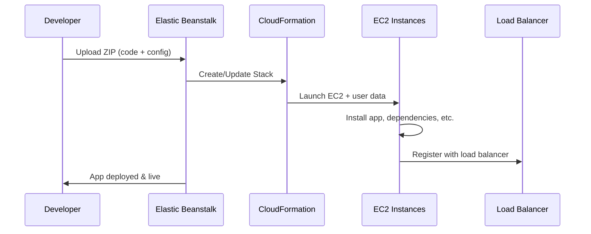

# 🧠 **Advanced AWS Elastic Beanstalk (EB) Internals & Architecture**

> You already know what EB _does_. Now let’s explore **how it actually works** under the hood, and what AWS sets up for you behind the scenes 👇

---

## 🌐 **1. EB Environment Types: Single vs. Load-Balanced**

When you create an Elastic Beanstalk environment, you choose between two **environment types**:

| Type                | Description                                             |
| ------------------- | ------------------------------------------------------- |
| **Single Instance** | For dev/test, creates one EC2 instance only             |
| **Load Balanced**   | For production — uses an ELB + Auto Scaling Group (ASG) |

---

### 🔧 What Happens Internally?

#### 📦 **Single Instance Environment**

- Creates a single **EC2 instance**
- Public IP assigned directly (no load balancer)
- You can SSH into it
- Uses **Auto Scaling Group with min/max = 1**
- Still managed by Elastic Beanstalk’s internal CloudFormation stack

> ✅ Best for: Development, testing, cost-saving

---

#### 🌐 **Load-Balanced Environment**

- Provisions:
  - One or more EC2 instances
  - **Elastic Load Balancer (ALB or Classic LB)**
  - **Auto Scaling Group** with dynamic scaling policies
- All EC2 instances sit behind the load balancer
- Great for high availability, performance, and horizontal scaling

> ✅ Best for: Production workloads and scalable apps

---

## 🧬 **2. Internal Architecture: What EB Sets Up Behind the Scenes**

When you deploy an app to EB, it actually **creates and manages a full CloudFormation stack** for you, including:

| Component             | Description                                          |
| --------------------- | ---------------------------------------------------- |
| 🖥️ EC2 Instances      | Your app runs on EC2 servers (can be one or many)    |
| 🌐 Load Balancer      | If using LB env, manages HTTP/HTTPS traffic          |
| 🚦 Auto Scaling Group | Adjusts the number of EC2s based on load             |
| 📶 Security Groups    | For EC2 and Load Balancer access control             |
| 🔍 CloudWatch Alarms  | For CPU and instance health monitoring               |
| 🪵 Logs + Metrics      | Stored in CloudWatch (or can be pushed to S3)        |
| 🧩 Instance Profile   | IAM role attached to EC2 with access to S3, CW, etc. |
| 🔧 Launch Template    | Governs EC2 config: AMI, user data, instance type    |

> ✅ You don’t see these in the EB UI directly, but they exist in the backend CloudFormation stack.

---

## 🔁 **3. Application Lifecycle in EB**

Let’s break down **how EB deploys your app** internally:

### 🛠️ Application Deployment Flow



✅ Elastic Beanstalk handles:

- Extracting the zip
- Setting up software
- Running your app via platform hooks
- Registering health checks
- Attaching to Load Balancer

---

## 🔄 **4. Configuration Layers: Where Settings Come From**

Elastic Beanstalk settings are applied in a **layered** way:

1. **Default platform config**
2. **Saved config settings** (from console or `.elasticbeanstalk/config.yml`)
3. **Environment properties** (env vars)
4. **`.ebextensions/` configs**
5. **`.platform/hooks/`** (for deeper OS-level customizations)

---

## 🔐 **5. Security in EB**

- EB automatically creates and attaches an **IAM role** to your EC2 instances (`aws-elasticbeanstalk-ec2-role`)

  - Used to access S3, CloudWatch Logs, etc.

- You can customize:
  - Instance Profile (permissions)
  - Service Role (for EB itself)
  - Security Groups (which ports are open)
  - HTTPS termination at the **Load Balancer** level

---

## 📦 **6. Deployment Package Requirements**

### 👇 Rules for ZIP deploy

- Must include your **app code** at the root level
- **Optional**: `.ebextensions/` and/or `Dockerrun.aws.json`
- Cannot exceed **512MB**
- Must be uploaded to:
  - EB Console
  - CLI (`eb deploy`)
  - CI/CD pipeline (e.g. CodePipeline)

---

## 🪟 **7. Platform Hooks and .platform Folder (Advanced Customization)**

> The `.ebextensions/` folder configures the environment stack, but `.platform/hooks/` lets you **modify EC2 instance behavior directly**.

Folder structure inside `.platform`:

```ini
.platform/
  hooks/
    prebuild/
    predeploy/
    postdeploy/
```

| Hook Type    | Runs When                        |
| ------------ | -------------------------------- |
| `prebuild`   | Before your app is built         |
| `predeploy`  | After build, before deployment   |
| `postdeploy` | After deployment and app startup |

You can use Bash or Python scripts here to:

- Install dependencies
- Patch system config
- Set cron jobs
- Restart services
- Debug issues

---

## 📡 **8. Load Balancer Configuration in EB**

Elastic Beanstalk defaults to using an **Application Load Balancer (ALB)**.

You can customize:

- Listener rules (e.g., redirect HTTP → HTTPS)
- Health check path (default: `/`)
- Target group settings (like deregistration delay)
- SSL certificates via ACM

💡 **Important**:

- If using HTTPS, terminate SSL at the **ALB**, not inside the EC2
- You can use **ACM-managed certificates** + HTTPS listeners easily in the EB console

---

## ⚙️ **9. Scaling & Auto Scaling Groups (ASG)**

### EB Auto Scaling Config

- Min & Max EC2 instance count
- Scaling based on **CPUUtilization**, **network I/O**, or custom metrics

You configure it in:

- Console → Environment → Configuration → Capacity
- Or via `.ebextensions`:

  ```yaml
  option_settings:
    aws:autoscaling:asg:
      MinSize: 2
      MaxSize: 4
  ```

---

## 🧪 **10. Health Checks & Monitoring**

EB checks your app’s health via:

| Source           | Description                                |
| ---------------- | ------------------------------------------ |
| ALB Target Group | Health checks every X seconds (URL path)   |
| EC2 Instance     | Checks if instance is alive and responsive |
| EB Environment   | Overall health = OK / Warning / Severe     |

💡 Log data is viewable via:

- CloudWatch Logs
- EB console (View Logs)
- `.ebextensions` to enable log streaming

---

## 💼 **11. CI/CD Integration**

You can automate EB deployments with:

### 🔧 CLI Tools

- `eb deploy`
- `eb setenv`

### 🔗 CI/CD Pipelines

- AWS CodePipeline + CodeBuild
- GitHub Actions
- GitLab CI/CD
- Bitbucket Pipelines

You just need to:

- Zip your source bundle
- Push it to S3 or directly to EB
- Trigger a deployment

---

## ☁️ **12. Supported Regions and Pricing**

Elastic Beanstalk is available in all major regions.

🧮 **Pricing**:

- EB itself = 💸 Free
- You pay for:
  - EC2 instances
  - Load Balancers
  - RDS (if used)
  - EBS storage
  - Data transfer

---

## 🧠 Pro Tips & Best Practices

| Tip                                              | Benefit                        |
| ------------------------------------------------ | ------------------------------ |
| Always use **external RDS**                      | Safer & persistent DB          |
| Enable **rolling or immutable deployments**      | Avoid downtime                 |
| Use `.platform/hooks/` for deeper customizations | Power user magic 🔧            |
| Store logs in **CloudWatch Logs or S3**          | Debug easily                   |
| Use **HTTPS** at ALB + ACM certs                 | Secure your app                |
| Don’t manually tweak EC2s                        | EB may override it on redeploy |
| Use **Elastic IP + DNS** for app stability       | Especially with blue/green     |
