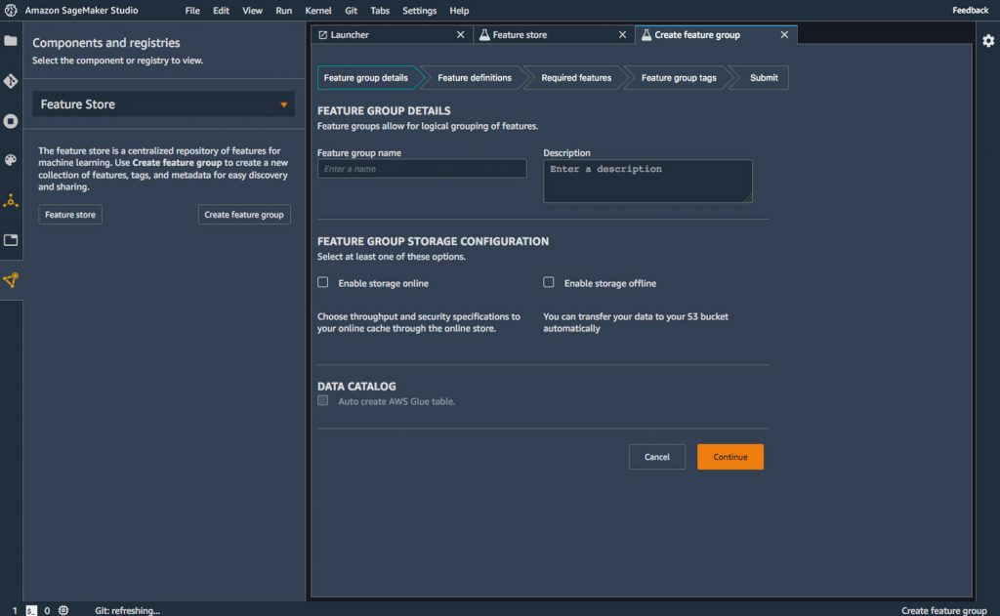
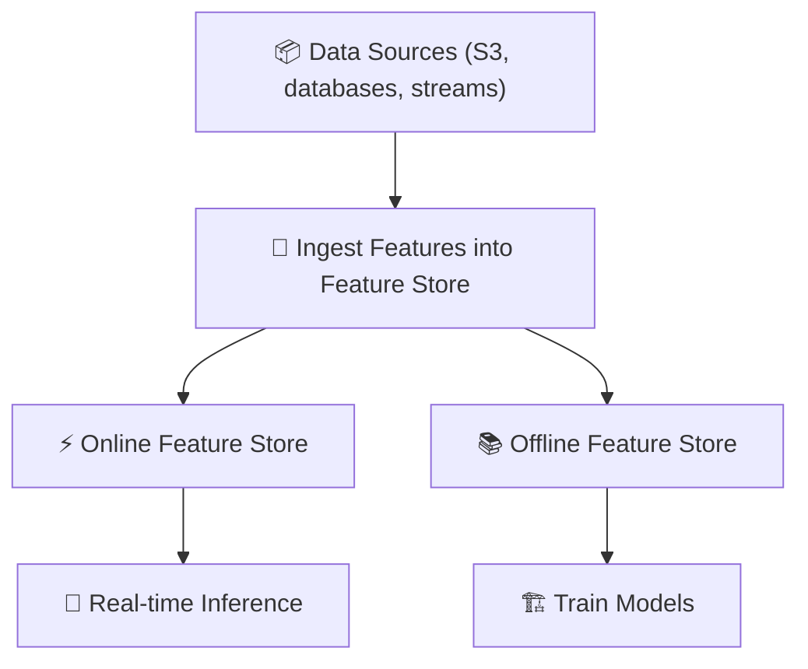

# 🏗️ 8. SageMaker Feature Store

## 🧠 What are Machine Learning Features?

> **Definition**:  
> In machine learning, **features** are the **individual measurable properties** or **characteristics** of a phenomenon being observed.

---

    

---

📌 **Simply**:

- Features are **inputs** to your machine learning model 🔢.
- They help the model **understand patterns** and **make predictions**.

📌 **Example**:

| Raw Data                       | Feature                              |
| :----------------------------- | :----------------------------------- |
| Customer birthdate: 1990-01-01 | Age = 34 (derived feature)           |
| Customer transaction records   | Average transaction amount           |
| User profile                   | Number of logins in the last 30 days |

📌 **Key Idea**:

> **Better features** → **Better models** → **Better predictions** 🎯.

---

## 🏛️ Why Feature Stores Matter

> **Definition**:  
> A **Feature Store** is a **centralized repository** for storing, sharing, and managing ML features across teams, projects, and models.

📌 **Problems without a feature store**:

| Problem                     | Impact                          |
| :-------------------------- | :------------------------------ |
| Duplicated feature creation | Waste of time and compute       |
| Inconsistent features       | Training vs Inference mismatch  |
| Difficult collaboration     | Teams rebuild the same features |

📌 **Why Feature Stores are Critical**:

- **Reusability**: Once a feature is created, it can be reused across different models.
- **Consistency**: Same feature logic used during training and inference ✅.
- **Collaboration**: Teams can discover and share features easily.
- **Speed**: No need to engineer from scratch for every new project.

📌 **Simple Analogy**:

> **Feature Store** = **Library** of **reusable ML ingredients** 🍽️.

---

## 🏗️ What is SageMaker Feature Store?

> **Definition**:  
> **SageMaker Feature Store** is a **fully managed repository** where you can **ingest**, **store**, **transform**, and **retrieve** ML features —  
> designed to be **used during both training and inference**, with **high performance and scalability**.

📌 **Key Highlights**:

| Capability        | Purpose                                            |
| :---------------- | :------------------------------------------------- |
| Online Store      | Low-latency retrieval for real-time inference      |
| Offline Store     | Historical data for model training                 |
| Feature Discovery | Search and find reusable features                  |
| Integration       | Works with Data Wrangler, Pipelines, Training Jobs |
| Data Ingestion    | Store features from multiple data sources          |

📌 **Visual Overview**:

---

## 🚚 SageMaker Feature Store Capabilities

### 📥 1. Ingest Features

📌 **Ingest** data from:

- Amazon S3
- Streaming sources (like Kinesis)
- Databases
- SageMaker Data Wrangler exports

📌 **Typical Workflow**:

- Create a Feature Group (think of it like a table schema).
- Define the feature names, types (e.g., int, float, string), and primary keys.
- Ingest records into the Feature Store (batch or real-time).

📌 **Example**:

- Feature Group: "Customer Behavioral Features"
  - `customer_id`, `avg_transaction_amount`, `num_logins_last_month`

---

### 🔄 2. Transform and Serve Features

📌 **Consistency between Training and Inference**:

- **Offline Store**: For large-scale ML model training (historical features).
- **Online Store**: For fast, real-time predictions (current user data).

📌 **Real-World Scenario**:

| Phase           | Use                                                                        |
| :-------------- | :------------------------------------------------------------------------- |
| Training Phase  | Pull millions of rows from Offline Store to train models                   |
| Inference Phase | Fetch a single user’s features from Online Store for real-time predictions |

📌 **Benefit**:

- **No mismatch** between training and serving features 🚀.

---

### 🔍 3. Discover Features

📌 **Built-in Search**:

- Browse and query feature groups inside SageMaker Studio.
- Metadata available:
  - Feature descriptions.
  - Data types.
  - Last updated timestamp.

📌 **Feature Reuse**:

- Instead of re-creating the same "Customer Average Order Value" feature,
  simply search and reuse the feature!

📌 **Benefit**:

- **📈 Increases productivity** .
- **❌ Reduces errors** .
- **👥 Boosts collaboration** among teams .

---

## ✍️ Mini Smart Recap

| Feature Store Capability | Key Action                                 |
| :----------------------- | :----------------------------------------- |
| 📥 Ingest                | Bring in features from diverse sources     |
| 🔄 Transform & Serve     | Enable offline training + online inference |
| 🔍 Discover              | Search and reuse existing features         |

📌 **Simple Rule**:

> "Stop reinventing the wheel 🛞!  
> Reuse smart features from your Feature Store 📚."
