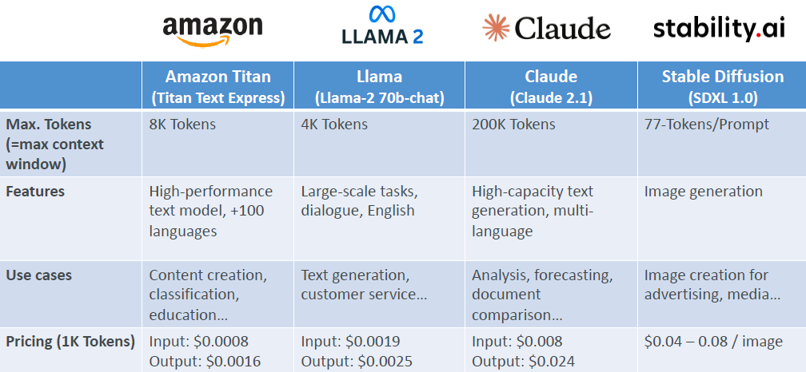

# 🧠 Amazon Bedrock – Base Foundation Models (FMs)

## 📜 What are Base Foundation Models?

> In Amazon Bedrock, **Base Foundation Models (FMs)** are **pre-trained AI models** built by top AI companies (AWS, Anthropic, Meta, Stability AI, etc.) that you can **use as-is** or **customize** for your own applications — all without needing to build or train them yourself.

✅ Think of them as **"ready-to-go brains"** 🧠 that you can plug into your apps.

---

## 🧩 How to Choose a Base Model?

Choosing the right Foundation Model depends on **several important factors**:

| Factor                  | What to Consider                                                        |
| ----------------------- | ----------------------------------------------------------------------- |
| 📚 Model Type           | Text generation, image generation, embeddings, multimodal?              |
| 🚀 Performance          | Speed, quality of output, precision needed                              |
| 🎯 Capabilities         | Creative writing? Summarization? Translation? Reasoning?                |
| 🔒 Compliance           | Industry-specific requirements (HIPAA, GDPR, etc.)?                     |
| 🧠 Customization        | Can you fine-tune it with your own data easily?                         |
| 📏 Model Size           | Larger models = better reasoning, but higher cost and latency           |
| 🏗️ Inference Options    | Real-time vs batch vs asynchronous generation                           |
| 📜 Licensing Agreements | Open-source (free) vs commercial (restricted use and pricing)           |
| ⏳ Context Window Size  | How much text can the model "see" at once? (affects long conversations) |
| ⚡ Latency Requirements | Need fast responses or can tolerate some delay?                         |

---

## 🎯 Key Model Categories in Bedrock

| Category             | Example Use Case                                             |
| -------------------- | ------------------------------------------------------------ |
| 📝 Text Models       | Generate text, summarize articles, chatbots                  |
| 🖼️ Image Models      | Create new images from text prompts (e.g., Stable Diffusion) |
| 🔀 Multimodal Models | Handle both text + image input/output together               |
| 🔍 Embedding Models  | Turn text into vectors for search or retrieval (RAG)         |

---

## 🚀 What is Amazon Titan?

> **Amazon Titan** is AWS’s **own family of high-performance Foundation Models** available through Bedrock.

| Feature                         | Details                                                |
| ------------------------------- | ------------------------------------------------------ |
| 📚 Supports Multiple Modalities | Text, image, and multimodal generation                 |
| 🔧 Customizable                 | Fine-tune easily with your private data                |
| 💰 Cost-Effective               | Smaller models for cheaper inference costs             |
| 🔒 Secure                       | Built under AWS-grade compliance and privacy standards |

✅ Titan is perfect when you want **tight AWS integration**, **control**, and **cost savings** — especially compared to purely commercial models.

---

## 🔥 Example Model Comparison

    

---

✅ **Summary Tip**:

- **Titan** ➔ AWS Native, secure, general-purpose
- **Llama** ➔ Open-source, flexible
- **Claude** ➔ Safe conversational AI
- **Stable Diffusion** ➔ Image generation genius 🎨

---

## 📚 Quick Smart Recap

| Area                 | Key Point                                    |
| -------------------- | -------------------------------------------- |
| 🧠 Base FMs          | Ready-to-use AI brains (pre-trained)         |
| 🧩 Choosing a Model  | Based on capabilities, speed, compliance     |
| 🏆 Amazon Titan      | AWS's native family of secure, high-perf FMs |
| ⚖️ Model Comparisons | Choose based on your specific needs          |

---

## 📌 Smart Memory Tip

> "**In Bedrock, picking the right base model is like choosing the right vehicle: 🚗 fast, 🚚 powerful, 🚀 futuristic — depending on your mission!**" 🧠✅
