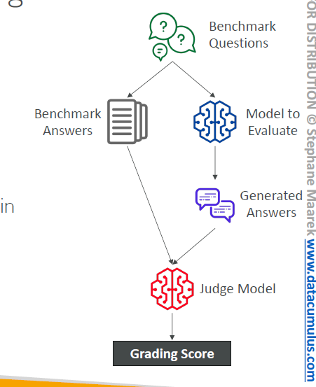
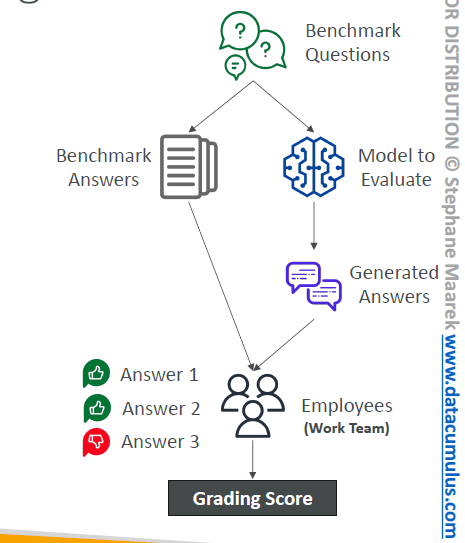
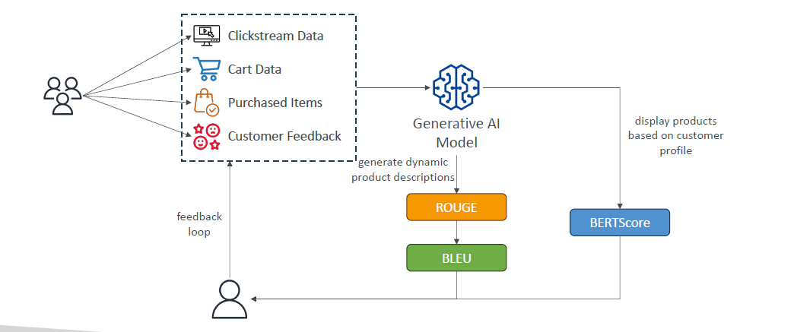

# 🧪 Amazon Bedrock – Evaluating a Model

## 🧠 **Why Evaluate a Model?**

> After building or fine-tuning a Foundation Model (FM), you must **evaluate** it to ensure it meets your quality, fairness, and business goals — _before_ deploying it into production.

✅ **Evaluation = Trust + Optimization.**

---

## 🛠️ **Two Main Evaluation Methods**

| Method                  | Purpose                                   |
| ----------------------- | ----------------------------------------- |
| ⚙️ Automatic Evaluation | Fast, statistical, no human review needed |
| 🧑‍⚖️ Human Evaluation  | In-depth, subjective human feedback       |

---

## ⚡ **Automatic Evaluation in Bedrock**

    

---

Amazon Bedrock can automatically evaluate your model using **built-in tasks** and **automatic scoring**.

### 📋 Built-in Task Types

- **Text Summarization** 📝
- **Question and Answer** ❓
- **Text Classification** 🏷️
- **Open-ended Text Generation** 🗣️

✅ **You can**:

- Use **Bedrock’s curated datasets**.
- Or **bring your own custom prompt dataset**.

### 📈 How It Works

- The model is tested automatically.
- Scores are calculated using **predefined metrics** (e.g., BERTScore, F1, ROUGE, BLEU).

> 📌 **Bedrock = Automated lab to check model quality without manual work!**

---

## 📦 **Benchmark Datasets**

| Feature                         | Description                                             |
| ------------------------------- | ------------------------------------------------------- |
| 📚 Wide Coverage                | Cover different topics, tasks, languages                |
| 🎯 Bias Detection               | Identify if the model discriminates against groups      |
| ⚙️ Accuracy, Speed, Scalability | Measure performance, runtime efficiency                 |
| 🛠️ Custom Benchmarking          | Create your own dataset specific to your business goals |

✅ Example:  
E-commerce company → Test model on **product categorization** + **customer Q&A**.

---

## 🧑‍⚖️ **Human Evaluation**

    

---

Sometimes, **only a human** can properly judge the model output!

| Step                 | Details                                                 |
| -------------------- | ------------------------------------------------------- |
| 🧑 Choose Evaluators | Employees, SMEs (Subject-Matter Experts)                |
| 🎯 Define Metrics    | Thumbs up/down, 5-star rating, ranking tasks            |
| 📝 Choose Tasks      | Same built-in types (summarization, QA, etc.) or custom |

✅ Humans can catch things automatic scoring misses — like tone, creativity, subtle bias.

---

## 📏 **Key Metrics Used for Evaluation**

| Metric     | Description                                                | Best For                     |
| ---------- | ---------------------------------------------------------- | ---------------------------- |
| ROUGE      | Compare generated summary vs reference text (n-gram match) | Summarization, Translation   |
| BLEU       | Translation quality based on overlapping phrases (n-grams) | Language Translation Tasks   |
| BERTScore  | Deep semantic similarity using BERT embeddings             | Fine-grained Text Similarity |
| Perplexity | How well the model predicts next token (lower = better)    | Language Modeling            |

---

    

---

## 📊 **Business Metrics for Real-World Evaluation**

Because you don't just care about BLEU scores — you care about **business success**!

| Business Metric                 | Description                                                   |
| ------------------------------- | ------------------------------------------------------------- |
| User Satisfaction               | Are users happy? (feedback, NPS scores)                       |
| Average Revenue Per User (ARPU) | Did GenAI increase revenue per customer?                      |
| Cross-Domain Performance        | Can the model handle multiple domains (finance + healthcare)? |
| Conversion Rate                 | Are AI recommendations leading to purchases, sign-ups, etc.?  |
| Efficiency                      | Is the model cost-effective in compute, storage, and latency? |

✅ **Smart Tip**:

> "Good BLEU score doesn't pay the bills — good **Conversion Rate** does!" 💰

---

## ✍️ **Full Smart Recap**

| Area                 | Quick Note                                                          |
| -------------------- | ------------------------------------------------------------------- |
| Automatic Evaluation | Bedrock evaluates models with built-in tasks and statistical scores |
| Benchmark Datasets   | Ready-made or custom datasets to test model robustness              |
| Human Evaluation     | SME/Employee based real-world feedback on outputs                   |
| Evaluation Metrics   | ROUGE, BLEU, BERTScore, Perplexity                                  |
| Business Metrics     | Focus on real-world KPIs like revenue, satisfaction, conversions    |
