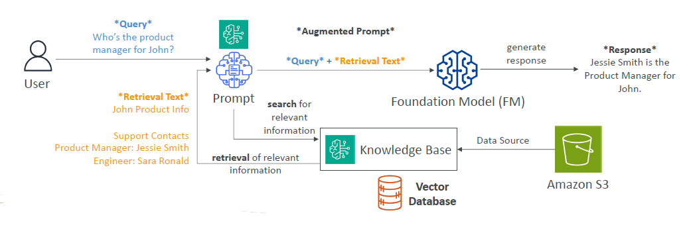

# 🧠 Amazon Bedrock – Retrieval-Augmented Generation (RAG)

## 📚 What is RAG?

> **RAG (Retrieval-Augmented Generation)** is a technique where a **Foundation Model (FM)** enhances its responses by **retrieving relevant data from an external source** at query time `without being fine-tuned`.

📌 **Why use RAG?**

- Foundation Models are trained on static data ➜ they don’t "know" recent or private info.
- RAG allows the model to **"look up" real-time, private, or proprietary data** when generating responses.

---

## ⚙️ How RAG Works in Bedrock

    

---

### 🔗 Steps Behind the Scenes

1. Your private data is uploaded to **Amazon S3** or other sources.
2. Bedrock creates **vector embeddings** of this data and stores them in a **vector database**.
3. When a user asks a question, the FM:
   - Retrieves relevant vectors (content chunks),
   - Injects them into the prompt,
   - Generates a more accurate and **context-aware** answer.

---

## 🫙 RAG Vector Databases

    

---

## 🧰 Supported Vector Databases in Amazon Bedrock

| Service                       | Type               | Highlights                              |
| ----------------------------- | ------------------ | --------------------------------------- |
| **Amazon OpenSearch**         | Search & Analytics | Scalable, real-time kNN search          |
| **Amazon DocumentDB**         | NoSQL              | MongoDB compatible, fast vector queries |
| **Amazon Aurora**             | Relational         | AWS-native, high performance            |
| **Amazon RDS for PostgreSQL** | Relational         | Open-source, familiar ecosystem         |
| **Amazon Neptune**            | Graph              | Graph-powered vector retrieval          |

---

## 📤 Supported RAG Data Sources

Amazon Bedrock lets you retrieve content from many data sources:

| Source                  | Examples                             |
| ----------------------- | ------------------------------------ |
| **Amazon S3**           | Upload structured/unstructured files |
| **Confluence**          | Wiki pages, technical docs           |
| **SharePoint**          | Internal knowledge bases             |
| **Salesforce**          | CRM content, FAQs                    |
| **Web Pages**           | Internal/external websites           |
| _(More coming soon...)_ |                                      |

---

## 🧠 RAG Use Cases

### 1️⃣ Customer Service Chatbot

| Component          | Example                                                             |
| ------------------ | ------------------------------------------------------------------- |
| **Knowledge Base** | Product manuals, FAQs                                               |
| **Goal**           | Respond to customer queries using the most recent and accurate data |

> _"Can I reset my router to factory settings?"_ → RAG uses internal docs to reply.

---

### 2️⃣ Legal Research and Analysis

| Component          | Example                                                  |
| ------------------ | -------------------------------------------------------- |
| **Knowledge Base** | Laws, case precedents, legal memos                       |
| **Goal**           | Help legal teams research faster with referenced context |

> _"Show relevant laws for employment termination in CA."_ ➜ Uses legal doc vector database.

---

### 3️⃣ Healthcare Q&A Chatbot

| Component          | Example                                                       |
| ------------------ | ------------------------------------------------------------- |
| **Knowledge Base** | Clinical guidelines, treatment procedures                     |
| **Goal**           | Help medical professionals or patients with real-time answers |

> _"What’s the latest guideline for Type 2 Diabetes treatment?"_ ➜ RAG checks the latest uploads.

---

## ✅ Why Use RAG?

| Benefit                        | Description                                    |
| ------------------------------ | ---------------------------------------------- |
| 🔄 **Real-time freshness**     | Inject up-to-date info even if FM is outdated  |
| 🔒 **Private data usage**      | Query secure internal knowledge bases          |
| 🎯 **Domain-specific answers** | Custom answers per industry (legal, health...) |

---

## ✍️ Summary

| Concept                          | Quick Recap                                |
| -------------------------------- | ------------------------------------------ |
| **RAG = Retrieval + Generation** | Combine FM power + external info           |
| **Bedrock Handles It All**       | Vector embeddings, retrieval, response     |
| **Use Cases**                    | Chatbots, legal research, medical guidance |
| **Data Sources**                 | S3, Salesforce, SharePoint, Web…           |
| **Vector DBs**                   | OpenSearch, Neptune, Aurora, PostgreSQL…   |
