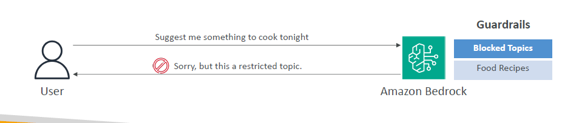

# 🛡️ Amazon Bedrock – Guardrails

## 🧠 What are Guardrails in Amazon Bedrock?

> **Guardrails** are **protective rules** that **control the interaction** between users and **Foundation Models (FMs)** to ensure **safe, secure, and responsible AI outputs**.

---

    

---

## 🔑 Main Features

| Feature                       | What It Does                                                                    |
| :---------------------------- | :------------------------------------------------------------------------------ |
| 🔒 Filter Undesirable Content | Block harmful, offensive, or inappropriate outputs                              |
| 🛡️ Remove PII                 | Automatically redact/remove **Personally Identifiable Information** for privacy |
| 📜 Enhanced Privacy           | Protect user and organization data                                              |
| 🎯 Reduce Hallucinations      | Improve model trustworthiness by reducing made-up facts                         |
| 🛠️ Create & Manage Guardrails | Build **multiple sets of rules** and monitor violations                         |
