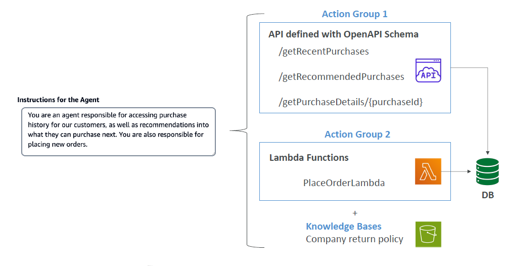
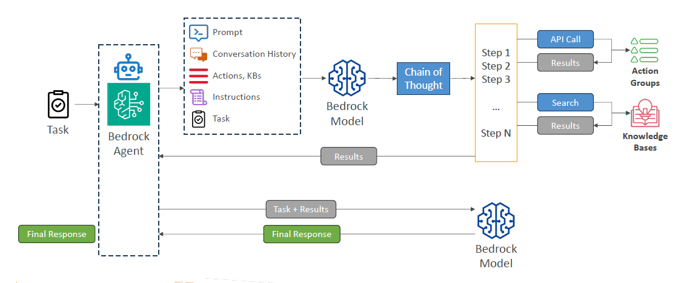

# 🤖 Amazon Bedrock – Agents: The AI That Gets Work Done

## 🧠 What Are Bedrock Agents?

> **Amazon Bedrock Agents** are **intelligent task coordinators** that **carry out multi-step tasks**, make **API calls**, interact with external systems, and use **real-time data** via **RAG** — all powered by Foundation Models (FMs).

In simple terms:

- Instead of just answering a question, **Agents take actions**.
- They can **retrieve**, **reason**, **decide**, and **execute** workflows.

---

## 🛠️ Key Capabilities of Bedrock Agents

| Feature                      | What It Enables                                                                 |
| ---------------------------- | ------------------------------------------------------------------------------- |
| 🔁 Multi-step Task Execution | Perform complex workflows in sequence (e.g., order tracking, report generation) |
| 🧠 Task Coordination         | Ensure tasks are executed in the **correct order** with shared context          |
| 🧩 Action Groups             | Pre-defined **sets of functions/APIs** the agent is allowed to use              |
| 🔗 System Integration        | Interact with databases, APIs, Lambda functions, and cloud systems              |
| 📚 Knowledge Retrieval       | Use **RAG (Retrieval-Augmented Generation)** to pull facts from knowledge bases |
| 🔐 Security & Control        | Define scopes and schemas using **OpenAPI** for structured and safe execution   |

---

## 🧰 Components in Bedrock Agent Setup

### ✅ 1. **Action Groups**

- Collections of **Lambda functions** or **API calls** that perform specific tasks.
- Actions are defined in **OpenAPI schemas** (for structured understanding by the Agent).

**Example Action Group Endpoints:**

| Endpoint                   | Purpose                              |
| -------------------------- | ------------------------------------ |
| `/getRecentPurchases`      | Fetch last 5 user purchases          |
| `/getRecommendedPurchases` | Suggest new items                    |
| `/getPurchaseDetails/{id}` | Look up more info on a specific item |
| `PlaceOrderLambda`         | Trigger a new order (via Lambda)     |

---

### 📚 2. **Knowledge Bases + RAG**

- RAG = Retrieval-Augmented Generation
- When the Agent needs up-to-date or factual data (e.g., return policy, inventory), it fetches it using RAG from:
  - Amazon S3 docs
  - Internal policy files
  - FAQs or product sheets

**Examples of Knowledge Sources:**

- “Company return policy”
- “Product manuals”
- “Troubleshooting guides”

---

### ⚙️ 3. **Lambda Functions + APIs**

- Agents **invoke Lambda** or **call APIs** to perform backend logic.
- Example: after gathering product ID → call a Lambda to place an order.

---

## 🧱 How Bedrock Agents Work (Conceptual Flow)

  

---

  

---

## 💡 Real-World Use Case: E-Commerce Assistant

> **Goal:** Help customers check recent purchases and place a new order.

**Workflow Example:**

1. User says: _"Order me the shampoo I bought last month."_
2. Agent:
   - Calls `/getRecentPurchases`
   - Finds the product
   - Calls `PlaceOrderLambda` with correct data
   - Confirms order with the user

---

## 🔒 Why Use Agents Instead of a Basic FM?

| Capability           | FM Only                | Bedrock Agent               |
| -------------------- | ---------------------- | --------------------------- |
| Task Execution       | ❌ No                  | ✅ Yes                      |
| External Data Access | ❌ Needs manual setup  | ✅ Built-in with RAG        |
| Multi-Step Logic     | ❌ Stateless           | ✅ Maintains context        |
| API Invocation       | ❌ Not directly        | ✅ With OpenAPI + Lambdas   |
| Workflow Automation  | ❌ Only generates text | ✅ Automates task sequences |

---

## 📌 Smart Summary

| 🔧 Feature              | 🧠 Description                                                  |
| ----------------------- | --------------------------------------------------------------- |
| 🪄 Agent                 | FM-powered brain that thinks, acts, and fetches data            |
| 🔗 Action Groups        | APIs and Lambdas to perform predefined tasks                    |
| 📚 Knowledge Base + RAG | Add real-time domain context (policies, product info, etc.)     |
| 📊 Coordination Engine  | Ensures logical, ordered execution across tasks                 |
| 🔐 API Schema (OpenAPI) | Ensures secure, structured communication between agent and APIs |
