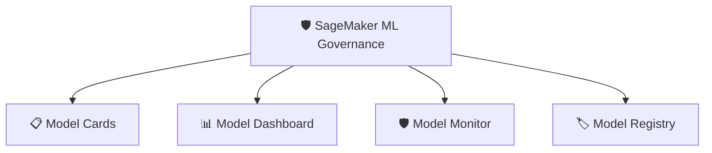

# 🛡️ 11. ML Governance with SageMaker

## 🧠 What is ML Governance?

> **Definition**:  
> **ML Governance** is the practice of **tracking**, **managing**, **documenting**, and **monitoring** machine learning models across their entire lifecycle to ensure **accountability**, **transparency**, **compliance**, and **quality**.

✅ **Simply**:

- It’s like **project management + auditing** but specifically for **ML models**.
- It ensures models are:
  - **Well-documented** 📝,
  - **Properly tracked** 📊,
  - **Continuously monitored** 🛡️,
  - **Safe to use** in production environments 🚀.

✅ **Why it's Crucial**:

| Risk                 | Without Governance                        |
| :------------------- | :---------------------------------------- |
| Model drift          | Models become outdated and inaccurate     |
| Lack of traceability | Hard to audit decisions (compliance risk) |
| Poor model quality   | Bad outcomes without detection            |
| Deployment chaos     | No version control or approval processes  |

✅ **Simple Rule**:

> **Building a model is only half the battle** — **managing it responsibly is the other half**.

---

## 🏛️ ML Governance Tools in SageMaker

---

### 📋 1. SageMaker Model Cards

> **Definition**:  
> **Model Cards** are structured documents that capture **essential information** about an ML model —  
> including its purpose, intended uses, limitations, and risk assessments.

✅ **Key Information Captured**:

| Section                | Details                               |
| :--------------------- | :------------------------------------ |
| Model Details          | Algorithm used, input/output formats  |
| Intended Use           | Who should use it and how             |
| Performance Metrics    | Accuracy, precision, recall, F1 score |
| Ethical Considerations | Bias risks, fairness notes            |
| Risk Ratings           | Risk of using the model incorrectly   |

✅ **Example**:

- A model card for a loan approval model would document:
  - Intended for personal loan approvals in North America 🌎.
  - Accuracy of 92% on validation set 📈.
  - Risk: Sensitive to bias based on income level ⚠️.

✅ **Benefit**:

- Easier to communicate model capabilities and risks to technical and non-technical stakeholders.

---

### 📊 2. SageMaker Model Dashboard

> **Definition**:  
> A **centralized portal** to **view, search, and monitor all ML models** across your organization.

✅ **Features**:

| Feature            | Benefit                                               |
| :----------------- | :---------------------------------------------------- |
| Model Inventory    | List of all models across accounts, regions, teams    |
| Search and Filters | Find models based on attributes (like project name)   |
| Health Monitoring  | See which models are drifting, unhealthy, or outdated |
| Compliance Status  | Check if models meet governance policies              |

✅ **Example View**:

- Models grouped by:
  - **Project** (e.g., "Fraud Detection Models"),
  - **Deployment status** ("Production" vs "Testing"),
  - **Last monitored** timestamp.

✅ **Benefit**:

- **One place** to track and manage everything,
- **Detect problems early** before they hurt your users.

---

### 🛡️ 3. SageMaker Model Monitor

> **Definition**:  
> **Model Monitor** continuously checks deployed models for **data drift**, **concept drift**, and **prediction quality degradation**.

✅ **Key Checks**:

| Check Type          | What it Detects                                 |
| :------------------ | :---------------------------------------------- |
| Data Drift          | Incoming data changes compared to training data |
| Model Drift         | Model behavior changes over time                |
| Bias Drift          | Shifts in fairness across different groups      |
| Quality Degradation | Drop in prediction accuracy or recall           |

✅ **How it Works**:

1. Capture inference data and ground truth data (if available).
2. Schedule regular monitoring jobs.
3. Generate detailed reports and alerts.

✅ **Example**:

- A model trained on customer transaction patterns starts failing to detect fraud because customer behavior changed over the past year —  
  **Model Monitor will alert you early** 🚨!

✅ **Benefit**:

- **Prevent model failures** before they escalate 🛡️.

---

### 🏷️ 4. SageMaker Model Registry

> **Definition**:  
> **Model Registry** is a **centralized repository** to **store**, **version**, **approve**, and **manage** models through different stages (training → testing → production).

✅ **Key Capabilities**:

| Capability             | Description                                             |
| :--------------------- | :------------------------------------------------------ |
| Model Versioning       | Track different versions of the same model              |
| Approval Workflow      | Approve/reject models before production deployment      |
| Metadata Tracking      | Store training datasets, hyperparameters, metrics       |
| Automation Integration | Integrate with SageMaker Pipelines for CI/CD automation |

✅ **Example Workflow**:

1. Train a model and register it in the Model Registry 🏗️.
2. Reviewer (manager, lead) **approves** the model ✅.
3. Approved model automatically deployed to production 🚀.

✅ **Benefit**:

- **Controlled, auditable, and safe** model promotion.

---

## ✍️ Mini Smart Recap

| Governance Tool    | Purpose                                     |
| :----------------- | :------------------------------------------ |
| 📋 Model Cards     | Document model purpose, performance, risks  |
| 📊 Model Dashboard | Central view of all models                  |
| 🛡️ Model Monitor   | Catch drift and quality issues early        |
| 🏷️ Model Registry  | Version, approve, and promote models safely |

✅ **Simple Rule**:

> "**If you can't track it, you can't trust it.**"  
> Use SageMaker ML Governance tools to **bring order, transparency, and safety** to your machine learning projects.
