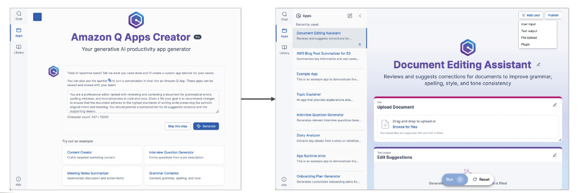

# 🛠️ Amazon Q Apps: No-Code AI App Creation

## 🧠 What is Amazon Q Apps?

> **Definition**:  
> **Amazon Q Apps** is a new feature inside **Amazon Q Business** that lets **employees create fully functional, GenAI-powered applications** by simply **describing what they want in natural language** —  
> **no coding required**, built **instantly on top of your company’s internal data and systems**.

---

    

---

📌 **Simply**:

- Imagine **talking** to Amazon Q and it **builds the app for you** 🎯.
- Apps can **search**, **summarize**, **automate tasks**, and even **integrate with plugins** like Jira — in minutes.

📌 **Key Highlights**:

| Feature              | Benefit                                                       |
| :------------------- | :------------------------------------------------------------ |
| No-code App Creation | Anyone can build AI-powered apps by describing them           |
| Company Data Powered | Apps use your internal documents, databases, knowledge        |
| Plugin Integrations  | Apps can trigger external actions (e.g., create Jira tickets) |
| Instant Deployment   | Apps are created and usable in minutes                        |

📌 **Simple Rule**:

> "**If you can describe it, you can build it.**" 🧠✨

---

## 🎯 What Can You Build with Amazon Q Apps?

📌 **Typical Use Cases**:

| Example Idea                                             | What Q App Does                                               |
| :------------------------------------------------------- | :------------------------------------------------------------ |
| "Create an app that lists open IT issues by department." | Fetches tickets from Jira, categorizes by department          |
| "Make a document search app for HR policies."            | Searches internal SharePoint and S3 for HR documents          |
| "Build a meeting summarizer tool."                       | Pulls meeting notes from WorkDocs and summarizes key points   |
| "Create an app to submit PTO requests."                  | Interacts with HR systems via Plugin to submit time-off forms |

📌 **Real-World Example**:

- You say:
  > "I need an app that shows me pending service tickets and lets me close them via Jira."
- Amazon Q Apps **creates** the app instantly —  
  you can **view, manage, and close tickets directly** from the new app UI! 🚀

---

## 🧠 How Amazon Q Apps Works Behind the Scenes

📌 **Conceptual Workflow**:

```mermaid
flowchart TD
    UserPrompt[🗣️ User Describes App in Natural Language]
    QUnderstanding[🤖 Amazon Q Understands the Request]
    DataSources[📚 Connects to Internal Company Data]
    Plugins["🔗 Optional Plugin Actions (e.g., Jira, Salesforce)"]
    AppCreated[📱 App Created and Ready to Use]

    UserPrompt --> QUnderstanding
    QUnderstanding --> DataSources
    QUnderstanding --> Plugins
    DataSources --> AppCreated
    Plugins --> AppCreated
```

📌 **Key Capabilities**:

| Capability                | Description                                  |
| :------------------------ | :------------------------------------------- |
| Natural Language Creation | No technical input needed                    |
| Internal Data Integration | Search and use secure company data           |
| Plugin Actions            | Perform tasks in connected systems           |
| Dynamic App Behavior      | Apps can answer, update, summarize, automate |

📌 **Benefit**:

- **Zero technical barrier** for employees to create **powerful business applications** 🎯.

---

## 🔌 Integration with Plugins

📌 **Amazon Q Apps can also leverage Plugins**:

- Pre-built plugin integrations:
  - **Jira** (manage tickets)
  - **ServiceNow** (submit IT requests)
  - **Salesforce** (update customer records)
  - **Zendesk**, **Slack**, **custom APIs**.

📌 **Example**:

- Your app might:
  - Fetch open support cases from Zendesk,
  - Automatically assign urgent cases to the support team,
  - Summarize trends weekly!

📌 **Real-World Scenario**:

> Build a "Customer Issue Resolver" app that:

- Searches Zendesk tickets,
- Summarizes issues,
- Sends unresolved cases to Jira with a single click —  
  _all from a simple natural language prompt_! 🔥

---

## 🔐 Security and Governance

📌 **Built-in Security**:

| Security Feature     | What It Means                                               |
| :------------------- | :---------------------------------------------------------- |
| IAM Permissions      | Users only build apps on data they are authorized to access |
| Data Access Controls | Apps respect existing data access policies                  |
| Admin Guardrails     | Companies can configure usage restrictions                  |

📌 **Benefit**:

- Apps built by employees **cannot leak**, **expose**, or **access unauthorized data**!  
  Everything is **governed** and **secured** behind IAM Identity Center 🔐.

---

## ✍️ Mini Smart Recap

| Concept                 | Key Idea                                      |
| :---------------------- | :-------------------------------------------- |
| 🛠️ Amazon Q Apps        | No-code AI app builder using natural language |
| 📚 Company Data Powered | Uses internal, secure data                    |
| 🔌 Plugin Integrations  | Interact with 3rd party systems               |
| 🛡️ Security Built-In    | Respect existing user permissions             |

📌 **Simple Rule**:

> "**From thought to application — without code.  
> Amazon Q Apps democratizes building AI solutions.**" 🧠⚡
