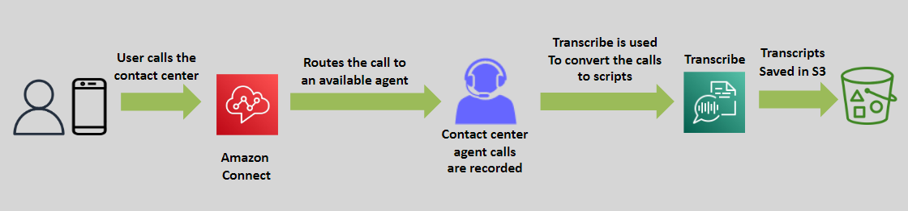
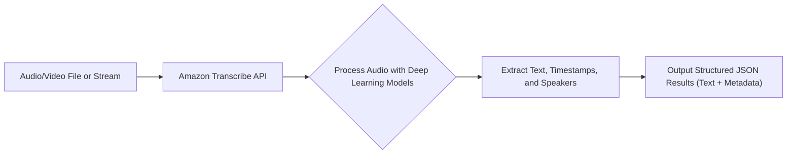

# 🤖 \(📺 🔉 ➔ 🧾\) **Amazon Transcribe: Turn Speech into Text at Scale**

> _Convert audio and video content into accurate, searchable, and actionable text — automatically._

---

    

---

## 🌟 **What is Amazon Transcribe?**

**Amazon Transcribe** is a **fully managed automatic speech recognition (ASR) service** that enables you to:

- 🎙️ Convert **recorded** or **live speech** into **high-quality text** automatically.
- 📄 Build applications with **subtitles**, **captions**, **meeting notes**, **analytics**, and **documentation**.
- 🚀 Scale effortlessly from a single recording to **millions of hours** of transcription.

✅ **Fast**, **scalable**, **real-time** transcription — powered by **deep learning**.

---

## ✨ **Key Features of Amazon Transcribe**

| Feature                          | Description                                                                |
| :------------------------------- | :------------------------------------------------------------------------- |
| 🎙️ **Speech-to-Text Conversion** | Accurately transcribes audio/video content into readable text.             |
| 🔧 **Custom Vocabulary**         | Teach Transcribe domain-specific terms (e.g., "EC2," "Kubernetes").        |
| 🛠️ **Custom Language Models**    | Enhance transcription accuracy for specialized industries or accents.      |
| 👤 **Speaker Identification**    | Detect and label multiple speakers automatically (Speaker Diarization).    |
| ⏱️ **Timestamping**              | Attach word-level or phrase-level timestamps for easy media syncing.       |
| ⚡ **Real-Time Transcription**   | Live stream transcription for chat support, video conferencing, and media. |
| 🔗 **Seamless AWS Integration**  | Works perfectly with Amazon S3, Lambda, Kinesis, and EventBridge.          |

✅ More than basic transcription — it's **intelligent speech processing**.

---

## 🛠️ **How Amazon Transcribe Works (Simplified Flow)**

✅ **Input ➔ Transcribe ➔ Output ➔ Use**

---

## 🎯 **Real-World Use Cases for Amazon Transcribe**

| Use Case                                  | Example                                                                             |
| :---------------------------------------- | :---------------------------------------------------------------------------------- |
| 🛎️ **Customer Support Call Analytics**    | Analyze recorded customer service calls for trends, satisfaction, and compliance.   |
| 🎥 **Media and Entertainment Subtitling** | Automatically generate captions for video-on-demand platforms and TV shows.         |
| 🎓 **Education and E-Learning**           | Create lecture transcripts to improve accessibility and student review materials.   |
| 🏥 **Healthcare Documentation**           | Capture and structure doctor-patient conversations securely for EHR systems.        |
| ♿ **Accessibility Solutions**            | Make content accessible for hearing-impaired audiences via live or static captions. |

✅ Improve **efficiency**, **reach**, and **compliance** across industries.

---

## 🔄 **Customization Options**

| Customization                       | How It Helps                                                                           |
| :---------------------------------- | :------------------------------------------------------------------------------------- |
| 📜 **Custom Vocabulary**            | Add specific terms, product names, jargon, or acronyms to boost accuracy.              |
| 🛠️ **Custom Language Models (CLM)** | Train domain-specific models for highly accurate transcription (e.g., legal, medical). |
| 🌐 **Multiple Language Support**    | Supports dozens of languages and dialects for global use.                              |

✅ **Tailor the transcription output** exactly to your business needs.

---

## 🤖 **Amazon Transcribe vs Amazon Lex (Important Distinction)**

| Feature                       | Amazon Transcribe            | Amazon Lex                                    |
| :---------------------------- | :--------------------------- | --------------------------------------------- |
| 🔥 **Primary Purpose**        | Speech-to-text transcription | Conversational AI (chatbots, voice bots)      |
| 🧠 **NLP Understanding**      | No (pure transcription)      | Yes (intent recognition, dialogue management) |
| 🎙️ **Speaker Detection**      | Supported (diarization)      | Not applicable                                |
| ⏩ **Real-Time Interaction**  | Real-time transcription      | Real-time conversation building               |
| 🧩 **Integration with Polly** | Not directly                 | Native (text-to-speech responses)             |

✅ **Transcribe = Listen and Write.**  
✅ **Lex = Listen, Understand, Respond.**

---

## 🚀 **Why Choose Amazon Transcribe?**

| Advantage                             | Why It Matters                                                                   |
| :------------------------------------ | :------------------------------------------------------------------------------- |
| 🎯 **Highly Accurate**                | Leverages deep learning models for natural, human-like transcription.            |
| ⚡ **Scalable and Fast**              | Handle live streams or petabytes of archived audio effortlessly.                 |
| 🔗 **Flexible and Easy to Integrate** | APIs, SDKs, and console workflows ready for any application.                     |
| 🛡️ **Security and Compliance**        | Data encryption at rest and in transit; HIPAA-eligible for healthcare use cases. |
| 💵 **Cost-Effective**                 | Pay-per-second pricing makes it affordable for startups to enterprises.          |

✅ **Build faster**, **analyze deeper**, and **reach more users** with voice-driven data.

---

## 🏆 **Final Smart Pro Tip**

> 🧠 **Use Amazon Transcribe with Amazon Comprehend** to **automatically analyze the sentiment, keywords, and topics** in your transcribed text ➔  
> Turning **speech → text → insights** — **all in one pipeline**!

✅ Speech + Text + Analysis = 🚀 **Supercharged intelligence workflows**
