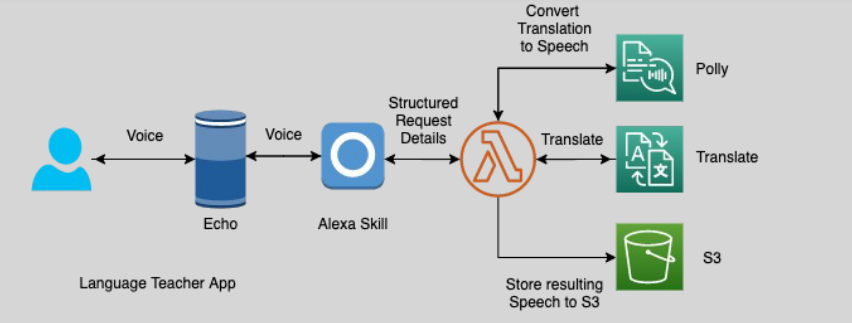

# 🗣️👧 **Amazon Alexa: Your Intelligent Voice Assistant**

> _Empowering users to interact with technology naturally through voice._

---

   

---

## 🌟 **What is Amazon Alexa?**

**Amazon Alexa** is a **cloud-based voice service** that enables users to:

- 🎙️ **Speak naturally** to control smart devices, access information, and perform tasks.
- 🧠 Leverage **AI-powered natural language understanding (NLU)** to interpret and respond intelligently.
- 🚀 Expand functionality through **custom skills** developed by third parties.

✅ Alexa powers popular devices like **Amazon Echo**, **Echo Dot**, **Echo Show**, and many **smart appliances**.

---

## ✨ **Key Features of Amazon Alexa**

| Feature                          | Description                                                                                     |
| :------------------------------- | :---------------------------------------------------------------------------------------------- |
| 🎙️ **Voice Interaction**         | Responds to natural language commands to perform tasks (music, weather, reminders, smart home). |
| 🛠️ **Custom Skills Development** | Extend Alexa’s capabilities using the **Alexa Skills Kit (ASK)**.                               |
| 📡 **Always Connected**          | Leverages cloud computing to stay updated, improve responses, and learn continuously.           |
| 🔗 **Smart Home Integration**    | Seamlessly controls lights, thermostats, locks, and other IoT devices.                          |

✅ A dynamic ecosystem that grows smarter over time.

---

## 🔥 **Popular Use Cases for Amazon Alexa**

| Use Case                              | Example                                                                                                    |
| :------------------------------------ | :--------------------------------------------------------------------------------------------------------- |
| 🏠 **Smart Home Automation**          | Voice control for lights, thermostats, door locks, and appliances.                                         |
| 🎵 **Entertainment Hub**              | Stream music, podcasts, audiobooks, and control TV content.                                                |
| 🛠️ **Productivity and Organization**  | Set timers, schedule meetings, maintain to-do lists, manage shopping lists.                                |
| 🎯 **Custom Enterprise Applications** | Build industry-specific bots (e.g., healthcare appointment scheduling, banking FAQs, educational quizzes). |

✅ Alexa **adapts** to both personal and professional needs.

---

## 🛠️ **Building Custom Alexa Skills**

You can **extend Alexa’s functionality** by creating **Custom Skills**:

| Step | Action                                                                |
| :--- | :-------------------------------------------------------------------- |
| 1️⃣   | Define an **Intent Schema** (what the user wants to do).              |
| 2️⃣   | Set up **Sample Utterances** (how users might phrase it).             |
| 3️⃣   | Implement a **Lambda function** or HTTPS endpoint to handle requests. |
| 4️⃣   | Return **structured responses** for Alexa to speak.                   |

✅ The **Alexa Skills Kit (ASK)** provides everything needed to create, test, and publish skills.

---

## 🚀 **Why Choose Amazon Alexa?**

| Advantage                              | Why It Matters                                                                 |
| :------------------------------------- | :----------------------------------------------------------------------------- |
| 🧠 **Intuitive Natural Interaction**   | Users can talk naturally without learning commands.                            |
| 🛠️ **Customizable and Extendable**     | Build custom experiences tailored to any industry.                             |
| 🌍 **Broad Device Ecosystem**          | Works across smart home devices, speakers, displays, and mobile apps.          |
| 🔄 **Continuous Updates and Learning** | Alexa evolves with new features, better language support, and improved skills. |

✅ **Flexibility + Scalability + Simplicity** make Alexa ideal for both consumers and businesses.

---

## 🏆 **Final Smart Pro Tip**

> 🧠 **Always think in terms of "conversational design"** —  
> When building Alexa Skills, design interactions that feel **natural**, **contextual**, and **personalized** to users.

✅ Great skills = **simple intents**, **rich responses**, and **smooth dialogs**.

---
