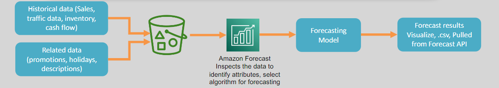
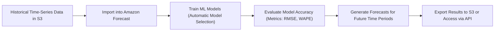

# 🤖📊 **AWS Forecast: Accurate Time-Series Predictions Made Easy**

> _Predict the future with the power of machine learning — no ML expertise required!_

---

   

---

## 🌟 **What is Amazon Forecast?**

**Amazon Forecast** is a **fully managed machine learning service** that:

- 📈 **Generates highly accurate time-series forecasts** based on historical data.
- 🧠 **Leverages deep learning** and **advanced statistical models** under the hood.
- 🚀 **Democratizes forecasting** — making it accessible without needing ML expertise.

✅ Built with the same technology used internally by Amazon.com for retail forecasting!

---

## ✨ **Key Features of Amazon Forecast**

| Feature                            | Description                                                               |
| :--------------------------------- | :------------------------------------------------------------------------ |
| ✅ **No ML Expertise Needed**      | Build complex forecasting models without coding ML algorithms.            |
| ⚡ **Fully Managed Service**       | No infrastructure setup — just upload data and forecast.                  |
| 📂 **Easy Data Integration**       | Pull data from Amazon S3; export forecasts back to S3 or access via APIs. |
| 🌍 **Wide Industry Applicability** | Retail, finance, healthcare, energy, logistics, and more.                 |
| 📈 **Automated Model Selection**   | Forecast automatically chooses the best algorithm based on your data.     |
| 🔄 **Continuous Updates**          | Re-train models as new data becomes available for even better accuracy.   |

✅ Powerful forecasting made **simple and practical** for any business!

---

## 🧠 **How Amazon Forecast Works (Simplified Flow)**

✅ **Upload ➔ Train ➔ Evaluate ➔ Predict ➔ Use**

---

## 📚 **Real-World Use Case Examples**

| Industry           | Use Case                                                                         |
| :----------------- | :------------------------------------------------------------------------------- |
| 🛍️ **Retail**      | Forecast product demand to optimize inventory levels.                            |
| 💳 **Finance**     | Predict future cash flows, credit usage, or revenue trends.                      |
| 🚚 **Logistics**   | Plan fleet capacity and warehouse staffing based on forecasted shipment volumes. |
| 🏥 **Healthcare**  | Anticipate patient admission rates and allocate hospital resources.              |
| ⚡ **Energy**      | Forecast energy demand to optimize generation and grid management.               |
| 🌦️ **Agriculture** | Predict rainfall patterns to plan irrigation and crop yields.                    |

✅ Forecasting transforms **reactive decisions into proactive planning**.

---

## 🎯 **Benefits of Using Amazon Forecast**

| Benefit                           | Why It Matters                                                                   |
| :-------------------------------- | :------------------------------------------------------------------------------- |
| 📈 **Highly Accurate**            | ML models typically outperform traditional forecasting techniques.               |
| 🧠 **Simplifies Complex Science** | No need to understand neural networks or time-series modeling to use it.         |
| 🚀 **Scalable**                   | From small datasets to massive, multi-year corporate histories.                  |
| 🔄 **Customizable**               | Fine-tune models with additional metadata (e.g., holidays, promotions, weather). |
| 💵 **Cost-Effective**             | Pay only for what you use (data processing, training, and forecasting).          |

✅ Focus on **making better decisions** — not on building forecasting infrastructure.

---

## 📋 **Typical Forecasting Workflow with Amazon Forecast**

| Step                           | Description                                                                                        |
| :----------------------------- | :------------------------------------------------------------------------------------------------- |
| 1️⃣ **Prepare Data**            | Upload historical time-series data (and optional related datasets) to Amazon S3.                   |
| 2️⃣ **Import and Analyze Data** | Create datasets and dataset groups in Forecast.                                                    |
| 3️⃣ **Train Models**            | Forecast auto-selects and trains the best model for your data.                                     |
| 4️⃣ **Evaluate Accuracy**       | Analyze metrics like RMSE (Root Mean Squared Error) and WAPE (Weighted Absolute Percentage Error). |
| 5️⃣ **Deploy and Forecast**     | Use your model to forecast future values and export predictions.                                   |

✅ Very **streamlined** and **repeatable** for ongoing forecasting needs.

---

## 🏆 **Final Smart Pro Tip**

> 🧠 **Always enrich your time-series data with related features** (holidays, promotions, price changes) —  
> This dramatically improves the forecasting accuracy!

✅ Example:

- Predict sales → Add “Black Friday” or “Discount Event” metadata ➔ Model learns sales spikes!
