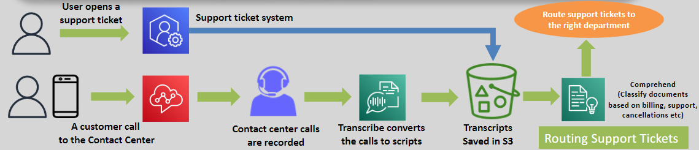
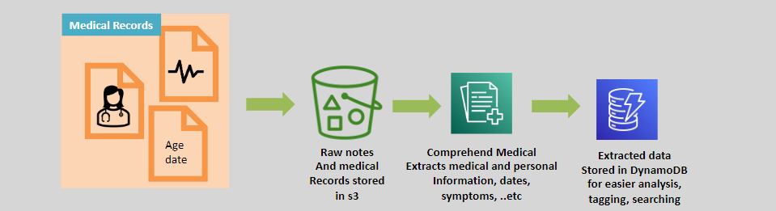

# 🧠 **Amazon Comprehend: Unlock Insights from Text**

> _Transform unstructured text into actionable intelligence — no machine learning expertise required._

---

   

---

## 🌟 **What is Amazon Comprehend?**

**Amazon Comprehend** is a **fully managed Natural Language Processing (NLP) service** that helps you:

- 🧠 Extract **entities**, **key phrases**, **language**, **events**, and **sentiments** from text.
- 📜 Analyze large volumes of **unstructured data** (documents, reviews, social media).
- 🚀 Integrate insights easily into your applications with **no prior ML knowledge needed**.

✅ Built to **unlock hidden meaning** and **automate text analysis workflows** across industries.

---

## ✨ **Key Features of Amazon Comprehend**

| Feature                      | Description                                                             |
| :--------------------------- | :---------------------------------------------------------------------- |
| 📋 **Entity Detection**      | Identify people, places, organizations, events, dates, quantities, etc. |
| 😀 **Sentiment Analysis**    | Determine if text is positive, negative, neutral, or mixed.             |
| 📝 **Key Phrase Extraction** | Pull important concepts from large texts automatically.                 |
| 🧬 **Language Detection**    | Detects the language of input text automatically.                       |
| 🏷️ **Text Classification**   | Organize documents into custom or built-in categories.                  |
| 🧩 **Syntax Analysis**       | Break down text grammatically (parts of speech tagging).                |

✅ Comprehensive suite for **understanding any kind of text**.

---

## 🔗 **Integration with AWS Services**

| Service                  | Purpose                                                      |
| :----------------------- | :----------------------------------------------------------- |
| 📦 **Amazon S3**         | Store and manage input text and analysis outputs.            |
| ⚙️ **AWS Lambda**        | Build serverless pipelines that trigger on document uploads. |
| 📊 **Amazon QuickSight** | Visualize trends and sentiments from extracted insights.     |
| 🔒 **AWS IAM**           | Securely manage who can access and analyze text data.        |

✅ Easily **build intelligent workflows** around your unstructured data.

---

## 🎯 **Common Use Cases for Amazon Comprehend**

| Use Case                            | Example                                                            |
| :---------------------------------- | :----------------------------------------------------------------- |
| 📱 **Social Media Monitoring**      | Analyze tweets and posts for sentiment and brand mentions.         |
| 📚 **Document Indexing and Search** | Tag documents automatically for faster retrieval.                  |
| 🛍️ **Customer Feedback Analysis**   | Discover trends in product reviews and customer surveys.           |
| 🏢 **Content Categorization**       | Organize large datasets into relevant topics or departments.       |
| 🔍 **Legal Document Review**        | Extract important clauses, names, and dates for faster processing. |

✅ **Turn chaos into clarity** with automatic text understanding.

---

## 🏥 **Amazon Comprehend Medical**

   

---

### 🏥 **What is Amazon Comprehend Medical?**

**Amazon Comprehend Medical** extends Comprehend's capabilities to the **healthcare and life sciences domain**:

- 📋 Extracts medical terms like **conditions**, **medications**, **treatments**, and **anatomy references**.
- 🚑 Detects **Personal Health Information (PHI)** for compliance and privacy protection.
- 🩺 Structures **free-text clinical documents** into machine-readable data formats.

✅ Built to **accelerate clinical insights** and **protect sensitive data**.

---

### 🩺 **Key Features of Comprehend Medical**

| Feature                          | Description                                                                  |
| :------------------------------- | :--------------------------------------------------------------------------- |
| 💊 **Medical Entity Detection**  | Extract medical conditions, tests, treatments, and procedures.               |
| 🧑‍⚕️ **PHI Identification**     | Locate and manage sensitive health data for HIPAA compliance.                |
| 🏥 **Clinical Data Structuring** | Turn handwritten doctor notes or hospital reports into searchable databases. |

✅ From **unstructured EHRs** to **structured analytics** in minutes.

---

### 🎯 **Use Cases for Comprehend Medical**

| Use Case                                       | Example                                                                            |
| :--------------------------------------------- | :--------------------------------------------------------------------------------- |
| 🏥 **Electronic Health Record (EHR) Analysis** | Extract patient conditions, allergies, medications automatically.                  |
| 🔒 **Privacy Protection**                      | Find and redact PHI to protect patient data in healthcare systems.                 |
| 🧠 **Healthcare Insights**                     | Detect disease trends and optimize treatment plans by analyzing medical histories. |

✅ **Faster, safer, smarter healthcare** driven by AI.

---

## 🚀 **Why Choose Amazon Comprehend?**

| Advantage                        | Why It Matters                                                       |
| :------------------------------- | :------------------------------------------------------------------- |
| 🧠 **No ML Experience Required** | Pre-trained, powerful NLP models ready to use.                       |
| 🚀 **Highly Scalable**           | Analyze millions of documents without worrying about infrastructure. |
| 🔗 **Seamless Integration**      | Works with AWS services and your custom applications.                |
| 💵 **Cost-Effective**            | Pay only for what you process (no servers, no upfront costs).        |

✅ Focus on **gaining insights**, not on **building NLP pipelines**.

---

## 🏆 **Final Smart Pro Tip**

> 🧠 **Always enrich your analysis by combining structured metadata with extracted insights** —  
> For example:
>
> - Combine extracted customer sentiments + product IDs = **targeted marketing opportunities**!
> - Combine extracted clinical conditions + dates = **trend prediction for better healthcare outcomes**!

✅ The **real power** comes from **contextualizing** what Comprehend extracts.
