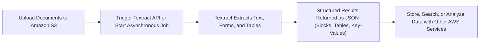

# 📄 **Amazon Textract: Intelligent Document Processing**

> _Extract text, tables, forms, and structured data from scanned documents automatically using machine learning._

---

    

---

## 🌟 **What is Amazon Textract?**

**Amazon Textract** is a **fully managed machine learning service** that enables you to:

- 🧠 Extract **printed** or **handwritten text**, **forms**, and **tables** from documents without manual review.
- 📄 Understand **contextual relationships** between data fields (like "Name" ➔ "John Doe").
- 🚀 Turn **scanned images**, **PDFs**, and **photos** into **machine-readable structured data** automatically.

✅ Built to **replace manual document processing** with **fast, scalable automation**.

---

## ✨ **Key Features of Amazon Textract**

| Feature                           | Description                                                                                |
| :-------------------------------- | :----------------------------------------------------------------------------------------- |
| 📝 **Text Detection**             | Detect and extract typed or handwritten words, lines, and paragraphs from images and PDFs. |
| 📋 **Structured Data Extraction** | Automatically extract data from forms (key-value pairs) and complex tables.                |
| 🔗 **API Access**                 | Use APIs to programmatically extract, analyze, and store document data.                    |
| ⚡ **Scalable and Serverless**    | No infrastructure management needed — scale up document processing instantly.              |
| 🔒 **Security Built-In**          | Supports encryption, access control, and compliance for sensitive documents.               |

✅ **Not just OCR** — it **understands document structure** intelligently!

---

## 🛠️ **How Amazon Textract Works (Simplified Flow)**

✅ **Scan ➔ Extract ➔ Store ➔ Automate**

---

## 🎯 **Popular Use Cases for Amazon Textract**

| Use Case                                        | Example                                                                       |
| :---------------------------------------------- | :---------------------------------------------------------------------------- |
| 🔍 **Intelligent Search Indexing**              | Create searchable digital libraries of contracts, manuals, and reports.       |
| 🧾 **Automated Invoice and Receipt Processing** | Extract payment amounts, vendor names, and due dates for financial systems.   |
| 🛡️ **Compliance and Audits**                    | Quickly retrieve relevant documents and structured data for audit purposes.   |
| 📝 **Form Processing**                          | Extract fields from insurance claims, bank applications, or healthcare forms. |
| 📊 **Data Migration Projects**                  | Digitize historical paper records into databases automatically.               |

✅ Save **thousands of hours** in manual processing!

---

## 📊 **What Data Types Textract Can Extract**

| Data Type                           | What It Captures                                                          |
| :---------------------------------- | :------------------------------------------------------------------------ |
| 📄 **Words, Lines, and Paragraphs** | Raw text for indexing and search.                                         |
| 🧾 **Key-Value Pairs**              | Form fields like Name ➔ John Doe, SSN ➔ 123-45-6789.                      |
| 📋 **Tables**                       | Understands columns, rows, and cell relationships automatically.          |
| ✍️ **Handwritten Content**          | Accurately extracts cursive and printed handwriting from forms and notes. |

✅ Structured, usable data — ready for apps, dashboards, and workflows.

---

## 🎯 Use Cases

    

1. **Intelligent Search Index:**

   - Create searchable indexes from document repositories.

2. **Automated Data Capture:**

   - Extract information from invoices, receipts, and forms for processing.

3. **Scalable Document Analysis:**
   - Analyze contracts, reports, and financial statements at scale.

---

## 🔗 **Integrations with Other AWS Services**

| AWS Service              | Integration Purpose                                                |
| :----------------------- | :----------------------------------------------------------------- |
| 📦 **Amazon S3**         | Store scanned documents and extracted data.                        |
| ⚙️ **AWS Lambda**        | Trigger document processing automatically when files are uploaded. |
| 🧠 **Amazon Comprehend** | Analyze extracted text for sentiment, topics, and entities.        |
| 📈 **Amazon QuickSight** | Build visual reports from structured document data.                |

✅ Combine services to build **powerful automation pipelines**!

---

## 🚀 **Why Choose Amazon Textract?**

| Advantage                          | Why It Matters                                                                     |
| :--------------------------------- | :--------------------------------------------------------------------------------- |
| 🛠️ **Automation-First Approach**   | Eliminate manual document review and data entry.                                   |
| 🎯 **High Accuracy**               | Uses deep learning to understand layouts, handwriting, and structured fields.      |
| 🔗 **Easy Integration**            | Works seamlessly with your AWS apps and custom systems via APIs.                   |
| 📈 **Scalability and Flexibility** | Handle small projects or large, continuous document flows without scaling worries. |
| 💵 **Cost-Efficient**              | Pay only for pages processed — no licensing fees or setup costs.                   |

✅ **Intelligent document processing** — **at cloud speed and scale**.

---

## 🏆 **Final Smart Pro Tip**

> 🧠 **Use Amazon Textract asynchronous jobs** (`StartDocumentTextDetection` and `StartDocumentAnalysis`) for large documents or batch processing ➔  
> They are more efficient and **reduce request timeout risks** compared to synchronous APIs!

✅ **Batch mode = better performance** for enterprise-scale document handling!
