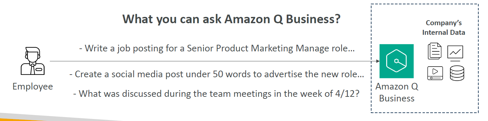
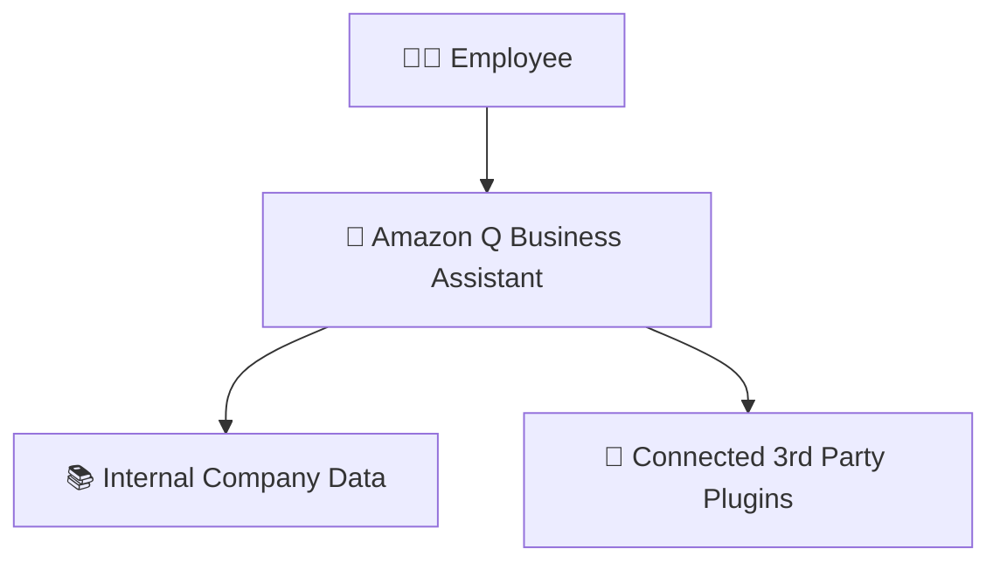
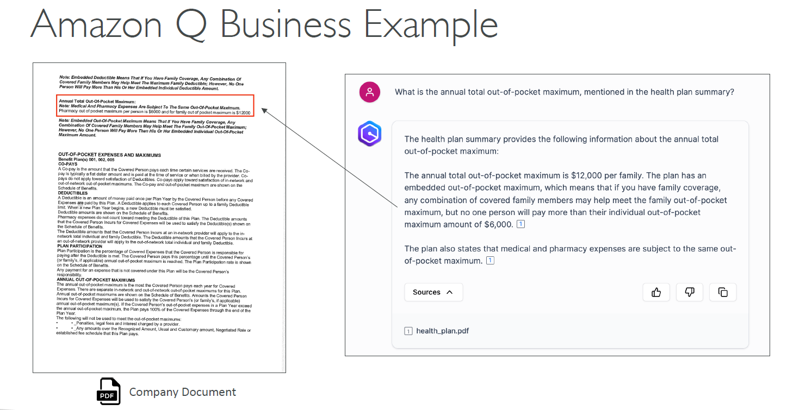
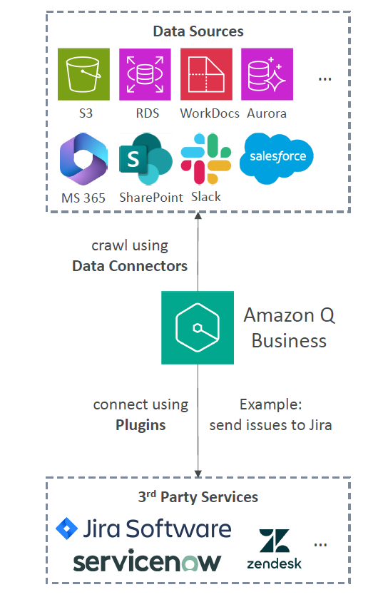
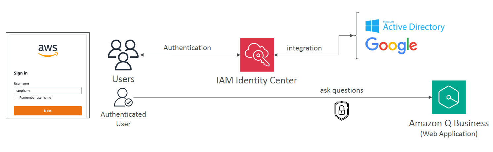
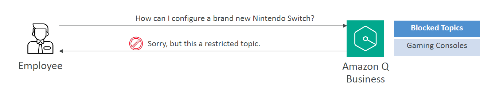

# 🧠 Amazon Q Business: Enterprise Gen-AI Assistant

## 🧠 What is Amazon Q Business?

> **Definition**:  
> **Amazon Q Business** is a **fully managed Generative AI assistant** designed specifically for **companies** to **boost employee productivity** by answering questions, summarizing content, automating tasks, and generating new content — all based on the company’s internal knowledge and data.

---

  

---

📌 **Simply**:

- It's like having a **private ChatGPT** tailored only for your company 📚🏢.
- Employees can **ask**, **create**, **summarize**, **automate** — securely, using **company-approved data**.

📌 **Key Highlights**:

| Feature                  | Benefit                                                   |
| :----------------------- | :-------------------------------------------------------- |
| Company Data Integration | Answers based on internal documents and data              |
| Automation               | Perform routine tasks (like submitting time-off requests) |
| Summarization            | Summarize meeting notes, project documents, PDFs          |
| Content Generation       | Draft emails, social posts, reports                       |
| Security                 | Restrict access based on user's permissions               |

📌 **Simple Rule**:

> "**Your company brain 🧠, powered by Generative AI 🚀 — secure, private, and smart.**"

---

## 🎯 What Can Employees Do with Amazon Q Business?

📌 **Typical Requests**:

| Example Request                                                    | Output                      |
| :----------------------------------------------------------------- | :-------------------------- |
| "Write a job posting for a Senior Product Marketing Manager."      | Full job description draft  |
| "Create a 50-word social media post about our new product launch." | Marketing-ready post        |
| "Summarize team meetings from the week of April 12th."             | Clear meeting notes summary |
| "Submit a time-off request for next Friday."                       | Automated action via Plugin |

📌 **Real-World Example**:

- You upload **project reports** ➔
- Employees can now **ask** Amazon Q:
  > "What were the key risks identified in last quarter’s project review?"  
  > and get an **instant smart summary**! ✍️

---

## 🛠️ Core Architecture of Amazon Q Business

---

📌 **Behind the Scenes**:

- Built on **Amazon Bedrock** infrastructure 🏗️.
- You **cannot pick the underlying Foundation Model (FM)** manually —  
  Amazon handles the FM selection optimized for business queries.

📌 **Why It’s Different**:

- Unlike public chatbots, **Amazon Q Business stays inside your company walls** 🛡️.
- No leaking of sensitive information into public models.

---

    

---

## 🔗 Data Connectors: Fully Managed Retrieval-Augmented Generation (RAG)

    

---

📌 **How Amazon Q Business Connects to Data**:

| Source Type       | Examples                                                          |
| :---------------- | :---------------------------------------------------------------- |
| AWS Sources       | S3, RDS, Aurora, WorkDocs                                         |
| External Services | Microsoft 365, Salesforce, Google Drive, Gmail, Slack, SharePoint |

📌 **Built-in Connectors**:

- **40+ popular enterprise apps** supported 📚🔌.
- No need to manually upload files — **live connection** with syncing.

📌 **Real-World Example**:

- Connect SharePoint ➔ Crawl all HR policies ➔ Employees can now ask:
  > "What is the current maternity leave policy?"  
  > and Q Business instantly fetches the right information!

📌 **Plugins Let Q Business Take Action**:

| Plugin         | Example Use                                 |
| :------------- | :------------------------------------------ |
| Jira           | Create or assign issues                     |
| ServiceNow     | Submit IT service tickets                   |
| Salesforce     | Update customer records                     |
| Custom Plugins | Connect to any API (e.g., internal HR tool) |

- Build your own plugins connecting to **any internal service API**!

---

## 🔐 Security and IAM Identity Center Integration

    

---

📌 **Authentication and Authorization**:

| Security Feature                             | Benefit                                          |
| :------------------------------------------- | :----------------------------------------------- |
| IAM Identity Center                          | Authenticate users                               |
| Access Controls                              | Users only see data they are permitted to access |
| Integration with External Identity Providers | Use Google Login, Microsoft AD, etc.             |

📌 **Real-World Example**:

- A sales employee can query CRM records,
- A finance employee can query invoices,
- But neither can see **each other's private data** —  
  thanks to **IAM permissions**! 🔐

---

## 🛡️ Admin Controls and Guardrails

    

---

📌 **Customizations for Organizations**:

| Control                 | Purpose                                    |
| :---------------------- | :----------------------------------------- |
| Block Words             | E.g., prevent mentioning competitors       |
| Block Topics            | E.g., prevent asking about gaming consoles |
| Internal Knowledge Only | Disable external web search                |

📌 **Granular Controls**:

- **Global Policies** (apply to all users).
- **Topic-Level Policies** (specific contexts).

📌 **Example**:

- If someone asks:
  > "How to configure a Nintendo Switch?"  
  > Amazon Q Business responds:
  > "Sorry, but this is a restricted topic." 🚫

📌 **Benefit**:

- **Stay safe**, **on-brand**, and **focused** internally.

---

## ✍️ Mini Smart Recap

| Capability               | Purpose                            |
| :----------------------- | :--------------------------------- |
| 🤖 Answer Questions      | From company’s data                |
| ✍️ Generate Content      | Emails, social posts, summaries    |
| 🛠️ Automate Actions      | Submit requests via plugins        |
| 🔌 Connect to Data       | Live connectors to 40+ services    |
| 🔐 Enforce Security      | IAM and guardrails                 |
| 📈 Increase Productivity | Employees work smarter, not harder |

📌 **Simple Rule**:

> "**All your company knowledge — one intelligent assistant, under your control.**" 🏢🤖
