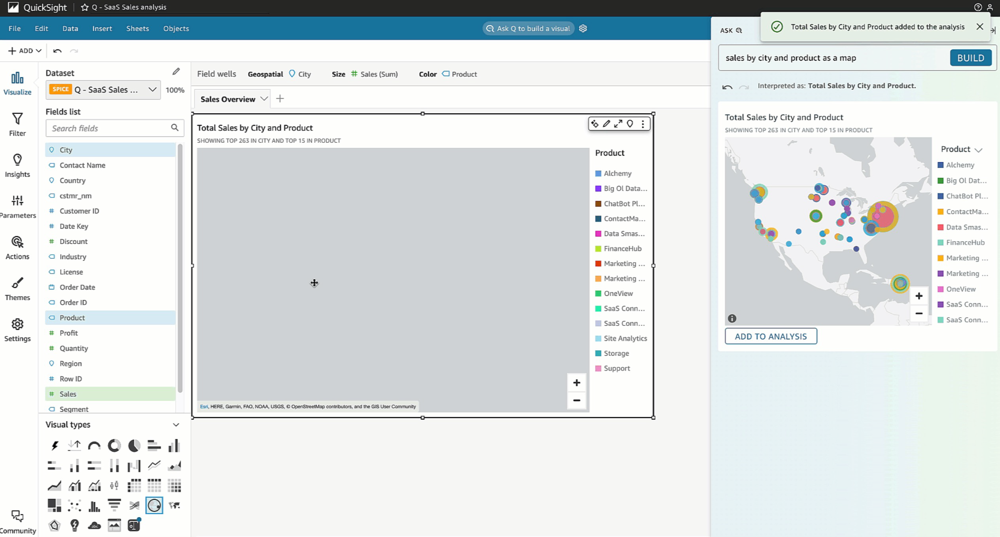
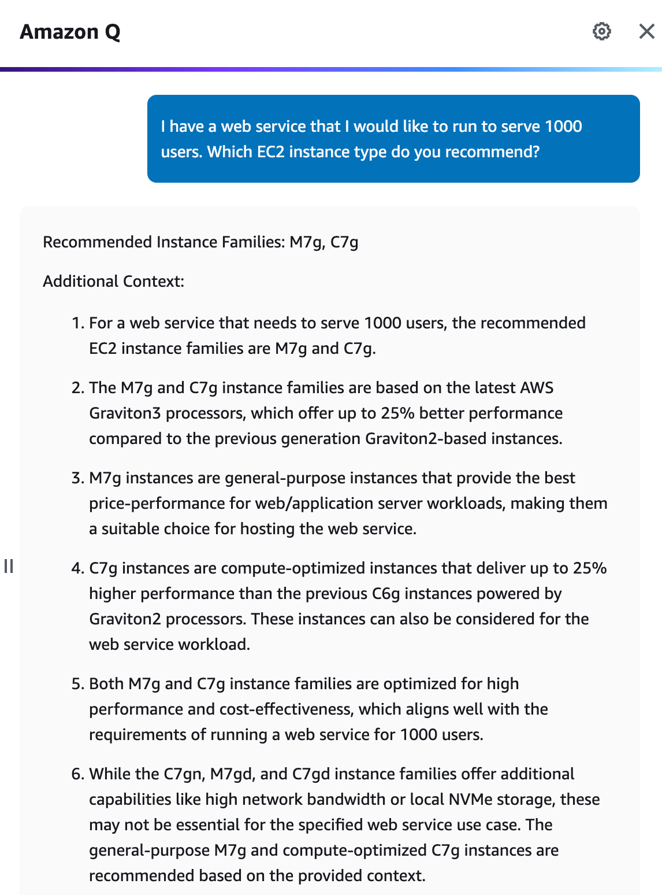
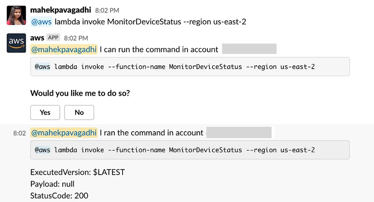
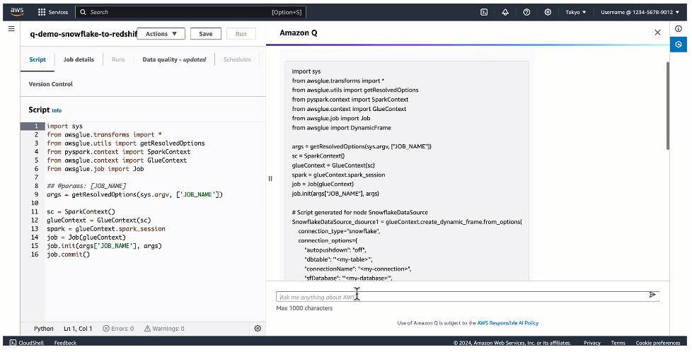

# 🧠 Amazon Q for AWS Services

## 🧠 What is Amazon Q for AWS Services?

> **Definition**:  
> **Amazon Q for AWS Services** is an extension of the Amazon Q family, providing **natural language-powered help** across **specific AWS services**.  
> It helps **answer questions**, **recommend configurations**, **generate scripts**, **resolve errors**, and even **troubleshoot infrastructure issues** —  
> **directly inside the context** of services like QuickSight, EC2, Glue, and AWS Chatbot.

📌 **Simply**:

- Think of it like having **a dedicated AWS expert** inside each service 🧠💬.
- You **ask in plain English**, it **guides you, suggests fixes, generates code, or configures your services** — all **context-aware**.

📌 **Key Highlights**:

| Service Integrated | What Amazon Q Can Do                                |
| :----------------- | :-------------------------------------------------- |
| QuickSight         | Summarize, visualize, and answer data questions     |
| EC2                | Recommend instance types based on workload          |
| AWS Chatbot        | Help troubleshoot AWS issues from Slack/Teams       |
| AWS Glue           | Answer ETL questions, generate code, fix job errors |

📌 **Simple Rule**:

> "**Speak human, act cloud-native.**" 🧠☁️

---

## 📊 Amazon Q for QuickSight

📌 **Amazon QuickSight** is AWS's data visualization and dashboard service 📈.

---

  

---

📌 **What Amazon Q does inside QuickSight**:

| Capability          | Description                                            |
| :------------------ | :----------------------------------------------------- |
| Data Q&A            | Ask questions like "What were the sales last quarter?" |
| Executive Summaries | Automatically summarize key trends in your dashboard   |
| Visual Creation     | Auto-generate charts, graphs, tables                   |
| Visual Editing      | Refine or adjust existing dashboard visuals            |

📌 **Real-World Example**:

- You type:
  > "Show me monthly revenue trends over the last year grouped by region."
- Amazon Q **creates** the visual instantly in QuickSight.

📌 **Benefit**:

- **No need to know SQL or dashboard building** —  
  **talk and visualize** your data instantly. 🎯

---

## 💻 Amazon Q for EC2

📌 **Amazon EC2** (Elastic Compute Cloud) provides virtual servers for your apps.

---

  

---

📌 **What Amazon Q does for EC2**:

| Capability              | Description                                                 |
| :---------------------- | :---------------------------------------------------------- |
| Instance Recommendation | Suggest best-fit EC2 instance types                         |
| Requirement Analysis    | Understand your workload needs via natural language         |
| Architecture Advice     | Recommend architectures based on cost, performance, scaling |

📌 **Real-World Example**:

- You say:
  > "I need a server for a memory-intensive machine learning application with moderate traffic."
- Amazon Q recommends:
  - r7g.large or r6i.large EC2 instances,
  - Suggests reserved instances if workload is steady!

📌 **Benefit**:

- **Select the right instance without digging into documentation for hours.**

---

## 🛠️ Amazon Q for AWS Chatbot

📌 **AWS Chatbot** lets you interact with AWS services directly from **Slack** or **Microsoft Teams**.

---

  

---

📌 **What Amazon Q adds inside Chatbot**:

| Capability              | Description                                       |
| :---------------------- | :------------------------------------------------ |
| Incident Response       | Help troubleshoot alarms and security issues      |
| Service Help            | Explain AWS service behaviors or usage            |
| Remediation Suggestions | Recommend next actions to fix issues              |
| Billing and Support     | Help with billing queries or open support tickets |

📌 **Real-World Example**:

- You get a CloudWatch alarm alert in Slack.
- You ask Amazon Q:
  > "How do I fix a spike in Lambda duration?"
- Amazon Q explains causes (cold starts, concurrency limits) and suggests actions!

📌 **Benefit**:

- **Accelerate incident handling without leaving your chat window**. 🚀

---

## 🔄 Amazon Q for AWS Glue

📌 **AWS Glue** is a managed ETL (Extract, Transform, Load) service for data integration 📚➡️🛢️.

---

  

---

📌 **What Amazon Q does inside Glue**:

| Capability            | Description                                                            |
| :-------------------- | :--------------------------------------------------------------------- |
| ETL Chatbot           | Answer "What is Glue DynamicFrame?" or "How to partition Glue tables?" |
| Code Generation       | Generate Glue ETL scripts automatically                                |
| Error Troubleshooting | Analyze Glue job errors and give step-by-step fixes                    |
| Documentation Links   | Direct quick access to official Glue docs                              |

📌 **Real-World Example**:

- You ask:
  > "Generate a Glue Python script to move data from S3 to Redshift."
- Amazon Q creates the ETL script you can deploy immediately!

📌 **Troubleshooting Example**:

- A Glue job fails with "Access Denied."
- Amazon Q explains it might be missing IAM permissions and points you to the exact permission fix!

📌 **Benefit**:

- **Faster ETL building** + **smarter error fixing** —  
  no more endless AWS Glue debugging headaches. 🎯

---

## ✍️ Mini Smart Recap

| Service        | What Amazon Q Helps You Do                       |
| :------------- | :----------------------------------------------- |
| 📊 QuickSight  | Summarize and visualize data in natural language |
| 💻 EC2         | Recommend and configure instance types           |
| 💬 AWS Chatbot | Troubleshoot AWS issues directly in Slack/Teams  |
| 🔄 AWS Glue    | Generate ETL code, fix jobs, and understand Glue |

📌 **Simple Rule**:

> "**With Amazon Q for AWS Services —  
> talk to your cloud, and your cloud will work for you.**" 🧠☁️🚀
