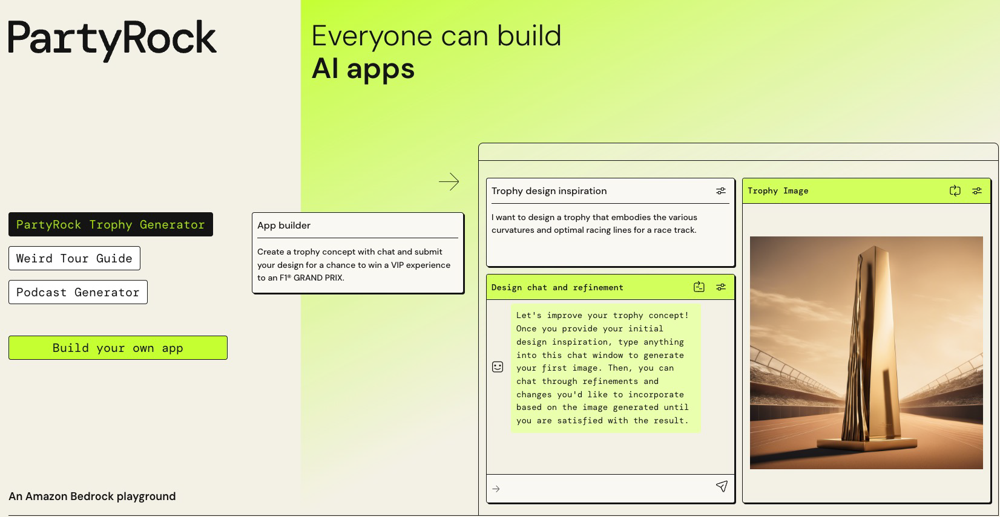

# 🎉 PartyRock: GenAI App Playground

## 🧠 What is PartyRock?

> **Definition**:  
> **PartyRock** is a **fun, no-code GenAI app-building playground** powered by **Amazon Bedrock**.  
> It lets you **experiment with building Generative AI applications** using various Foundation Models (FMs) —  
> **without needing any AWS account, setup, or coding skills**!

---

    

---

📌 **Simply**:

- Think of PartyRock as a **"sandbox"** where you can **build AI apps like Lego blocks** 🧱✨.
- Just **drag, drop, and describe** — the app is live instantly!

📌 **Key Highlights**:

| Feature                   | Benefit                                                  |
| :------------------------ | :------------------------------------------------------- |
| No AWS Account Needed     | Anyone can start building immediately                    |
| No Coding Required        | Full visual interface                                    |
| Powered by Amazon Bedrock | Access multiple powerful Foundation Models               |
| Easy and Fun              | Like Amazon Q Apps, but lighter and even faster to start |

📌 **Simple Rule**:

> "**If you can think it, you can build it — instantly, for free, and for fun.**" 🎯

---

## 🎨 What You Can Do with PartyRock

📌 **Use Cases**:

| Idea                             | Example                            |
| :------------------------------- | :--------------------------------- |
| Create a text-to-image generator | "Generate a fantasy landscape"     |
| Build a chat assistant           | "Create a workout coach chatbot"   |
| Make a data summarizer           | "Summarize a product review page"  |
| Develop a content idea generator | "Suggest viral TikTok video ideas" |

📌 **Real-World Example**:

- In 5 minutes, you can build:
  - A **startup idea generator**,
  - A **meme caption maker**,
  - A **customer review summarizer** —  
    all **without coding anything**! 🚀

---

## ✍️ Mini Smart Recap

| Concept                     | Quick Fact                          |
| :-------------------------- | :---------------------------------- |
| 🎉 PartyRock                | No-code playground to build AI apps |
| ⚡ Powered by               | Amazon Bedrock (Foundation Models)  |
| 🧑‍💻 Coding Skills Needed? | None!                               |
| 🆓 AWS Account Needed?      | No!                                 |

📌 **Simple Rule**:

> "**PartyRock = GenAI made fun, simple, and accessible to everyone.**" 🎉🚀

---

## 🎯 Where to Try PartyRock?

👉 Visit: [https://partyrock.aws/](https://partyrock.aws/)  
_(and start building magic in seconds!)_
