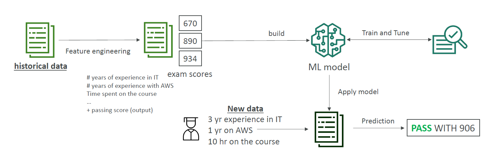

# 🧠 1. Introduction to Amazon SageMaker

---

## 📚 What is Amazon SageMaker?

> **Definition**:  
> **Amazon SageMaker** is a **fully managed machine learning service** provided by AWS.  
> It allows developers and data scientists to **build**, **train**, **tune**, **deploy**, and **monitor** ML models at scale — without worrying about the heavy lifting of infrastructure.

📌 **Simply**:

- No need to manually **provision servers** 🔧.
- No need to worry about **scaling, security, monitoring** 🛡️.
- You can manage the **entire machine learning lifecycle** from a **single platform**.

📌 **Key Benefits**:

| Feature        | Benefit                                                        |
| :------------- | :------------------------------------------------------------- |
| Fully Managed  | AWS handles all the infrastructure behind the scenes           |
| Scalable       | Automatically scales up/down based on your needs               |
| Cost-Efficient | Pay for what you use, with serverless and auto-scaling options |
| Integrated     | Works with S3, Athena, Redshift, CloudWatch, IAM, and more     |
| End-to-End     | Covers everything from data preparation to model deployment    |

📌 **Supported Users**:

- Developers 👨‍💻
- Data Scientists 📊
- Machine Learning Engineers 🤖
- MLOps Teams 🚀

---

## 🏛️ End-to-End Machine Learning Lifecycle with SageMaker

Amazon SageMaker provides a **complete ML workflow**:

```mermaid
flowchart TD
    DataCollection[📦 1. Collect & Prepare Data]
    FeatureEngineering[🛠️ 2. Feature Engineering]
    ModelTraining[🏗️ 3. Build and Train Model]
    ModelTuning[🎯 4. Tune Hyperparameters]
    ModelDeployment[🚀 5. Deploy Model]
    ModelMonitoring[🛡️ 6. Monitor & Debug Model]

    DataCollection --> FeatureEngineering
    FeatureEngineering --> ModelTraining
    ModelTraining --> ModelTuning
    ModelTuning --> ModelDeployment
    ModelDeployment --> ModelMonitoring
```

---

### 📦 1. Collect & Prepare Data

- Gather data from databases, cloud storage (like S3), or real-time streams.
- Clean, transform, and preprocess it.
- Use SageMaker Data Wrangler for an easy interface.

---

### 🛠️ 2. Feature Engineering

- Create new features that better represent the problem to improve model performance.
- Store reusable features in the SageMaker Feature Store.

---

### 🏗️ 3. Build and Train Model

- Train models using built-in algorithms, custom scripts, or bring-your-own-models.
- Use CPU, GPU, or distributed training options easily.

---

### 🎯 4. Tune Hyperparameters

- Optimize learning rate, batch size, regularization, and other hyperparameters.
- Use SageMaker Automatic Model Tuning (AMT) to automate this process.

---

### 🚀 5. Deploy Model

- Deploy models easily to endpoints for **real-time**, **serverless**, **batch**, or **async** inference.
- Choose server types (CPU/GPU), enable autoscaling, and monitor health.

---

### 🛡️ 6. Monitor and Debug Model

- Continuously monitor models for **data drift**, **prediction quality**, and **bias** using SageMaker Model Monitor and Clarify.
- Re-train models when needed based on monitoring feedback.

---

## 🎯 Example Use Case: Predicting AWS Exam Scores

    

---

### 🧩 Problem

> Predict someone's AWS exam score based on their background and preparation data.

---

### 📦 Step 1: Collect Historical Data

| Experience in IT | Experience in AWS | Hours Spent on Course | Final Score |
| :--------------- | :---------------- | :-------------------- | :---------- |
| 3 years          | 1 year            | 10 hours              | 906         |
| 5 years          | 3 years           | 20 hours              | 890         |
| 2 years          | 0 years           | 5 hours               | 670         |

✅ Store this data in **Amazon S3**.

---

### 🛠️ Step 2: Feature Engineering

- Extract meaningful features like:
  - Total years of experience
  - AWS-specific experience
  - Study hours

✅ Use **Data Wrangler** to clean and transform features.

---

### 🏗️ Step 3: Build and Train Model

- Select a **regression algorithm** (e.g., XGBoost).
- Launch a training job using SageMaker's built-in algorithms.

✅ SageMaker provisions instances, trains the model, and stores the output.

---

### 🎯 Step 4: Tune Hyperparameters

- Optimize parameters like **learning rate** and **tree depth**.
- Use **Automatic Model Tuning** (AMT) to find the best settings.

---

### 🚀 Step 5: Deploy Model

- Create a **real-time endpoint** on SageMaker.
- Automatically scales based on traffic.

---

### 🛡️ Step 6: Monitor and Improve

- Use **Model Monitor** to track prediction quality.
- If prediction accuracy drops, re-train with new data!

---

✅ **Result**:
When a new user comes in with:

- 4 years IT experience
- 1 year AWS experience
- 15 hours study

The model predicts:

> "**Pass with a score of 892**" 🎉

---

## ✍️ Mini Smart Recap

| Step                   | What Happens                       |
| :--------------------- | :--------------------------------- |
| Define Problem         | What are we predicting?            |
| Collect & Prepare Data | S3 + Data Wrangler                 |
| Build Model            | Built-in algorithms                |
| Tune Model             | Automatic Model Tuning (AMT)       |
| Deploy Model           | Real-time endpoint                 |
| Monitor Model          | Track prediction quality over time |
