# 📚 3. SageMaker Built-in Algorithms

## 🧠 What are SageMaker Built-in Algorithms?

> **Definition**:  
> **SageMaker Built-in Algorithms** are **pre-optimized, ready-to-use machine learning models** that AWS provides inside SageMaker —  
> allowing you to **quickly train**, **tune**, and **deploy** models **without needing to code them from scratch**.

📌 **Simply**:

- **No need** to manually implement standard algorithms.
- **Highly optimized** for AWS infrastructure (fast training, scalable).
- Ideal for **jumpstarting ML projects** without reinventing the wheel.

📌 **Benefits**:

| Feature                   | Benefit                                                         |
| :------------------------ | :-------------------------------------------------------------- |
| Fully managed             | Just configure, train, and deploy                               |
| Optimized for performance | Faster training on AWS compute                                  |
| Scalability built-in      | Automatically scale with data size                              |
| Variety of algorithms     | Covers supervised, unsupervised, anomaly detection, NLP, vision |

---

## 🏛️ Categories of Built-in Algorithms

```mermaid
flowchart TD
    BuiltInAlgos[🏛️ SageMaker Built-in Algorithms]
    BuiltInAlgos --> Supervised[🎯 Supervised Learning]
    BuiltInAlgos --> Unsupervised[🔍 Unsupervised Learning]
    BuiltInAlgos --> Anomaly[🚨 Anomaly Detection]
    BuiltInAlgos --> TextImage[🖼️📜 Text and Image Processing]
```

---

## 🎯 1. Supervised Learning Algorithms

> **Definition**:  
> Learn a mapping from **input data (features)** to a **known output (label)**.

📌 **Typical Problems**:

- **Regression**: Predicting continuous values.
- **Classification**: Predicting discrete classes.

📌 **Key Built-in Algorithms**:

| Algorithm                 | Problem Type                | Description                                                            |
| :------------------------ | :-------------------------- | :--------------------------------------------------------------------- |
| Linear Learner            | Regression & Classification | Optimized version of linear regression and logistic regression         |
| K-Nearest Neighbors (KNN) | Classification              | Assigns label based on the most common class among k closest neighbors |

📌 **Example**:

- **Linear Learner**: Predicting house prices 🏠.
- **KNN**: Classifying if an email is spam or not 📧.

📌 **Notes**:

- **Linear Learner** is super fast for huge tabular datasets 📈.
- **KNN** is simple but powerful for small-to-medium datasets.

---

## 🔍 2. Unsupervised Learning Algorithms

> **Definition**:  
> Find **patterns or structure** in **unlabeled** data.

📌 **Typical Problems**:

- **Clustering**: Grouping similar data points.
- **Dimensionality Reduction**: Reducing number of features while keeping information.

📌 **Key Built-in Algorithms**:

| Algorithm                          | Problem Type             | Description                                           |
| :--------------------------------- | :----------------------- | :---------------------------------------------------- |
| Principal Component Analysis (PCA) | Dimensionality Reduction | Reduce feature space while retaining maximum variance |
| K-Means                            | Clustering               | Group similar points into k clusters                  |

📌 **Example**:

- **PCA**: Reduce dimensions of image data for faster training 🎨.
- **K-Means**: Group customers into marketing segments 🎯.

📌 **Notes**:

- PCA helps with **visualization** and **faster training**.
- K-Means is great for **customer segmentation**, **anomaly detection**, and **document clustering**.

---

## 🚨 3. Anomaly Detection Algorithms

> **Definition**:  
> Detect **unusual behavior** or **rare events**.

📌 **Use Cases**:

- Fraud detection 💳.
- Intrusion detection in networks 🔐.
- Equipment failure prediction ⚙️.

📌 **Key Built-in Algorithm**:

| Algorithm               | Problem Type      | Description                                              |
| :---------------------- | :---------------- | :------------------------------------------------------- |
| Random Cut Forest (RCF) | Anomaly Detection | Detect anomalies in streams or batch data without labels |

📌 **Example**:

- **RCF**: Detect sudden spikes in credit card transactions 📈💳.

📌 **Notes**:

- RCF is highly efficient for **streaming data** or **real-time fraud detection**.

---

## 🖼️📜 4. Text and Image Processing Algorithms

> **Definition**:  
> Specialized algorithms for **Natural Language Processing (NLP)** and **Computer Vision**.

📌 **Use Cases**:

- Text classification 📜.
- Sentiment analysis 😊☹️.
- Object detection 🖼️.

📌 **Key Built-in Algorithms**:

| Algorithm             | Problem Type        | Description                                      |
| :-------------------- | :------------------ | :----------------------------------------------- |
| BlazingText           | Text classification | Very fast word embedding and text classification |
| Object Detection      | Computer vision     | Identify and locate objects in images            |
| Image Classification  | Computer vision     | Classify images into predefined categories       |
| Semantic Segmentation | Computer vision     | Assign labels to every pixel in an image         |

📌 **Examples**:

- **BlazingText**: Predict the category of a customer review ("positive", "negative", "neutral") 📖.
- **Object Detection**: Detect faces or license plates from photos 📸.

📌 **Notes**:

- **BlazingText** is much faster than classic Word2Vec.
- **Semantic Segmentation** is important for medical imaging, autonomous vehicles 🚑🚗.

---

## ✍️ Mini Smart Recap

| Category                     | Key Algorithms                                                             | Main Use                   |
| :--------------------------- | :------------------------------------------------------------------------- | :------------------------- |
| 🎯 Supervised Learning       | Linear Learner, KNN                                                        | Predict known labels       |
| 🔍 Unsupervised Learning     | PCA, K-Means                                                               | Find hidden patterns       |
| 🚨 Anomaly Detection         | Random Cut Forest                                                          | Detect rare, unusual cases |
| 🖼️📜 Text & Image Processing | BlazingText, Object Detection, Image Classification, Semantic Segmentation | Work with text and images  |

📌 **Simple Rule**:

> SageMaker's built-in algorithms = **"Fastlane" for ML Projects** 🚀 —  
> covering almost all typical ML problems without the need for heavy coding!
