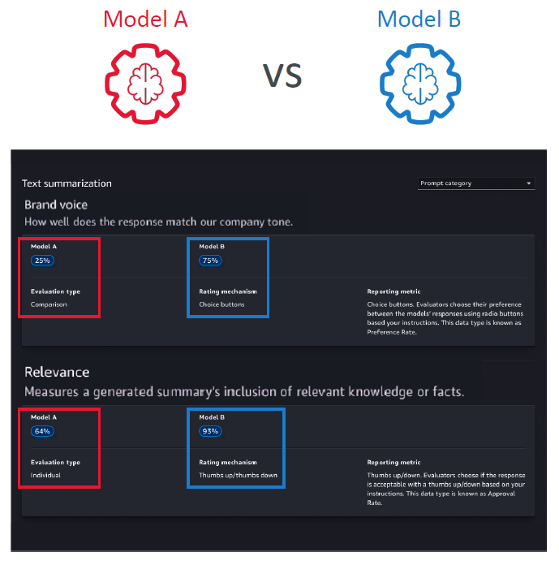

# 🔎 9. SageMaker Clarify: Bias and Explainability

## 🧠 What is SageMaker Clarify?

> **Definition**:  
> **SageMaker Clarify** is a tool inside SageMaker that helps you **detect biases** and **explain** how machine learning models make predictions —  
> **before**, **during**, and **after** model deployment.

---

  

---

📌 **Simply**:

- Clarify **shines light** 🔦 on your model's behavior.
- It helps you understand "**Why did the model predict this?**" and "**Is the model fair?**".

📌 **Why it Matters**:

| Problem                 | Risk                                |
| :---------------------- | :---------------------------------- |
| Hidden Bias             | Leads to unfair, unethical outcomes |
| Black-Box Models        | Hard to trust or debug predictions  |
| Regulatory Requirements | Need explainability for auditing    |

📌 **Simple Rule**:

> You cannot trust a model **until you can explain it** and **ensure it's fair**. ✅

---

## 📜 Model Explainability: Why Was a Prediction Made?

> **Definition**:  
> **Model Explainability** is about **understanding which features influenced the model's decision** and **how much** they contributed.

---

  

---

📌 **How SageMaker Clarify Explains Models**:

- **Feature Importance**:
  - Shows which input features contributed the most to the prediction.
- **SHAP Values** (SHapley Additive exPlanations):
  - A formal method based on game theory to assign credit to each feature.

📌 **Real-World Example**:

- Loan Approval Model:
  - Prediction = "Reject Loan" ❌
  - Clarify reveals:
    - 60% influenced by low income.
    - 30% influenced by high debt.
    - 10% influenced by credit score.

📌 **Benefit**:

- Know **why** each decision was made 🧠.
- Catch **unexpected feature behaviors** early.
- Build **trust** with stakeholders and customers.

---

## 🚨 Bias Detection: Finding Hidden Discrimination

> **Definition**:  
> **Bias Detection** means **checking** if the model's predictions are **unfairly favoring or discriminating** against certain groups.

---

  

---

📌 **Common Bias Types**:

| Bias Type         | Meaning                                                                  |
| :---------------- | :----------------------------------------------------------------------- |
| Sampling Bias     | Training data doesn't fairly represent the whole population              |
| Measurement Bias  | Data collected or measured incorrectly                                   |
| Observer Bias     | Data influenced by human prejudice                                       |
| Confirmation Bias | Favoring info that matches preconceived ideas (more for human reviewers) |

📌 **Real-World Example**:

- Sampling Bias:
  - If training data for a credit model includes mostly urban customers,
    it may perform poorly for rural customers.

📌 **SageMaker Clarify Bias Detection**:

- Measures bias using **statistical fairness metrics**.
- Detects issues in:
  - **Training Data** (before training).
  - **Model Predictions** (after training).

📌 **Important Metrics**:

| Metric            | What It Measures                                       |
| :---------------- | :----------------------------------------------------- |
| Class Balance     | Whether different groups are equally represented       |
| Disparate Impact  | Whether decisions differ significantly between groups  |
| Equal Opportunity | Whether true positive rates are the same across groups |

📌 **Benefit**:

- Catch biases early.
- Fix or mitigate them before causing harm.

---

## 🛡️ How SageMaker Clarify Helps Build Trust

📌 **Clarify Provides**:

| Capability                 | Description                                              |
| :------------------------- | :------------------------------------------------------- |
| Data Bias Detection        | Analyze datasets for sampling or measurement bias        |
| Model Bias Detection       | Check if model predictions are biased                    |
| Feature Importance         | Understand how much each feature impacts predictions     |
| Explainability Reports     | Auto-generate explanations at training or inference time |
| Integration with Pipelines | Add bias checks into automated ML workflows              |

📌 **Workflow Example**:

```mermaid
flowchart LR
    RawData[📦 Raw Data]
    DataBiasCheck[🚨 Data Bias Detection]
    ModelTraining[🏗️ Train Model]
    ModelBiasCheck[🚨 Model Bias Detection]
    ModelExplainability[🔎 Explain Predictions]
    DeployModel[🚀 Deploy Trusted Model]

    RawData --> DataBiasCheck
    DataBiasCheck --> ModelTraining
    ModelTraining --> ModelBiasCheck
    ModelBiasCheck --> ModelExplainability
    ModelExplainability --> DeployModel
```

📌 **Practical Benefits**:

- Safer, more ethical AI systems 🤖.
- Higher user and business trust 🤝.
- Easier regulatory compliance (e.g., GDPR, CCPA) 📜.

---

## ✍️ Mini Smart Recap

| Concept              | Key Idea                                                       |
| :------------------- | :------------------------------------------------------------- |
| Model Explainability | Understand how features influence predictions                  |
| Bias Detection       | Find and measure unfair treatment of groups                    |
| Clarify's Role       | Analyze data, model, and outputs for fairness and transparency |

📌 **Simple Rule**:

> Trustworthy AI = **Explainable + Fair** ➔ Use SageMaker Clarify to **build better models**.
