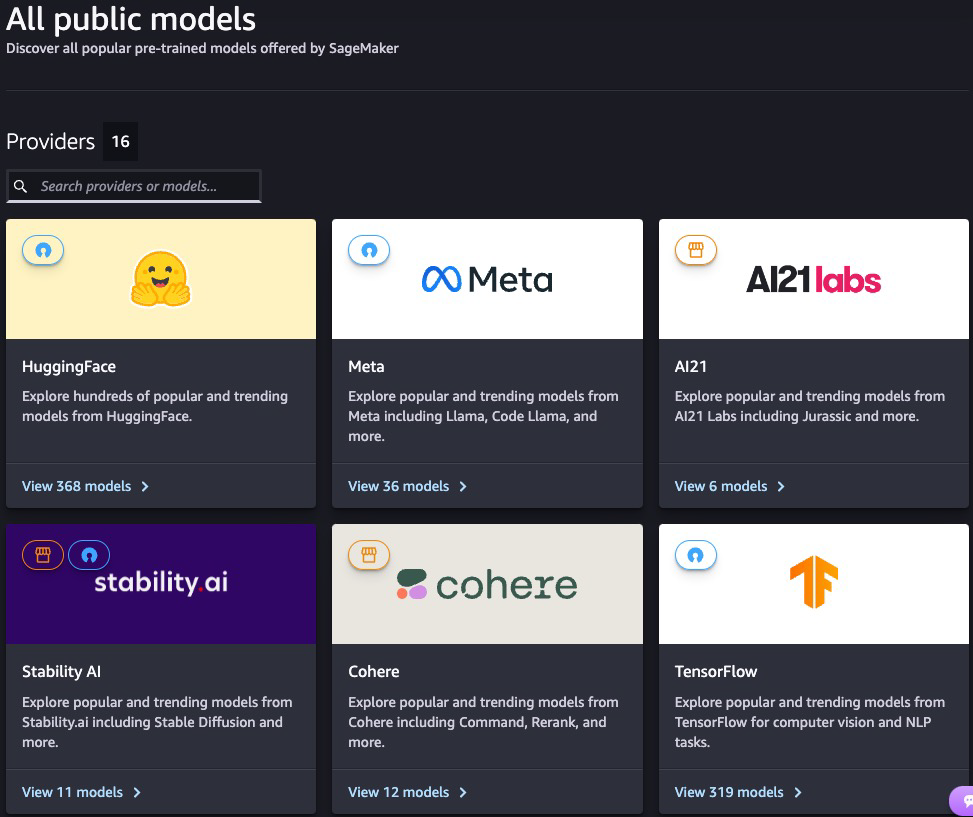
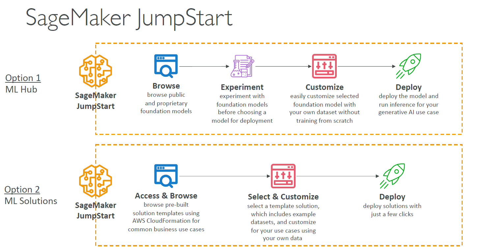
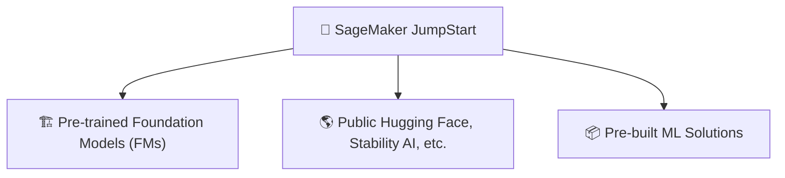
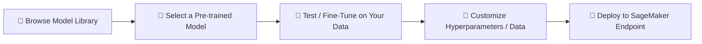

# 🚀 13. SageMaker JumpStart

## 🧠 What is SageMaker JumpStart?

> **Definition**:  
> **SageMaker JumpStart** is a **machine learning hub** inside SageMaker that provides **ready-to-use models**, **foundation models (FMs)**, and **pre-built solution templates** —  
> so you can **quickly start**, **experiment**, **customize**, and **deploy** ML solutions **without building everything from scratch**.

---

  

---

  

---

📌 **Simply**:

- It’s like **an app store** 📱 but for **ML models and solutions**! 🎯
- You can **browse, pick a model or template**, and **launch it** with **a few clicks**.

📌 **Key Benefits**:

| Feature                    | Benefit                                  |
| :------------------------- | :--------------------------------------- |
| Pre-trained Models         | Skip training from zero                  |
| Solution Templates         | Quickly deploy common ML solutions       |
| Experimentation Playground | Try different models before committing   |
| Customization              | Fine-tune models on your own datasets    |
| Fast Deployment            | Deploy ready models to production easily |

---

## 🏛️ SageMaker JumpStart Hub Structure

---

## 🏗️ ML Hub for Pre-trained Foundation Models (FMs)

📌 **Foundation Models (FMs)**:

- Large, **pre-trained models** that can perform **multiple tasks** with minimal fine-tuning:
  - Text generation ✍️.
  - Sentiment analysis 😊☹️.
  - Image generation 🎨.
  - Object detection 📸.

📌 **Popular Foundation Models available**:

| Source       | Examples          |
| :----------- | :---------------- |
| Amazon       | Titan Embeddings  |
| Hugging Face | BLOOM, DistilBERT |
| Meta         | Llama models      |
| Stability AI | Stable Diffusion  |
| Databricks   | Dolly models      |

📌 **Use Cases**:

- Use a **pre-trained GPT-like model** to build a chatbot.
- Use **Stable Diffusion** to generate creative marketing images.

📌 **Benefit**:

- No need to train massive models from scratch 💸.
- **Save weeks or months** of development time.

---

## 🧪 Browse, Experiment, Customize, Deploy Models

📌 **Typical Workflow**:

📌 **Key Steps**:

| Step       | Description                                |
| :--------- | :----------------------------------------- |
| Browse     | Explore by task, industry, or model type   |
| Experiment | Test models directly inside JumpStart      |
| Customize  | Fine-tune models using your data           |
| Deploy     | One-click deployment to scalable endpoints |

📌 **Real-World Example**:

- Browse Hugging Face models → Select a **Sentiment Classifier** → Fine-tune on your company's customer reviews → Deploy instantly! 🚀

📌 **Benefit**:

- **Try multiple models** quickly before selecting the best one.
- **Fine-tune only if needed**, or **use directly** if performance is good enough!

---

## 📦 Pre-built ML Solution Templates

📌 **What are Solution Templates?**:

- Fully pre-built **end-to-end machine learning workflows** for **common business problems**.
- Includes **sample datasets**, **training pipelines**, **pre-configured models**, and **deployment scripts**.

📌 **Popular Template Categories**:

| Template                    | Example                                                 |
| :-------------------------- | :------------------------------------------------------ |
| Forecasting                 | Demand Forecasting for retail, energy, or manufacturing |
| Fraud Detection             | Financial fraud prediction pipelines                    |
| Churn Prediction            | Customer retention prediction solutions                 |
| Computer Vision             | Object Detection or Image Classification                |
| Natural Language Processing | Sentiment analysis, topic modeling                      |

📌 **How it works**:

- Choose a solution ➔ Launch CloudFormation template ➔
- SageMaker **provisions everything** (notebooks, training jobs, deployments).

📌 **Real-World Example**:

- Launch "Fraud Detection Template" → Get:
  - Preprocessing notebook,
  - Pre-trained XGBoost model,
  - Batch Transform scripts,
  - Full inference pipeline — all ready to customize!

📌 **Benefit**:

- **Full project jumpstart**: You get 70% of the solution ready on Day 1! 🚀

---

## ✍️ Mini Smart Recap

| JumpStart Capability    | Key Action                                   |
| :---------------------- | :------------------------------------------- |
| 🏗️ Pre-trained Models   | Launch Foundation Models easily              |
| 🧪 Experimentation      | Test and fine-tune models                    |
| 🚀 One-Click Deployment | Deploy to real-time endpoints                |
| 📦 Solution Templates   | Pre-built ML solutions for business problems |

📌 **Simple Rule**:

> "**Don’t start from scratch if you can start from success.**"  
> SageMaker JumpStart lets you **leap ahead** in ML development! 🚀
