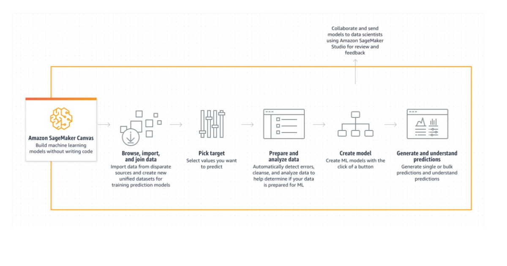
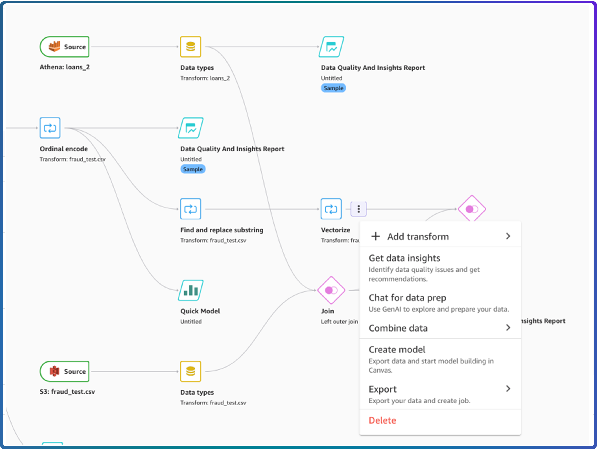
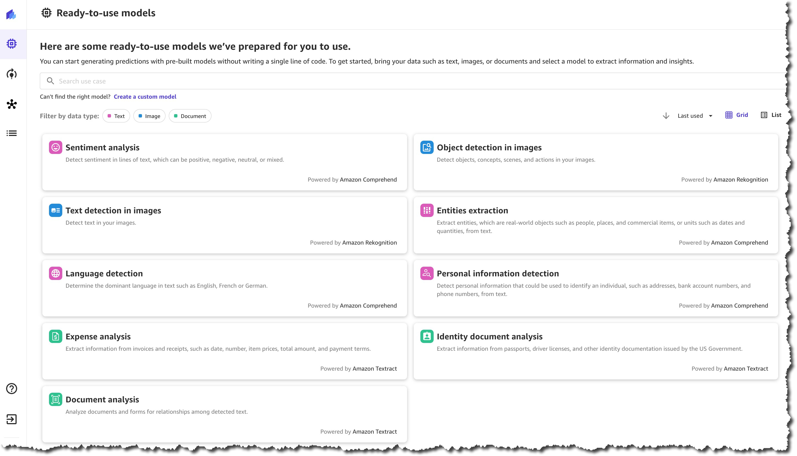

# 🖥️ 14. SageMaker Canvas (No-Code ML)

## 🧠 What is SageMaker Canvas?

> **Definition**:  
> **SageMaker Canvas** is a **no-code machine learning tool** inside SageMaker that lets you **build**, **train**, **analyze**, and **deploy ML models** —  
> **using a simple drag-and-drop visual interface**, without writing a single line of code!

---

  

---

📌 **Simply**:

- Like **PowerPoint**, but for **building ML models** instead of slides! 🧩
- Great for **business analysts**, **domain experts**, and **non-programmers** who want to **use ML easily**.

📌 **Key Highlights**:

| Feature            | Benefit                                           |
| :----------------- | :------------------------------------------------ |
| Visual Interface   | Drag, drop, and click to build models             |
| No Coding Required | No need to write Python, SQL, etc.                |
| AutoML Powered     | Automatically preprocess, select, and tune models |
| Easy Deployment    | Push models to SageMaker endpoints with a click   |

📌 **Simple Rule**:

> "**If you can use Excel, you can now build ML models!**" 📈✨

---

## 🎨 Build Models Visually Without Code

  

---

📌 **Main Actions**:

| Step    | What You Do                                             |
| :------ | :------------------------------------------------------ |
| Import  | Upload CSV, JSON, or connect to S3, Redshift, Snowflake |
| Prepare | Filter, join, clean, transform columns                  |
| Build   | Choose target column, click to train AutoML models      |
| Analyze | View model accuracy, feature importance                 |
| Deploy  | Deploy model to SageMaker endpoint                      |

📌 **Real-World Example**:

- Import customer churn dataset ➔
- Select "Churn Yes/No" as the target ➔
- Click **Build Model** ➔
- Get a high-accuracy classifier without coding! 🚀

---

## 🏗️ Ready-to-Use Models from Rekognition, Comprehend, Textract

  

---

📌 **Canvas also provides access to pre-built ML models** from other AWS AI services:

| AWS Service | What It Does                                                        |
| :---------- | :------------------------------------------------------------------ |
| Rekognition | Analyze images and videos (detect faces, labels, unsafe content) 📸 |
| Comprehend  | Analyze text (sentiment, language, entities, key phrases) 📜        |
| Textract    | Extract structured data from scanned documents (forms, tables) 📑   |

📌 **Typical Use Cases**:

- **Rekognition**:
  - Detect objects in uploaded product photos.
- **Comprehend**:
  - Perform sentiment analysis on customer reviews.
- **Textract**:
  - Extract invoice data from PDFs into structured tables.

📌 **Benefit**:

- Instantly apply **powerful AI capabilities** without needing to train your own model!

---

## 🔗 Integration with SageMaker Data Wrangler

📌 **Data Wrangler + Canvas** = **Dream Team** for no-code + low-code ML 🔥:

| Step          | How They Work Together                |
| :------------ | :------------------------------------ |
| Data Wrangler | Clean, transform, and enrich datasets |
| Canvas        | Build models and analyze predictions  |

📌 **Workflow**:

1. Prepare your dataset inside **Data Wrangler** (normalize, encode, feature engineer).
2. Export the cleaned data **directly into Canvas**.
3. Build models without needing coding skills!

📌 **Real-World Example**:

- Use Data Wrangler to preprocess customer transaction logs.
- Push the cleaned dataset to Canvas.
- Build a **customer lifetime value prediction model** visually.

📌 **Benefit**:

- Full end-to-end ML lifecycle (data ➔ model ➔ insights) — **without touching any code**.

---

## ✍️ Mini Smart Recap

| Canvas Capability            | Key Action                                   |
| :--------------------------- | :------------------------------------------- |
| 🖥️ No-Code Interface         | Build, train, deploy ML models visually      |
| 🏗️ AutoML Power              | Auto-select and tune best models             |
| 🎨 Pre-built Models          | Use Rekognition, Comprehend, Textract easily |
| 🔗 Data Wrangler Integration | Combine data prep + no-code ML building      |

📌 **Simple Rule**:

> "**No coding? No problem.**"  
> **SageMaker Canvas** empowers everyone to **leverage machine learning** 🚀✨.
