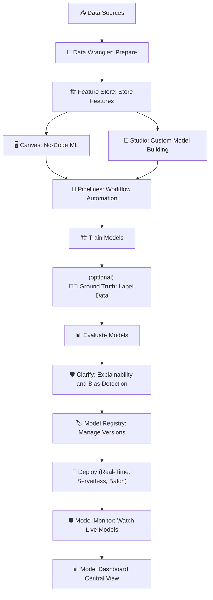

# 🎯 16. Final SageMaker Summary

## 🧠 Quick Recap of All SageMaker Services

📌 Over the past topics, you mastered the **full SageMaker ecosystem**.  
Here's a quick memory refresher 🧠✨:

| SageMaker Service                | What It Does                                         |
| :------------------------------- | :--------------------------------------------------- |
| **SageMaker Studio**             | Unified web-based ML development IDE                 |
| **SageMaker Data Wrangler**      | Import, clean, transform data easily                 |
| **SageMaker Feature Store**      | Centralized storage for ML features                  |
| **SageMaker Clarify**            | Explain model predictions and detect bias            |
| **SageMaker Ground Truth**       | Human data labeling and RLHF                         |
| **SageMaker Pipelines**          | Automate ML workflows (CI/CD for ML)                 |
| **SageMaker JumpStart**          | Find and deploy ready-to-use models and templates    |
| **SageMaker Canvas**             | Build ML models without any coding (No-Code ML)      |
| **MLFlow on SageMaker**          | Manage experiments and track ML runs easily          |
| **SageMaker Deployment Options** | Real-time, serverless, batch, and async inference    |
| **SageMaker Model Registry**     | Store and version models safely                      |
| **SageMaker Model Dashboard**    | View and monitor all models centrally                |
| **SageMaker Model Monitor**      | Detect drift and quality degradation post-deployment |

📌 **Simple Rule**:

> "**From data to deployment, from no-code users to deep ML engineers —  
> SageMaker gives everyone a complete AI factory.**" 🏭✨

---

## 🛠️ When to Use Each Part

📌 **Decision Table**:

| You Want To                                 | Use This SageMaker Service |
| :------------------------------------------ | :------------------------- |
| Prepare data visually                       | Data Wrangler              |
| Build models without coding                 | Canvas                     |
| Train custom models with code               | Studio Notebooks           |
| Track experiments                           | MLFlow on SageMaker        |
| Automate training → evaluation → deployment | Pipelines                  |
| Deploy a real-time API                      | Real-time Inference        |
| Deploy infrequent workloads cheaply         | Serverless Inference       |
| Detect bias and explain models              | Clarify                    |
| Label data manually                         | Ground Truth               |
| Store and reuse features                    | Feature Store              |
| Track all models centrally                  | Model Dashboard            |
| Monitor live model drift                    | Model Monitor              |
| Browse ready-to-use models                  | JumpStart                  |
| Register model versions safely              | Model Registry             |

📌 **Simple Rule**:

> "**Pick the right tool depending on your phase**:  
> Data ➔ Build ➔ Tune ➔ Explain ➔ Monitor ➔ Automate."

---

## 🗺️ Big Picture: How SageMaker Offers an End-to-End ML Platform

📌 **Full Lifecycle View**:

📌 **The Flow**:

- **Start with raw data** ➔
- **Prepare and engineer features** ➔
- **Build models** (no-code or code) ➔
- **Track experiments and automate workflows** ➔
- **Explain and evaluate models** ➔
- **Register, deploy, and monitor models** ➔
- **Manage the full model inventory** from a centralized dashboard.

📌 **Key Mindset**:

> "SageMaker is **not just a training service** —  
> it’s a **professional, industrial-strength Machine Learning factory**."

---

## ✍️ Mini Smart Final Recap

| Concept               | What SageMaker Provides                         |
| :-------------------- | :---------------------------------------------- |
| Data to Model         | Prepare, Clean, Build, Track                    |
| Model to Production   | Evaluate, Register, Deploy, Monitor             |
| End-to-End Automation | Workflows, Pipelines, Dashboards                |
| Trust and Governance  | Bias detection, explainability, version control |

📌 **Simple Rule**:

> "**One platform, all stages of ML — built to scale your machine learning from zero to hero.**" 🏆🚀
