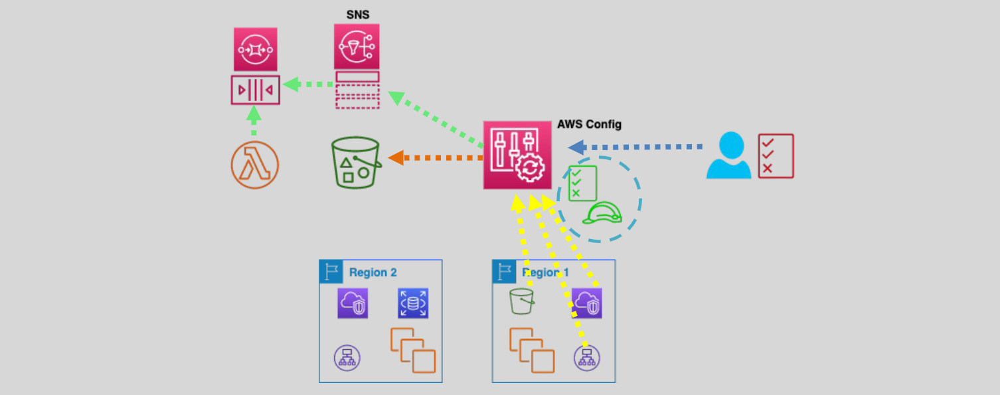

# 🛡️ **AWS Config: Track, Manage, and Secure Your AWS Resources**

> _Real-time visibility into your AWS infrastructure, ensuring compliance, security, and operational excellence._

---

<div align="center" style="padding:0 20px;">
  
</div>

---

## 🌟 **What is AWS Config?**

**AWS Config** is a **fully managed service** that:

- 📋 **Tracks** resource configurations
- 🔎 **Audits** changes over time
- ✅ **Evaluates** compliance against best practices
- ⚙️ **Automates** responses to misconfigurations

> Think of it as a **security camera** + **compliance officer** for your AWS environment.

---

## 🔄 **How AWS Config Works**

| Step                        | What Happens                                                                 |
| :-------------------------- | :--------------------------------------------------------------------------- |
| 🛰️ **Discovery & Tracking** | Auto-discovers AWS resources, records their configurations                   |
| 🗃️ **Storage**              | Saves history in **S3**, sends notifications via **SNS**                     |
| 🧪 **Evaluation**           | Applies **rules** to assess if resources are compliant                       |
| 🛠️ **Remediation**          | Triggers auto-remediation for non-compliant resources                        |
| 🌎 **Aggregation**          | Centralized compliance across multi-accounts/regions (Organizations support) |

✅ **Always-on monitoring, compliance checking, and auditing.**

---

## 🧩 **Key Components of AWS Config**

---

### 🛠️ 1. **Configuration Recorder**

- Automatically **captures resource changes**.
- Generates **configuration items (CIs)** to track resource state over time.

---

### 📜 2. **Rules**

| Type                  | Description                                                            |
| :-------------------- | :--------------------------------------------------------------------- |
| **AWS Managed Rules** | Pre-built rules for common use cases (e.g., encryption, public access) |
| **Custom Rules**      | Write custom logic with **AWS Lambda** for unique compliance needs     |

✅ Rules can be **periodic** or **triggered by changes**.

---

### 🔄 3. **Remediation Actions**

- Attach **automatic fixes** to non-compliance (e.g., auto-encrypt a public S3 bucket).
- Use **AWS Systems Manager Automation** documents or custom Lambda functions.

---

### 🛡️ 4. **Resource Relationships**

- Understand **how resources are connected** (e.g., EC2 → VPC → Security Group).
- Helps with **troubleshooting** and **impact analysis**.

---

### 📊 5. **Configuration Queries**

- Query historical and current resource states with a **SQL-like syntax**.
- Great for **inventory management**, **security analysis**, and **cost optimization**.

Example query:

```sql
SELECT resourceId, resourceType WHERE resourceType = 'AWS::S3::Bucket'
```

---

## 🌐 **AWS Config Integrations**

| Service                | Benefit                                       |
| :--------------------- | :-------------------------------------------- |
| **AWS CloudTrail**     | Tracks **who** made changes                   |
| **Amazon EventBridge** | Automate reactions to configuration changes   |
| **AWS Lambda**         | Build **custom rules** or remediation actions |
| **AWS Organizations**  | Aggregate multi-account compliance status     |

---

## 🚀 **Popular Use Cases**

| Category       | Example                                                        |
| :------------- | :------------------------------------------------------------- |
| **Security**   | Ensure S3 buckets are not publicly accessible                  |
| **Compliance** | Validate all EC2 instances have encryption enabled             |
| **Operations** | Monitor changes to EBS volume types for optimization           |
| **Audit**      | Retrieve the full history of changes to IAM roles and policies |

---

## 📈 **Pricing Overview**

| Item                          | Cost                                       |
| :---------------------------- | :----------------------------------------- |
| **Configuration Items**       | \$0.003 per recorded resource per region   |
| **Rule Evaluations**          | \$0.001 per rule evaluation per region     |
| **Storage (S3)**              | Standard S3 storage fees apply             |
| **Notifications (SNS)**       | SNS pricing based on messages sent         |
| **Lambda (for custom rules)** | Charged based on Lambda execution duration |

> 🧠 **Tip:**  
> Use **resource filtering** and **smart rule scoping** to optimize costs.

---

## 📋 **Real-World Example**

> 🏢 Suppose your security team mandates:

✅ All S3 buckets must be encrypted  
✅ All EC2 instances must not have public IPs

With AWS Config:

- Create AWS managed rules:
  - `s3-bucket-server-side-encryption-enabled`
  - `ec2-instance-no-public-ip`
- AWS Config continuously evaluates all new and existing resources.
- If a violation occurs:
  - Flag as **non-compliant** 🔥
  - (Optionally) auto-remediate via Lambda or Systems Manager.

✅ **Full automated security enforcement.**

---

## 🧠 **Key Benefits of AWS Config**

| ✅ Benefit                   | Why It Matters                                               |
| :--------------------------- | :----------------------------------------------------------- |
| 📷 Continuous Visibility     | Real-time awareness of your AWS resource changes             |
| 📜 Compliance as Code        | Define, monitor, and automate compliance rules               |
| 🛡️ Improved Security Posture | Detect and remediate misconfigurations immediately           |
| 📊 Historical Snapshots      | Troubleshoot using full config history                       |
| 🚀 Automation-Ready          | Integrate with EventBridge and Lambda for auto-fixing issues |

---

## 🧭 **Summary: When to Use AWS Config**

| Situation                                   | Should You Use AWS Config? |
| :------------------------------------------ | :------------------------- |
| Enforcing compliance across AWS resources   | ✅ Yes                     |
| Auditing changes during security reviews    | ✅ Yes                     |
| Monitoring multi-account cloud environments | ✅ Yes                     |
| Small lab setup with no compliance needs    | ❌ Optional                |

---

## 🏆 **Final Pro Tip**

> 🧠 **Use AWS Config early, even in small projects.**  
> It's much easier (and cheaper) to maintain compliance **continuously** than to fix issues during audits or incidents later.

✅ Think of AWS Config as your **always-on auditor, security guard, and historian** — all in one!
