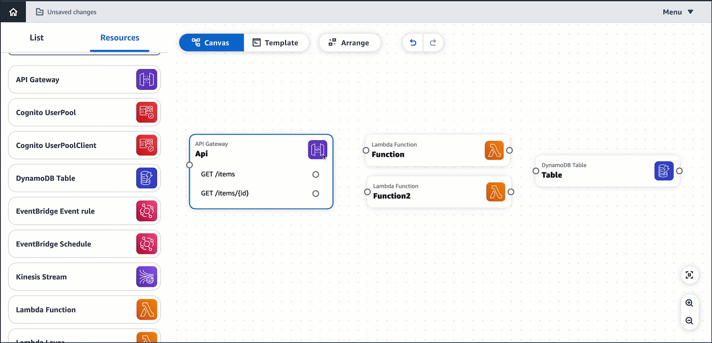

---
tags:
  - aws
  - aws/service
  - aws/topic/misc
aliases:
  - "AWS Infrastructure Composer"
---

# 🧩 **AWS Infrastructure Composer**

_Visual Tool for Designing Cloud Architectures!_

**AWS Infrastructure Composer** is a **visual, low-code tool** that helps you design, configure, and generate AWS infrastructure as code (IaC) — right from your browser.

---

  

## 🎯 Key Features

| Feature                      | Description                                                       |
| ---------------------------- | ----------------------------------------------------------------- |
| 🖼️ **Drag-and-Drop UI**      | Visually design AWS resources like Lambda, S3, VPC, etc.          |
| 🧾 **IaC Code Generation**   | Automatically generates code in **AWS CloudFormation** or **CDK** |
| 🧠 **Built-in Validation**   | Detects misconfigurations and missing dependencies                |
| 🔗 **Real-Time Preview**     | Instantly preview architecture diagrams and code                  |
| 🛠️ **Customizable Settings** | Modify resource properties like memory, timeout, CIDRs, etc.      |

---

## 🧰 Typical Use Cases

- Quickly prototype **serverless** or **microservice** architectures
- Teach IaC concepts to new developers
- Speed up infrastructure planning and visualization
- Generate production-ready CloudFormation/CDK templates

---

## 🧠 Summary

| 🔹 Feature       | 💡 Value                |
| ---------------- | ----------------------- |
| Visual Builder   | ✅ Yes                  |
| Code Output      | ✅ CDK / CloudFormation |
| Deployment Ready | ✅ Yes                  |
| In-Browser Tool  | ✅ No setup needed      |

> 📍 Try it from the [AWS Application Composer Console](https://console.aws.amazon.com/applicationcomposer)
---

## Related Notes
- [[aws-services/misc/aws-data-exchage|AWS Data Exchange]] - previous lesson
- [[aws-services/misc/efa-elastic-fiber-adapter|AWS Elastic Fiber Adapter - EFA]] - next lesson
- [[aws-services/1.management-governance/1.cloudformation/1.1.cfn|AWS CloudFormation]] - mentions AWS CloudFormation
- [[aws-daily/aws-architectures/3.1.serverless|Server-Based Architectures vs. Serverless Computing]] - mentions Serverless
- [[aws-services/10.developer/1.4.aws-sam/1.serverless|The Ultimate Guide to Serverless Computing & Tools]] - mentions Serverless

---
