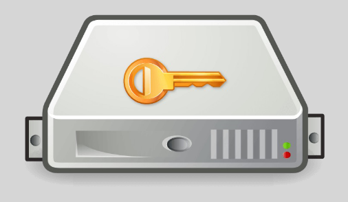
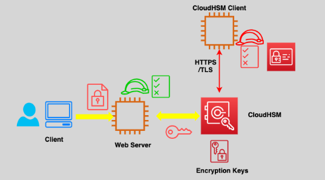
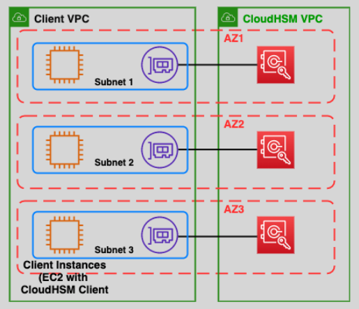

# 🔐 **AWS CloudHSM: Dedicated Cryptographic Security in the Cloud**

> _Secure, control, and manage your cryptographic keys with hardware-backed assurance — all within your AWS environment._

---

  

---

## 🌟 **What is AWS CloudHSM?**

**AWS CloudHSM** is a **fully managed hardware security module (HSM)** service that enables you to:

- 🔑 **Safeguard cryptographic keys** with dedicated HSM devices.
- 🔒 **Perform encryption, decryption, digital signing, and key management** securely.
- 🤝 **Retain full control** over your cryptographic operations — AWS does not have access.

✅ Ideal for use cases demanding **the highest levels of security and compliance** (e.g., financial services, healthcare, government).

---

  

---

## 🧠 **Key Features of AWS CloudHSM**

| Feature                     | Description                                                   |
| :-------------------------- | :------------------------------------------------------------ |
| 🔒 **Dedicated Hardware**   | You get your own isolated HSMs — no multi-tenancy             |
| 🛡️ **Full Key Ownership**   | You create, manage, and control access to your keys           |
| 📜 **Compliance**           | FIPS 140-2 Level 3 certification for high-assurance workloads |
| 🌎 **High Availability**    | Multi-AZ clustering for fault tolerance and redundancy        |
| 🔗 **Flexible Integration** | Supports industry-standard APIs: PKCS#11, JCE, OpenSSL        |
| 🔄 **Daily Backups**        | Automated secure backups across regions                       |

✅ **Security, compliance, and control — in your hands.**

---

## 🔑 **CloudHSM Cryptographic Capabilities**

| Cryptographic Task           | Purpose                                                        |
| :--------------------------- | :------------------------------------------------------------- |
| 🔐 **Encryption/Decryption** | Secure sensitive data                                          |
| 🖋️ **Digital Signatures**    | Verify authenticity and integrity                              |
| 🧹 **Hashing**               | Generate message digests                                       |
| 🛠️ **Key Management**        | Generate, import, export, and rotate symmetric/asymmetric keys |

✅ Supports RSA, ECC, AES, SHA-2, and more cryptographic standards.

---

## 🔗 **AWS CloudHSM and KMS: Custom Key Store Integration**

> 

>  
> 

>
> ---
>
> 🔗 **Custom Key Store** connects AWS KMS to your CloudHSM cluster  
> 🔒 Keys created in KMS stay inside your dedicated CloudHSM hardware  
> 🔑 Used for S3, EBS, RDS encryption — while maintaining full key control
>
> ✅ **Best of both worlds**: KMS ease + CloudHSM hardware security.

## 🔄 **High Availability and Redundancy**

- 🏢 Deploy multiple HSM nodes across **different AZs** in a VPC.
- 🗂️ Daily encrypted **backups** with optional **cross-region replication**.
- 🔄 Clustered HSMs automatically **load balance** cryptographic operations.

✅ No single point of failure for your critical cryptographic operations.

---

  

## ⚖️ **AWS CloudHSM vs AWS KMS**

| Feature                           | AWS KMS                                           | AWS CloudHSM                                                     |
| :-------------------------------- | :------------------------------------------------ | ---------------------------------------------------------------- |
| **Type**                          | Shared HSM fleet (multi-tenant)                   | Dedicated physical HSMs (single-tenant)                          |
| **Management**                    | Fully managed by AWS                              | Customer-managed via HSM client                                  |
| **Control over Keys**             | AWS controls HSMs, customers control keys via KMS | Full customer control over hardware, firmware, and keys          |
| **Compliance Level**              | FIPS 140-2 Level 2                                | FIPS 140-2 Level 3                                               |
| **Use Cases**                     | General-purpose encryption (easy integration)     | High-security applications requiring compliance or HSM isolation |
| **Integration with AWS Services** | Deep (S3, EBS, RDS, Lambda)                       | Indirect via Custom Key Store or manual apps                     |

✅ **Simple need? → KMS**  
✅ **Regulated, high-security app? → CloudHSM**

---

## 📚 **When Should You Use AWS CloudHSM?**

| Scenario                                                             | Use CloudHSM?      |
| :------------------------------------------------------------------- | :----------------- |
| You must meet **FIPS 140-2 Level 3** compliance                      | ✅ Yes             |
| You need **full, exclusive control** over keys and cryptographic ops | ✅ Yes             |
| You are implementing **PKI** (Certificate Authorities)               | ✅ Yes             |
| General app encryption with S3, EBS, RDS only                        | ❌ Use KMS instead |
| Cost-sensitive, general key storage                                  | ❌ Use KMS instead |

---

## 💼 **Common CloudHSM Use Cases**

| Use Case                            | Description                                                 |
| :---------------------------------- | :---------------------------------------------------------- |
| 🛡️ **Database Field Encryption**    | Encrypt sensitive fields (e.g., customer SSNs) in databases |
| 🛂 **Authentication/Authorization** | Enable encrypted login sessions and token signing           |
| 🖋️ **Digital Signing**              | Sign code, documents, transactions                          |
| 📜 **PKI Infrastructure**           | Host your own certificate authorities securely              |
| 🎞️ **Media Protection (DRM)**       | Protect digital content rights for media/entertainment apps |

---

## 💰 **Pricing Overview**

| Pricing Component                            | Cost Details                           |
| :------------------------------------------- | :------------------------------------- |
| **Per HSM Instance (hourly)**                | Pay-as-you-go                          |
| **Backup Storage**                           | Small charges based on S3 backup usage |
| **Data Transfer (cross-region replication)** | Standard AWS data transfer costs       |

✅ No upfront cost. Pay **only for HSM usage hours**.

---

## 🧠 **Summary: Why Use AWS CloudHSM?**

> _AWS CloudHSM delivers the highest level of control, security, and compliance for your most sensitive cryptographic operations._

✅ Dedicated hardware, FIPS 140-2 Level 3 compliance  
✅ Your keys, your control — AWS cannot access them  
✅ Scales securely across multiple Availability Zones  
✅ Perfect for highly regulated industries like **finance, healthcare, and government**

---

## 🔥 **Final Pro Tip**

> 🧠 **Use AWS CloudHSM when you need hardware isolation and regulatory-grade security** — and **pair it with AWS KMS Custom Key Store** when you want to bring this power seamlessly into AWS service integrations like S3, EBS, and RDS.
