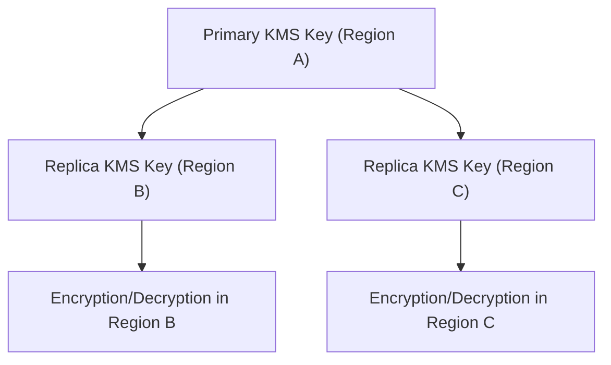

# 🔑 **AWS KMS Multi-Region Keys: Simplified Cross-Region Encryption**

## 🌟 **What are Multi-Region Keys in AWS KMS?**

**Multi-Region Keys** are a feature of **AWS Key Management Service (KMS)** that allow you to:

- 🔑 Create **cryptographic copies** of keys that are usable across multiple AWS Regions.
- 🌍 Enable **encryption and decryption operations** in different regions without manually creating separate keys.
- 🚀 Achieve **high availability** and **disaster recovery** for your encrypted data across the globe.

✅ Think of Multi-Region Keys like **twins**:  
Each twin lives in a different region but **behaves identically**!

---

## 🧠 **How AWS KMS Multi-Region Keys Work**

<div align="center">



</div>

---

✅ One **Primary Key** ➔ Multiple **Replica Keys** across regions.

All replicas:

- Share the **same key material**.
- Share **same key ID and properties** (like usage policies).
- Are **independent** for availability and disaster recovery (no cross-region API calls needed).

---

## 🛠️ **Key Features of KMS Multi-Region Keys**

| Feature                                   | Description                                                                          |
| :---------------------------------------- | :----------------------------------------------------------------------------------- |
| 🔗 **Cryptographic Consistency**          | Same key material across all regions (decrypt anywhere if encrypted by any replica). |
| 🚀 **Regional Independence**              | Use the replica in its local region for faster, resilient operations.                |
| 🔁 **Manual or Automated Replication**    | Create replicas manually or use automation tools (like Terraform, CloudFormation).   |
| 🛡️ **Fully Integrated with AWS Services** | Encrypt S3, EBS, RDS, DynamoDB, EKS, Lambda, Secrets Manager, etc., across regions.  |
| 📦 **Exportable for Cross-Region DR**     | Use to meet multi-region disaster recovery strategies.                               |

✅ Built for **resilience**, **performance**, and **global reach**!

---

## 🧩 **Primary vs Replica Keys**

| Feature       | Primary Key                                                         | Replica Key                             |
| :------------ | :------------------------------------------------------------------ | :-------------------------------------- |
| 🔑 Ownership  | The original key you create first.                                  | A copy derived from the primary.        |
| 🛠️ Management | Can create replicas.                                                | Cannot create new replicas.             |
| 🔄 Promotions | Can promote a replica to become a new primary if needed (failover). | Yes (manual promotion possible).        |
| 🗑️ Deletion   | Deleting primary deletes all replicas.                              | Deleting a replica only affects itself. |

✅ Replicas are **independent** but **still cryptographically linked**.

---

## 🔥 **When to Use Multi-Region Keys**

| Scenario                              | Why Multi-Region Keys Help                                                                                   |
| :------------------------------------ | :----------------------------------------------------------------------------------------------------------- |
| 🌍 **Cross-Region Disaster Recovery** | Ensure encrypted backups (like EBS snapshots, RDS backups) are decryptable after failover to another region. |
| 🚀 **Global Applications**            | If your app runs across multiple AWS Regions and needs fast, local encryption/decryption.                    |
| 📦 **Multi-Region Storage**           | Store encrypted data in S3 buckets replicated with S3 Cross-Region Replication (CRR).                        |
| 🛡️ **Compliance and Resilience**      | Meet compliance requirements for regional redundancy of encrypted data.                                      |

✅ Always use multi-region keys for **critical production environments** that span AWS regions.

---

## 📜 **How to Create Multi-Region Keys**

### Step 1: Create a Primary Key

```bash
aws kms create-key --multi-region
```

### Step 2: Create a Replica in Another Region

```bash
aws kms replicate-key --key-id <primary-key-id> --region <target-region>
```

✅

- The replica is ready to perform encryption, decryption, re-encryption, and signing operations.
- You can create **multiple replicas** across as many regions as needed.

---

## ⚠️ **Limitations and Important Notes**

| Limitation                                              | Details                                                                           |
| :------------------------------------------------------ | :-------------------------------------------------------------------------------- |
| 🛑 **Multi-Region Feature Must Be Enabled at Creation** | You cannot convert a single-region key into a multi-region key later.             |
| 🔒 **Key Policies Are Not Automatically Copied**        | Must manage policies separately for replicas if needed.                           |
| 🕒 **Latency Still Matters**                            | Even though keys are replicated, app data locality still matters for low latency. |
| 🛡️ **Pricing**                                          | You are billed separately for each replica key in each region.                    |

✅ Plan carefully during initial key creation for multi-region needs.

---

## 🏆 **Final Smart Pro Tip**

> 🧠 **For disaster recovery (DR) designs:  
> Always replicate your KMS keys into your DR region alongside your data replication.**

✅ Example:

- Replicate S3 buckets + Replicate KMS keys ➔ Seamless cross-region failover.

✅ Same idea applies for:

- EBS Snapshots
- RDS Snapshots
- DynamoDB Tables
- Any encrypted AWS resource
