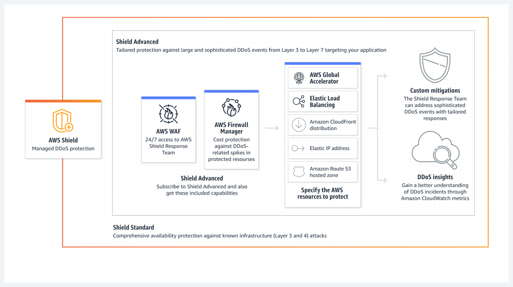
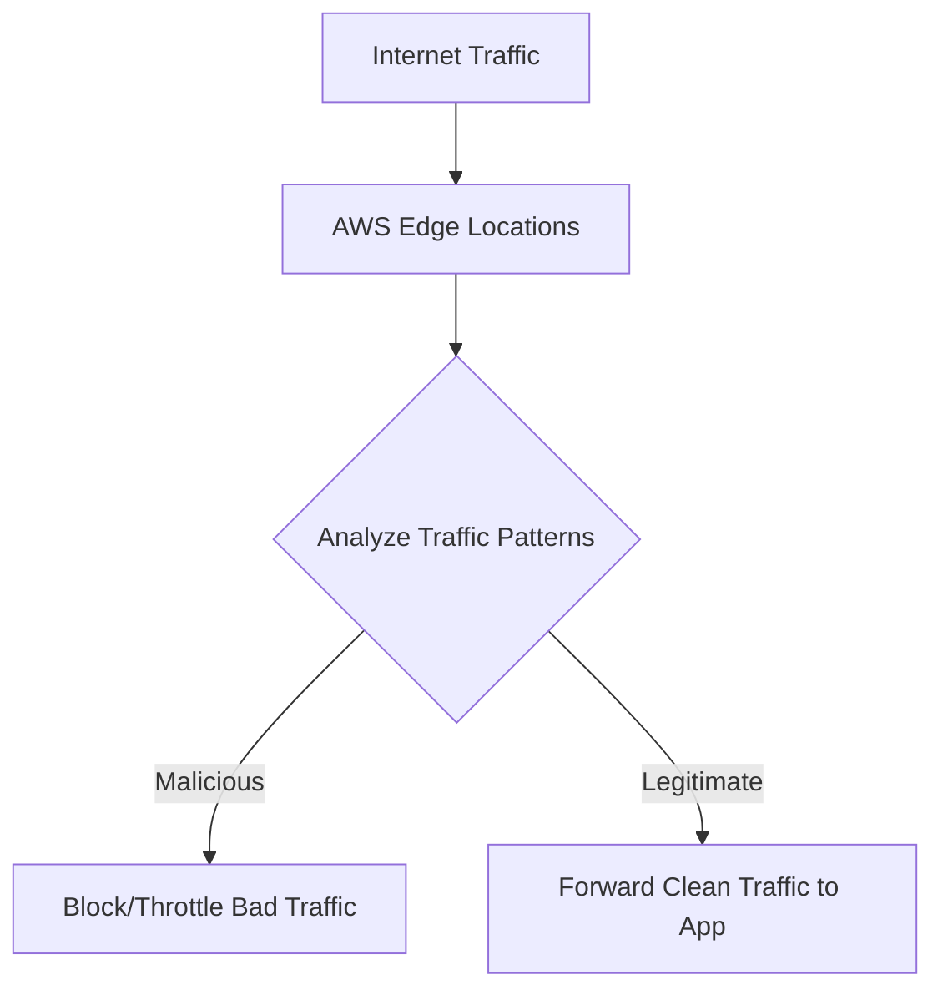

# 🛡️ **AWS Shield: Always-On DDoS Protection for Your AWS Applications**

> _Defend your cloud services from DDoS attacks — automatically, intelligently, and at scale._

---

  

---

## 🌐 **What is AWS Shield?**

**AWS Shield** is a **managed DDoS protection service** designed to safeguard your AWS-powered applications from:

- 🚨 **Network-based attacks** (like SYN floods, UDP floods)
- 🚨 **Application-layer attacks** (like HTTP floods)

✅ It **automatically detects and mitigates** malicious traffic in real-time, ensuring your services remain **available**, **responsive**, and **protected** — without you lifting a finger.

---

## 🛡️ **AWS Shield Protection Levels**

| Tier                     | Purpose                                               | Key Features                                                                                                                                                                             | Cost                 |
| :----------------------- | :---------------------------------------------------- | :--------------------------------------------------------------------------------------------------------------------------------------------------------------------------------------- | :------------------- |
| 🛡️ **Shield Standard**   | Baseline protection for all AWS customers             | - Free automatic DDoS defense - Protects L3/L4 (network/transport) layers - No impact on performance                                                                               | ✅ Free              |
| 🛡️✨ **Shield Advanced** | Advanced protection for mission-critical applications | - Enhanced DDoS detection - Application layer (L7) protection - 24/7 DDoS Response Team (DRT) - Real-time metrics & reporting - Financial protection against scaling charges | 💲 Paid Subscription |

---

## 🧠 **How AWS Shield Works**

✅ **Shield** continuously **monitors**, **analyzes**, and **mitigates** DDoS threats **inline** — without impacting good users.

---

## 🔧 **Deep Dive: AWS Shield Standard vs Shield Advanced**

| Feature                                          | Shield Standard | Shield Advanced |
| :----------------------------------------------- | :-------------- | :-------------- |
| Always-on DDoS detection                         | ✅              | ✅              |
| Automatic traffic filtering                      | ✅              | ✅              |
| 24/7 DDoS Response Team (DRT) access             | ❌              | ✅              |
| Near real-time attack visibility                 | ❌              | ✅              |
| Application layer (L7) protection (with AWS WAF) | ❌              | ✅              |
| DDoS cost protection (financial safeguards)      | ❌              | ✅              |
| Detailed forensics and attack reports            | ❌              | ✅              |

✅ **Shield Standard** = Good enough for general web apps.  
✅ **Shield Advanced** = Essential for **business-critical** or **high-profile** apps.

---

## 📈 **What Services AWS Shield Protects**

- **Elastic Load Balancers (ALB/NLB)**
- **Amazon CloudFront Distributions**
- **Amazon Route 53 (DNS)**
- **Elastic IP Addresses (EIP)**
- **AWS Global Accelerator**

✅ It protects both **your web layer** and **your network layer** resources.

---

## 🌟 **Benefits of AWS Shield**

| 🚀 Feature                                  | 💬 Why It Matters                                               |
| :------------------------------------------ | :-------------------------------------------------------------- |
| 📢 **Automatic Protection**                 | No manual intervention needed to start protecting your services |
| 📈 **Scalability**                          | Handles massive traffic surges without service degradation      |
| ⚡ **Low Latency**                          | Mitigation happens near the edge to maintain performance        |
| 🧠 **Smart Detection**                      | Machine learning analyzes traffic patterns continuously         |
| 🛡️ **Cost Protection (Advanced)**           | AWS credits your scaling costs during real DDoS attacks         |
| 👨‍💻 **DDoS Response Team Access (Advanced)** | 24/7 expert support for complex attack mitigation               |

---

## 📚 **Real-World Examples of Using AWS Shield**

| Use Case                          | Why Shield Helps                                                       |
| :-------------------------------- | :--------------------------------------------------------------------- |
| 🛒 **E-commerce Store**           | Keep checkout, cart, and product pages live during high-volume attacks |
| 🏦 **Financial Services App**     | Protect sensitive APIs and prevent transaction disruptions             |
| 🎥 **Streaming Media Service**    | Absorb huge volumes of traffic and continue delivering content         |
| 📈 **High-Profile SaaS Products** | Defend login portals and dashboards from credential-stuffing attacks   |

---

## 💰 **Pricing Overview**

| Tier                | Cost                                                              |
| :------------------ | :---------------------------------------------------------------- |
| **Shield Standard** | ✅ Free for all AWS customers                                     |
| **Shield Advanced** | 💲 \$3,000/month per account (plus usage for protected resources) |

✅ Shield Advanced also includes **AWS WAF credits** and **CloudFront usage credits** if used together.

---

## 🧠 **Summary: Why AWS Shield Matters**

> _Whether you're running a simple blog or a global e-commerce platform, DDoS attacks are a risk — AWS Shield provides the built-in defense you need._

✅ **Shield Standard** — No extra setup, free, protects most apps.  
✅ **Shield Advanced** — Critical for enterprises, banks, government apps, gaming platforms, and high-profile web services.

---

## 🏆 **Final Pro Tip**

> 🧠 **For public-facing apps, combine AWS Shield + AWS WAF + Amazon CloudFront to create a powerful multi-layered defense strategy.**  
> Defense-in-depth is key when uptime is everything!
