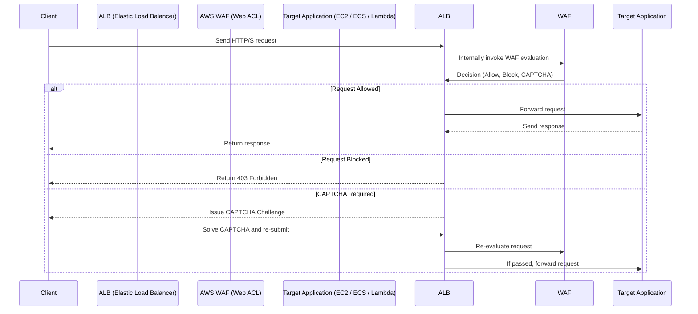

# 📈 **Detailed AWS WAF + ALB (Elastic Load Balancer) Integration Flow**

- (🌎) Client sends request to ALB DNS
- (🛡️) ALB internally asks WAF Web ACL to evaluate
- (🚦) WAF decides Allow / Block / CAPTCHA
- (🚀) ALB forwards allowed traffic to backend
- (📨) ALB returns the backend response to client

## 🧠 **Quick High-Level Answer**

> ❗ The request **first** reaches the **ALB**.  
> Then **AWS WAF is attached to the ALB itself** and **evaluates the request internally** before forwarding it to your application.

✅ **So WAF does not sit "in front" of ALB** externally.  
✅ **WAF is integrated into the ALB** — working like a filter **inside ALB**.
✅ WAF is **not a separate redirect** — it's **an internal request evaluation step inside ALB**.

---

## 📋 **Step-by-Step Flow**

1️⃣ Client (browser, API client) sends an HTTP/S request to the ALB DNS name

2️⃣ Request hits the ALB

3️⃣ ALB **invokes AWS WAF evaluation** (attached Web ACL) internally

4️⃣ AWS WAF **applies rules** (Allow, Block, Count, CAPTCHA/Challenge)

5️⃣ Based on WAF result:

- **Allow**: ALB forwards the request to target group (EC2, ECS, etc.)
- **Block**: ALB immediately responds to client with 403 Forbidden
- **CAPTCHA/Challenge**: ALB handles CAPTCHA flow before forwarding

6️⃣ If allowed, target server handles the request and responds back through ALB

7️⃣ ALB returns the response to the client

---

## 📊 **Mermaid Sequence Diagram**

---

## 🔥 **Real-World Example**

Imagine your website uses:

- **CloudFront** → (optional)
- **ALB** → **EC2 instances**

You attach **AWS WAF Web ACL** to ALB to block:

- SQL Injection attempts
- Bots
- Rate limit (e.g., no more than 1000 requests/minute/IP)

**Result**:

- If attacker tries SQLi: **WAF blocks before the EC2 instance even sees it**.
- If normal user accesses: **Request is allowed and forwarded to EC2**.

✅ **Your app remains safe**, **fast**, and **not overloaded**.

---

## 🏆 **Final Smart Pro Tip**

> 🧠 **Always attach AWS WAF Web ACL to the ALB** itself.  
> Don’t rely on adding external proxies unless needed — AWS gives you native integration with ALB + WAF without any DNS, routing, or architecture change.
