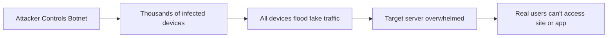

# 🚨 **What is a DDoS Attack?**

> _A traffic flood designed to crash or slow down your application — using an army of hijacked devices._

---

  

---

## 🌪️ **Simple Definition**

A **Distributed Denial of Service (DDoS) attack** happens when **many computers** (often hijacked ones) flood your server or network with **fake traffic** — making it **slow**, **unstable**, or **completely unavailable** for real users.

✅ **Think of it like a traffic jam:**  
Thousands of fake cars (botnets) clog the highway, so **real customers can't reach your business**.

---

## 🧠 **Key Concepts Behind DDoS Attacks**

| 🔥 Concept                 | 💬 Explanation                                                                        |
| -------------------------- | ------------------------------------------------------------------------------------- |
| 🌍 **Multiple Sources**    | Attackers use **botnets** — networks of infected computers worldwide.                 |
| 🚀 **Traffic Flood**       | Huge volumes of fake requests **overwhelm your server**.                              |
| 🛑 **Resource Exhaustion** | Your server runs out of **bandwidth**, **CPU**, **memory**, or **connection limits**. |
| ⚡ **Rapid Impact**        | Attacks can cause slowness, **crashes**, and **service downtime** within minutes.     |

---

## 🎯 **How a DDoS Attack Typically Works**

✅ **One attacker → Thousands of devices → Your server goes offline.**

---

## 🛠️ **Effects of a DDoS Attack**

| 🚨 Impact Area                  | 💬 What Happens                                              |
| :------------------------------ | :----------------------------------------------------------- |
| 🌐 **Website/Service Downtime** | Users can't reach your site or app                           |
| 🐢 **Severe Slowness**          | Long loading times or timeouts                               |
| 💵 **Revenue Loss**             | E-commerce sites can lose money every minute they're offline |
| 🔒 **Security Risks**           | DDoS may be used to distract from bigger security breaches   |
| 🔥 **Brand Reputation Damage**  | Customers lose trust if services are unstable                |

---

## 🧩 **Common Types of DDoS Attacks**

| Type                             | Description                                                              |
| :------------------------------- | :----------------------------------------------------------------------- |
| 📶 **Volume-Based Attacks**      | Massive amounts of traffic (UDP floods, ICMP floods)                     |
| ⚙️ **Protocol Attacks**          | Exploit weaknesses in network protocols (SYN floods, fragmented packets) |
| 🖥️ **Application Layer Attacks** | Target specific app services (HTTP floods, API abuse)                    |

✅ Each attack targets a different layer of your infrastructure.

---

## 📋 **Summary: Why You Should Care**

- 🛡️ **Any internet-facing app is vulnerable**, no matter its size.
- 🚀 **Attacks are cheap and easy for attackers** — tools and botnets are widely available.
- 💥 **DDoS can cost businesses thousands of dollars per minute** of downtime.

---

## 🔥 **Final Pro Tip**

> 🧠 **Always design your architecture with DDoS protection in mind — even before you're attacked.**  
> Prevention (using tools like AWS Shield, WAF, and CloudFront) is **far cheaper and smarter** than dealing with the aftermath.
