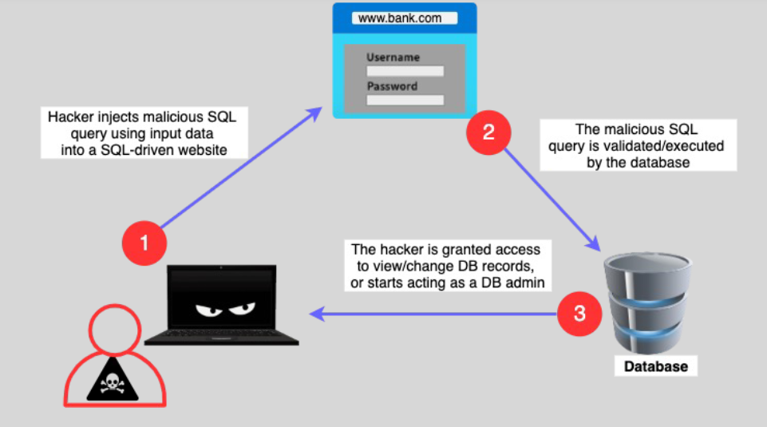

# 💥 **SQL Injection (SQLi) Attack: How Hackers Target Your Databases**

> _One malicious input can open the doors to your entire database._

---

<div align="center" style="padding: 0 20px;">
  
</div>

---

## 🌟 **Simple Definition**

An **SQL Injection (SQLi)** happens when an attacker **inserts malicious SQL code** into an application’s input fields (like login forms or search boxes) — causing your application to **run unexpected database commands**.

✅ **Think of it like this:**

> A restaurant takes your order without checking — attacker says: “One pizza AND take all the money from the cash register.”

---

## 🧠 **How SQL Injection Works**

```mermaid
flowchart TD
    A[User submits input (search, login, form)] --> B[Application constructs SQL query]
    B --> C{Input sanitized?}
    C -- No --> D[Malicious SQL gets executed on database]
    C -- Yes --> E[Query runs safely]
```

✅ If the application doesn't sanitize inputs → **attacker controls your database**.

---

## 🎯 **Example of a Basic SQL Injection**

Suppose your login code does:

```sql
SELECT * FROM users WHERE username = 'user_input' AND password = 'user_input';
```

An attacker enters:

```bash
' OR '1'='1
```

So the query becomes:

```sql
SELECT * FROM users WHERE username = '' OR '1'='1' AND password = '' OR '1'='1';
```

✅ **Always true** → **Attacker logs in without knowing any real password!**

---

## 🔥 **What Attackers Can Do With SQL Injection**

| 🎯 Goal                          | 💬 Real Impact                                                   |
| :------------------------------- | :--------------------------------------------------------------- |
| 🕵️ **Bypass authentication**     | Login as admin without knowing passwords                         |
| 📋 **Dump database contents**    | Steal all user data, passwords, credit cards                     |
| 🛠️ **Modify or delete data**     | Insert, update, delete critical records                          |
| 🔥 **Take full control**         | Execute administrative operations (e.g., shut down the database) |
| 📡 **Pivot deeper into network** | Use database access to attack internal systems                   |

---

## 🧩 **Types of SQL Injection Attacks**

| Type                             | Description                                                                         | Example                                     |
| :------------------------------- | :---------------------------------------------------------------------------------- | :------------------------------------------ |
| 🧨 **Classic SQL Injection**     | Inject malicious SQL directly into queries                                          | `SELECT * FROM users WHERE id = '1 OR 1=1'` |
| 🧬 **Blind SQL Injection**       | Server responds with generic error or true/false only — attacker guesses bit by bit | No direct error, slow exploitation          |
| 🎭 **Out-of-Band SQL Injection** | Forces server to send data elsewhere (e.g., DNS exfiltration)                       | Rare but dangerous                          |

---

## 🛡️ **How to Prevent SQL Injection**

| 🛠️ Defense                                             | 💬 What to Do                                                                                            |
| :----------------------------------------------------- | :------------------------------------------------------------------------------------------------------- |
| 📚 **Use Prepared Statements / Parameterized Queries** | Don’t concatenate SQL manually — use safe APIs                                                           |
| 🧹 **Input Validation**                                | Accept only expected formats (e.g., numbers, emails)                                                     |
| 🛑 **Escape Dangerous Characters**                     | Escape inputs like `'`, `"`, `;`, `%` properly                                                           |
| 🚪 **Least Privilege Access**                          | DB user accounts should have **only necessary permissions** (e.g., no DROP TABLE access for normal apps) |
| 🔥 **Use Web Application Firewalls (AWS WAF)**         | Block known SQLi patterns at the edge                                                                    |

✅ Best protection = **Parameterized queries first**, **validation second**, **firewall third**.

---

## 📚 **Real-World Example**

> A major e-commerce site failed to sanitize its product search box.  
> Hackers injected malicious SQL into the search input.  
> Within hours, they **dumped millions of customer records** — leading to **huge fines**, **loss of reputation**, and **legal actions**.

✅ SQL Injection is **one of the most common and devastating web vulnerabilities**.

---

## 📈 **Why SQL Injection is Still Dangerous Today**

| ❗ Danger       | 💬 Why It Still Happens                                                |
| :-------------- | :--------------------------------------------------------------------- |
| 👨‍💻 Legacy Code  | Older apps didn’t use secure coding practices                          |
| 🏗️ New Features | Developers rushing to release features forget to sanitize              |
| 🧩 Complex APIs | Even modern GraphQL and NoSQL apps can have injection flaws if misused |
| 💥 High Impact  | One injection = total database takeover                                |

---

## 📋 **Summary: How to Think About SQL Injection**

| Question               | Answer                                                            |
| :--------------------- | :---------------------------------------------------------------- |
| What is SQL Injection? | Inserting malicious SQL code into an app's database queries       |
| Why is it dangerous?   | Can bypass login, steal or destroy all data                       |
| How to prevent it?     | Parameterized queries + Input validation + Least privilege access |

---

## 🏆 **Final Smart Pro Tip**

> 🧠 **Never build SQL queries using user input directly.**  
> Always use **prepared statements** — no exceptions.

✅ Example (Python with `sqlite3`):

```python
cursor.execute("SELECT * FROM users WHERE username = ?", (user_input,))
```

✅ Example (PHP PDO):

```php
$stmt = $pdo->prepare('SELECT * FROM users WHERE username = :username');
$stmt->execute(['username' => $user_input]);
```

✅ No manual string building = No SQL injection!
