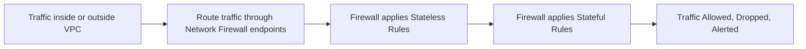
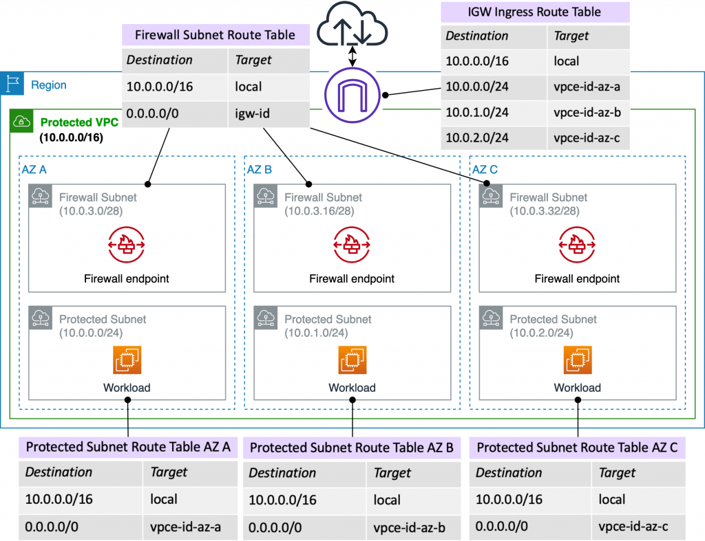
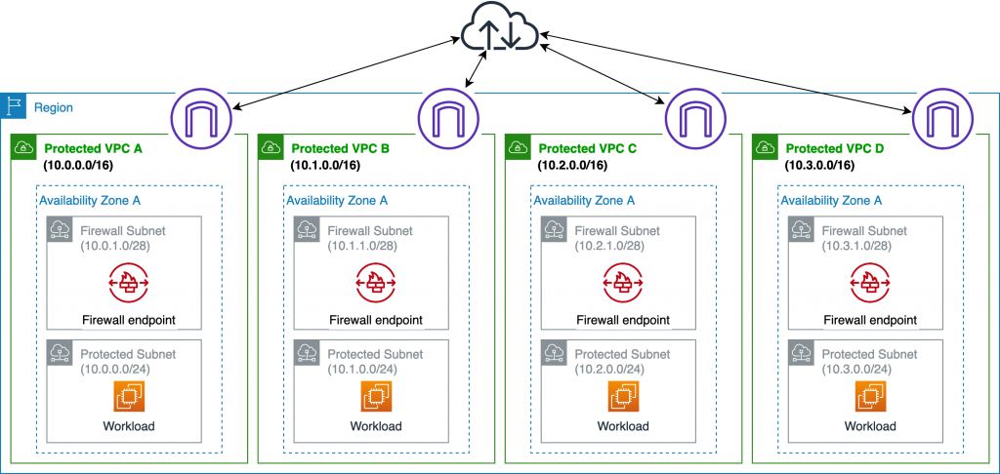

# 🔥🛡️ **AWS Network Firewall: Deep Network-Level Protection for Your VPCs**

> _Control, inspect, and filter network traffic inside your AWS VPCs — with flexible, stateful, and scalable firewall rules._

---

  

---

## 🌟 **What is AWS Network Firewall?**

**AWS Network Firewall** is a **managed, scalable network security service** that:

- 🚀 Deploys **firewalls inside your VPCs**.
- 🔥 Filters **inbound, outbound, and VPC-to-VPC** traffic.
- 🔎 Performs **deep packet inspection** (L3, L4, and L7).
- 📜 Allows **custom rule groups** or **prebuilt threat signatures**.

✅ You get **stateful**, **stateless**, and **application-layer filtering** —  
directly integrated into your cloud networking.

---

## 🛠️ **What AWS Network Firewall Protects You From**

| Threat Type                        | Example                                        |
| :--------------------------------- | :--------------------------------------------- |
| 🌍 IP-based attacks                | Malicious IP addresses, scanning               |
| 🔥 Port/Protocol Attacks           | SSH brute force, unauthorized ports            |
| 🛠️ Malware and Exploits            | Known signatures, command-and-control attempts |
| 📜 Web Filtering                   | Block unwanted domains or URLs                 |
| 🚫 Unauthorized VPC communications | Block lateral movement inside your VPC         |

✅ It’s like having a **next-generation firewall** **inside AWS** — but **managed for you**.

---

## 🧠 **How AWS Network Firewall Works**

✅ **Traffic is routed** through Network Firewall **using VPC routing tables** (not attached directly to interfaces).

---

## ✨ **Key Features of AWS Network Firewall**

| Feature                              | Description                                                       |
| :----------------------------------- | :---------------------------------------------------------------- |
| ⚡ **Scalable Deployment**           | Grows automatically with your traffic load                        |
| 📜 **Stateless Filtering**           | Quick packet filtering (IP, protocol, port matching)              |
| 🔥 **Stateful Filtering**            | Track connection states (e.g., TCP handshakes, session awareness) |
| 🌐 **Application Layer Inspection**  | Filter based on HTTP, TLS, DNS, etc.                              |
| 🔍 **Deep Packet Inspection (DPI)**  | Analyze packet payloads, detect exploits and threats              |
| 🛠️ **Custom Rule Groups**            | Write your own firewall rules (Suricata-compatible syntax)        |
| 🎯 **AWS Managed Threat Signatures** | Prebuilt rules to block common attacks                            |
| 📈 **Logging and Monitoring**        | Send flow logs and alerts to S3, CloudWatch, Kinesis              |

---

## 🪜 **How You Set Up AWS Network Firewall**

1. 🚀 **Create a Firewall** inside your VPC.
2. 🛠️ **Create Rule Groups**:
   - Stateless Rule Groups (IP/Port filtering)
   - Stateful Rule Groups (Deep inspection)
3. 📜 **Attach Rules** to the firewall policy.
4. 🛤️ **Update VPC Route Tables**:
   - Route specific traffic through the firewall endpoint (subnet).
5. 📈 **Enable Logging and Monitoring**.

✅ All new traffic follows firewall rules **before reaching EC2, RDS, Lambda, etc.**

---

## 🎯 **Common Deployment Scenarios**

| Scenario                             | AWS Network Firewall Helps                          |
| :----------------------------------- | :-------------------------------------------------- |
| 🛡️ Protect VPCs from inbound threats | Inspect incoming traffic from Internet Gateways     |
| 🔄 Secure VPC-to-VPC communications  | Filter East-West traffic                            |
| 🌐 DNS filtering                     | Block malicious or unwanted domains                 |
| 🚀 SaaS workloads and sensitive apps | Separate and isolate traffic securely               |
| 🔥 Enforce strict egress policies    | Control what traffic leaves the VPC to the internet |

---

## 🧩 **Stateless vs Stateful Rules**

|                | Stateless Rules                             | Stateful Rules                            |
| :------------- | :------------------------------------------ | :---------------------------------------- |
| 📜 Basis       | Simple packet matching (IP, port, protocol) | Deep inspection and connection awareness  |
| ⚡ Speed       | Faster (basic filtering)                    | Slower (full session tracking)            |
| 🛠️ Example Use | Allow/block traffic based on CIDR ranges    | Detect SQL Injection, malware C&C traffic |

✅ Most real-world firewalls use **both layers together**.

---

## 📚 **Integration with Other AWS Services**

| Service                     | How It Works Together                                                    |
| :-------------------------- | :----------------------------------------------------------------------- |
| **Amazon VPC Routing**      | You must update route tables to send traffic through firewall endpoints. |
| **AWS Transit Gateway**     | Centralize traffic from many VPCs into a single firewall.                |
| **CloudWatch, S3, Kinesis** | For storing and analyzing firewall logs.                                 |
| **AWS Firewall Manager**    | Centrally manage Network Firewall policies across multiple accounts.     |

---

## 💰 **Pricing Overview**

- **Firewall Endpoint**: \$0.0395/hour.
- **Traffic Processing**: \$0.065/GB.

| Cost Component              | Basis                                     |
| :-------------------------- | :---------------------------------------- |
| **Firewall Endpoint Hours** | Pay per firewall endpoint active per hour |
| **Data Processing Charges** | Pay per GB processed through the firewall |
| **Rule Group Evaluations**  | Pay based on number of rule evaluations   |

✅ **Pay-as-you-go** model based on usage and scale.

---

## 🤔 **AWS Network Firewall vs AWS WAF**

| **Feature**               | **AWS Network Firewall**                                                     | **AWS WAF**                                                                                    |
| ------------------------- | ---------------------------------------------------------------------------- | ---------------------------------------------------------------------------------------------- |
| **Purpose**               | Protects **network traffic** at the VPC level (perimeter or between VPCs).   | Protects **web applications** and APIs against common web exploits like SQL injection and XSS. |
| **Traffic Scope**         | Filters **VPC traffic** (inbound, outbound, and east-west).                  | Filters **HTTP/S traffic** for applications served via CloudFront, ALB, or API Gateway.        |
| **Use Case**              | Designed for network-level security and intrusion prevention (IDS/IPS).      | Focused on application-layer attacks, such as OWASP Top 10 vulnerabilities.                    |
| **Inspection Capability** | Deep packet inspection with Suricata rules for detecting malicious patterns. | Monitors HTTP/S requests based on Web ACLs (e.g., IP-based, geo-location, request patterns).   |
| **Rule Customization**    | Highly customizable, supports stateful and stateless rules.                  | Includes managed rule sets for OWASP Top 10 and supports custom Web ACL rules.                 |
| **Integration**           | Integrated with **Firewall Manager** for centralized rule management.        | Integrates with **CloudFront**, **ALB**, **API Gateway**, and **AppSync**.                     |
| **Pricing Model**         | Based on the number of firewall endpoints and volume of processed traffic.   | Pay-as-you-go pricing based on the number of rules and web requests evaluated.                 |

---

## 🏆 **Final Smart Pro Tip**

> 🧠 **Always route only what you need through AWS Network Firewall** —  
> Don’t route everything blindly if it’s unnecessary, to save cost and performance.

✅ Plan traffic routing smartly:  
✅ Ingress Filtering → Egress Filtering → East-West Filtering

---

## 📚 **Reference**

[https://aws.amazon.com/blogs/networking-and-content-delivery/deployment-models-for-aws-network-firewall/](https://aws.amazon.com/blogs/networking-and-content-delivery/deployment-models-for-aws-network-firewall/)

---

---

