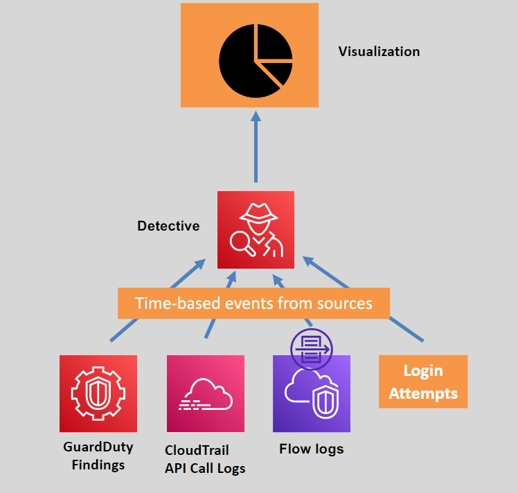
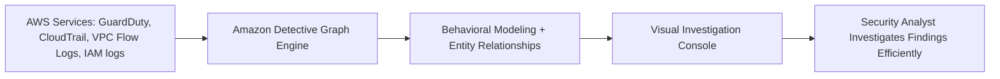

# 👮‍♂️ **AWS Detective: Investigate and Analyze Security Incidents Easily**

> _Find out what really happened inside your AWS environment — with automatic graphs, timelines, and deep security insights._

---

  

---

## 🌟 **What is AWS Detective?**

**Amazon Detective** is a **fully managed security investigation service** that:

- 🔎 Helps you **analyze and investigate** suspicious activities across AWS accounts.
- 🧠 Uses **machine learning** and **graph analysis** to automatically build visual timelines of events.
- 🚨 Correlates **logs and findings** into easy-to-understand investigation maps.

✅ Instead of manually checking CloudTrail, VPC Flow Logs, GuardDuty findings separately — Detective **connects everything together visually**.

✅ It’s like your **cloud security detective assistant** 🕵️ —  
mapping out **what happened, when it happened, and how** it’s all connected.

---

## 🛠️ **How AWS Detective Works**

✅ **Detective ingests logs**, **builds a behavior graph**, and **lets you investigate** with point-and-click graphs.

---

## 🧠 **What Data Sources AWS Detective Analyzes**

| Source                        | Purpose                                               |
| :---------------------------- | :---------------------------------------------------- |
| 📜 **AWS CloudTrail Logs**    | Tracks API calls and user activity history            |
| 🌐 **VPC Flow Logs**          | Shows network traffic flows at packet level           |
| 🛡️ **AWS GuardDuty Findings** | Flags suspicious activity (credential theft, malware) |
| 🛠️ **IAM Role Activity**      | Analyzes role assumption patterns                     |
| 🐳 **EKS Audit Logs**         | Kubernetes API audit trail (for EKS clusters)         |

✅ Multiple data sources combined = **full incident story**.

---

## 🔎 **What AWS Detective Helps You Investigate**

| Use Case                          | Example                                                                          |
| :-------------------------------- | :------------------------------------------------------------------------------- |
| 🧑‍💻 **Compromised Credentials** | Analyze where compromised users connected from, what they accessed.              |
| 🔥 **EC2 Instances Compromised**  | See all communications (IP addresses, ports) and actions from affected instance. |
| 🕸️ **Unusual API Calls**          | Investigate why IAM role modifications, access key creations happened.           |
| 🐳 **EKS Cluster Threats**        | Investigate abnormal Kubernetes API requests.                                    |

✅ Detective **shows the relationships visually** — so you **see the "attack path"** immediately.

---

## ✨ **Key Features of AWS Detective**

| Feature                                | Description                                                                            |
| :------------------------------------- | :------------------------------------------------------------------------------------- |
| 🧠 **Automatic Behavior Graphs**       | Automatically builds and updates entity relationships (users, IPs, instances, buckets) |
| 📅 **Time-Series Analysis**            | Investigate security events over customizable time ranges                              |
| 🖥️ **Interactive Visualizations**      | Point-and-click drill-down on findings, APIs, IP traffic                               |
| 🔍 **GuardDuty Finding Investigation** | Quickly expand and understand what caused each finding                                 |
| 🌍 **Multi-Account Investigation**     | Works across multiple AWS accounts using AWS Organizations                             |
| 🚨 **Real-Time Updates**               | Continuously ingests new data without manual effort                                    |

---

## 🛡️ **How AWS Detective Complements Other Services**

| Service             | Purpose                  | Detective Adds                                           |
| :------------------ | :----------------------- | :------------------------------------------------------- |
| 🛡️ **GuardDuty**    | Detects security threats | Investigate GuardDuty findings visually and contextually |
| 🛠️ **Security Hub** | Aggregates findings      | Drill into findings for detailed investigation           |
| 🗃️ **CloudTrail**   | API event logs           | Analyze long-term user and service behaviors easily      |

✅ **Detection → Aggregation → Investigation**  
✅ AWS Detective **fits right after GuardDuty and Security Hub**.

---

## 📈 **Typical Investigation Workflow with AWS Detective**

| Step | Action                                                                    |
| :--- | :------------------------------------------------------------------------ |
| 1️⃣   | A GuardDuty finding appears (e.g., suspicious login)                      |
| 2️⃣   | Click "Investigate in Detective"                                          |
| 3️⃣   | View related entities (users, IPs, instances) over time                   |
| 4️⃣   | Expand timelines, inspect network traffic, API calls                      |
| 5️⃣   | Understand attack scope (stolen keys? instance breach? lateral movement?) |
| 6️⃣   | Plan response (isolate instances, revoke credentials, update policies)    |

✅ Detective **saves hours** of manual log correlation work.

---

## 💰 **Pricing Overview**

| What You Pay For   | Pricing Basis                                   |
| :----------------- | :---------------------------------------------- |
| **Data Ingestion** | Per GB of log data processed                    |
| **Data Retention** | Additional cost for extended graph data storage |

✅ Pricing is **pay-as-you-go**, and **storage cost depends** on how long you retain investigation data.

---

## 🏆 **Final Smart Pro Tip**

> 🧠 **Use GuardDuty for threat detection, Security Hub for central view, and AWS Detective to investigate deeply and respond fast.**

✅ Always **enable GuardDuty ➔ integrate with Detective ➔ automate investigation triggers** (e.g., using EventBridge).  
✅ Together, they build a **cloud-native, modern, scalable incident response system**.

---

## 📢 **Summary: Why AWS Detective Matters**

| ✅ Feature                                                        | 💬 Why It Matters                                      |
| :---------------------------------------------------------------- | :----------------------------------------------------- |
| Visual and automatic security graph building                      | Investigate faster with less guesswork                 |
| Seamless integration with GuardDuty, CloudTrail, and Security Hub | Streamlined threat detection to investigation workflow |
| No manual correlation of logs needed                              | Saves critical time during incidents                   |
| Pay-as-you-go with no infrastructure management                   | Focus on security, not backend maintenance             |
