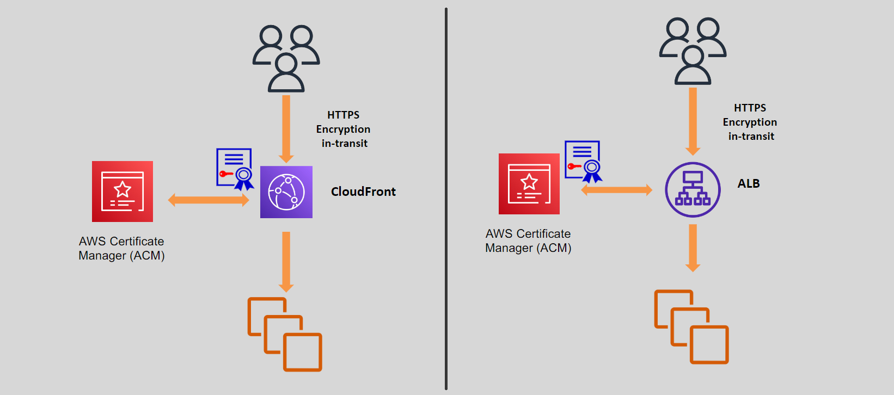
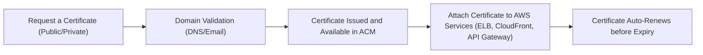

# 📜 **AWS Certificate Manager (ACM): Simplifying SSL/TLS Certificate Management**

> _Secure your web apps, APIs, and services easily — without manual certificate headaches._

---

<div align="center" style="padding: 0 20px;">
  
</div>

---

## 🌟 **What is AWS Certificate Manager?**

**AWS Certificate Manager (ACM)** is a **fully managed service** that:

- 📜 **Issues**, **manages**, **renews**, and **deploys** SSL/TLS certificates.
- 🔒 Helps secure websites, APIs, and internal applications with **encryption** and **identity authentication**.
- 🚀 Eliminates manual steps like CSR generation, private key handling, and renewals.

✅ **You focus on securing your app, not managing certificates manually!**

---

## 🔑 **Key Capabilities of ACM**

| Capability                                     | What It Does                                                             |
| :--------------------------------------------- | :----------------------------------------------------------------------- |
| 📥 **Certificate Issuance**                    | Instantly issue **public** or **private** certificates for your domains. |
| 🔁 **Automatic Renewal**                       | ACM automatically renews its issued certificates — no downtime!          |
| 🛠️ **Certificate Import**                      | Import your existing third-party certificates if needed.                 |
| 🌐 **Wildcard Certificates**                   | Secure entire subdomains (e.g., `*.example.com`).                        |
| 🏛️ **Private Certificate Authority (ACM PCA)** | Manage internal certificates for private networks or devices.            |

✅ Simplified **public web app** and **internal enterprise security** management.

---

## 🛠️ **How AWS Certificate Manager Works**



✅ **Issue ➔ Attach ➔ Forget (ACM handles renewal)!**

---

## 📜 **Types of Certificates in ACM**

| Certificate Type             | Description                                                                   |
| :--------------------------- | :---------------------------------------------------------------------------- |
| 🌐 **Public Certificates**   | Free ACM-issued certs trusted by browsers (for internet-facing apps).         |
| 🏛️ **Private Certificates**  | Issued using **ACM Private CA** for internal apps (e.g., microservices, IoT). |
| ✳️ **Wildcard Certificates** | Secures all subdomains (`*.example.com`) with one cert.                       |
| 📥 **Imported Certificates** | Bring your own third-party certificates (for rare external needs).            |

---

## 🧠 **Step-by-Step: Using ACM in Real Life**

### 🚀 Step 1: Request a Certificate

- Open ACM Console ➔ **Request Certificate**.
- Choose **Public** (for internet apps) or **Private** (for internal apps).
- Enter domain names (`www.example.com`, `*.example.com`).

---

### 🛡️ Step 2: Validate Domain Ownership

- ✅ **DNS Validation** (Preferred) → Add a CNAME record to your DNS host.
- ✅ **Email Validation** (Legacy) → Approve through an email sent to domain registrant/admin.

---

### 🏗️ Step 3: Deploy the Certificate

Attach the issued certificate to:

- 🖥️ **Elastic Load Balancer (ELB)**: For web servers behind ALB/NLB.
- 🌍 **CloudFront**: For global website and app acceleration.
- 🚀 **API Gateway**: For protecting your APIs (REST, WebSocket, GraphQL).
- 🧠 **Cognito User Pools**: For secure authentication endpoints.
- 📦 **Amplify, App Runner, Beanstalk**: For modern apps.
- 🔍 **OpenSearch**: For encrypted search services.

---

### 🔄 Step 4: Automatic Renewal & Monitoring

- ACM auto-renews ACM-issued certificates **90 days before expiration**.
- For **imported certificates**, monitor and re-import manually.

Check certificate status via:

```bash
aws acm list-certificates
```

✅ Stay secure without worrying about expiry dates!

---

## ✨ **Where ACM Certificates Can Be Used**

| AWS Service                                   | Purpose                                           |
| :-------------------------------------------- | :------------------------------------------------ |
| 🖥️ **Elastic Load Balancer**                  | Encrypt traffic between client and load balancer. |
| 🌍 **CloudFront Distributions**               | HTTPS globally with low latency.                  |
| 🚀 **API Gateway**                            | Secure APIs over HTTPS.                           |
| 🧠 **Cognito**                                | Secure login portals.                             |
| ⚙️ **Elastic Beanstalk, App Runner, Amplify** | Auto-attach certs to web apps.                    |

---

## ⚠️ **Limitations of AWS Certificate Manager**

| Limitation                                      | Details                                                                    |
| :---------------------------------------------- | :------------------------------------------------------------------------- |
| 🚫 **No Export of Public ACM Certificates**     | You cannot download ACM public certs for local servers (security reasons). |
| 🚫 **No Direct Install on EC2**                 | Use a Load Balancer or CloudFront to present the cert.                     |
| 🔁 **Manual Renewal for Imported Certificates** | Imported certs require your manual monitoring and renewal.                 |

✅ **Plan architecture accordingly** when using ACM!

---

## 💡 **Best Practices for Using ACM**

| Best Practice                                | Why                                                     |
| :------------------------------------------- | :------------------------------------------------------ |
| 🛡️ **Prefer DNS Validation**                 | Easier renewals, automation-friendly.                   |
| 🔄 **Monitor Imported Certificates**         | Prevent downtime due to expiration.                     |
| 🏛️ **Use ACM Private CA for Internal Use**   | Secure microservices, IoT, or VPNs with internal certs. |
| 🚀 **Attach to Load Balancers / CloudFront** | Never serve apps without HTTPS encryption.              |

---

## 🤔 **Why Choose AWS Certificate Manager?**

| Reason                          | Benefit                                                 |
| :------------------------------ | :------------------------------------------------------ |
| ⚡ **Ease of Use**              | One-click issuance and auto-renewal.                    |
| 🛡️ **Free Public Certificates** | Save money on SSL/TLS certs.                            |
| 🔄 **Seamless Integration**     | Out-of-the-box with ELB, CloudFront, API Gateway.       |
| 🔐 **Increased Security**       | Reduces risks of expired/misconfigured certificates.    |
| 🧠 **No Server Management**     | Fully managed — no hardware, no CA servers to maintain. |

---

## 🏆 **Final Smart Pro Tip**

> 🧠 **Always automate domain validation using DNS (Route 53) + use ACM + CloudFront for maximum HTTPS protection with minimum effort.**

- **Secure fast** (1 click)
- **Renew automatically** (no expiry downtime)
- **No private key handling** (safer security model)
