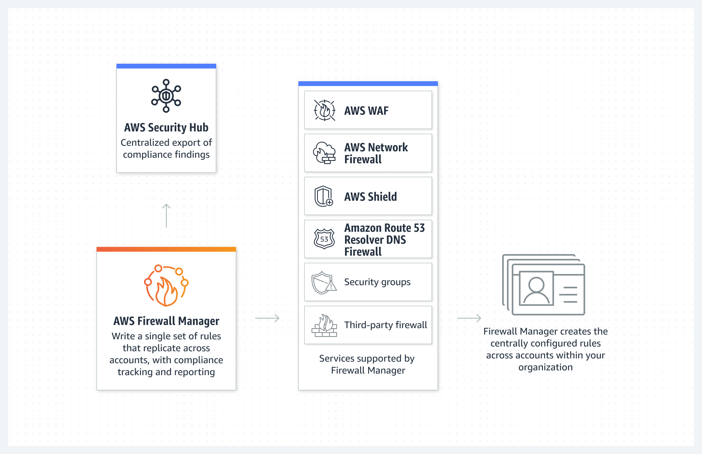
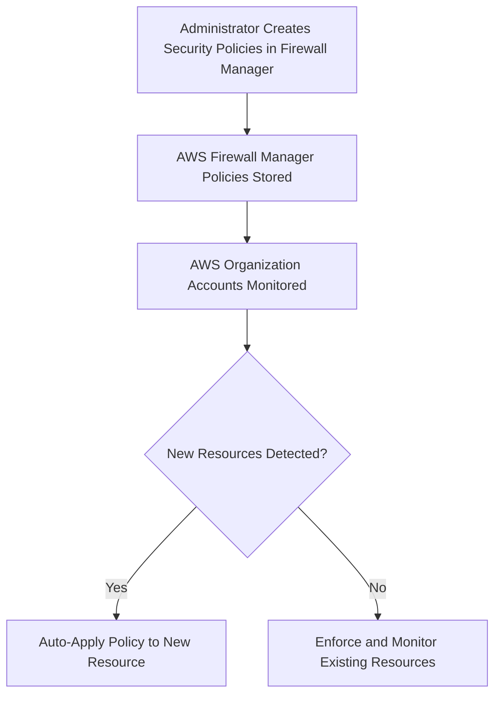
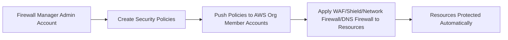

# 🏛️ **AWS Firewall Manager: Centralized Security Management Across AWS**

> _Secure multiple AWS accounts and resources from a single place — automatically, consistently, and smartly._

---

  

---

## 🌟 **What is AWS Firewall Manager?**

**AWS Firewall Manager** is a **security management service** that helps you:

- 🛡️ Centrally configure and enforce firewall rules across **multiple AWS accounts and resources**.
- 🚀 Automatically apply security policies **as new resources are created**.
- 🔄 Ensure consistent security posture across **your entire AWS Organization**.

✅ One place to manage:

- **AWS WAF rules**
- **AWS Shield Advanced protections**
- **VPC security groups**
- **AWS Network Firewall rules**
- **Route 53 Resolver DNS Firewall rules**

---

## 🧠 **Why AWS Firewall Manager Matters**

Without Firewall Manager:

- Every AWS account team might configure security differently (risky!).
- Hard to ensure all accounts apply updated WAF rules or Shield protections.
- New resources (e.g., ALB, API Gateway) might launch **unprotected** by mistake.

✅ Firewall Manager **automates** applying security policies **uniformly and immediately**.

---

## 🛠️ **How AWS Firewall Manager Works**

✅ It **monitors AWS Organization accounts** and **pushes policies automatically** based on rules you define.

---

## 🔎 **Key Features of AWS Firewall Manager**

| Feature                              | Description                                                                                                                        |
| :----------------------------------- | :--------------------------------------------------------------------------------------------------------------------------------- |
| 🛡️ **Centralized Policy Management** | Create WAF, Shield, Security Group, DNS Firewall, and Network Firewall policies once — enforce everywhere.                         |
| 🌍 **Multi-Account Coverage**        | Automatically protects accounts in your **AWS Organizations** structure.                                                           |
| 🛠️ **Auto-Remediation**              | Detects non-compliant resources and auto-corrects them.                                                                            |
| 📜 **Policy Types**                  | Supports WAF Web ACLs, Shield Advanced subscriptions, VPC Security Groups, Network Firewall policies, Route 53 DNS Firewall rules. |
| 📈 **Compliance Dashboard**          | View compliance status and security gaps across all your accounts.                                                                 |

---

## 🧩 **Types of Policies You Can Create**

| Policy Type                                  | Purpose                                                                |
| :------------------------------------------- | :--------------------------------------------------------------------- |
| 🚦 **AWS WAF Policy**                        | Deploy Web ACLs automatically to CloudFront, ALB, API Gateway, AppSync |
| 🛡️ **Shield Advanced Policy**                | Subscribe and apply Shield Advanced protections automatically          |
| 🔥 **VPC Security Group Policy**             | Audit or enforce security group configurations across VPCs             |
| 🌐 **AWS Network Firewall Policy**           | Deploy centralized firewall rules inside VPCs                          |
| 🛡️ **Route 53 Resolver DNS Firewall Policy** | Block/restrict DNS queries based on domain lists                       |

✅ You can mix and match policies to meet **different application needs**.

---

## 🛡️ **Example: WAF + Shield Protection Auto-Applied**

| Without Firewall Manager                                                         | With Firewall Manager                                                               |
| :------------------------------------------------------------------------------- | :---------------------------------------------------------------------------------- |
| Admins must manually apply WAF Web ACLs to every new CloudFront or ALB resource. | New CloudFront or ALB distributions automatically get the right WAF rules attached. |
| Shield Advanced must be manually subscribed per resource.                        | Shield Advanced is automatically enabled when a resource is created.                |
| Risk of human error and security gaps.                                           | Security posture is **automatic, uniform, and fast**.                               |

---

## 📚 **Common Real-World Use Cases**

| Scenario                         | How Firewall Manager Helps                                             |
| :------------------------------- | :--------------------------------------------------------------------- |
| 🏢 Large Enterprises             | Manage security for 50, 100, or 500 AWS accounts consistently          |
| 🚀 Fast-Growing Startups         | New apps, APIs, websites spin up securely with zero manual effort      |
| 🛡️ Regulated Industries          | Enforce security and compliance policies across accounts automatically |
| 📈 Security Compliance Reporting | Get audit-ready security dashboards for all your accounts              |

---

## 🌍 **Architecture View**

✅ Admin in **Management Account** → pushes policies → all accounts stay compliant.

---

## 💰 **Pricing Overview**

| Item                                | Cost                       |
| :---------------------------------- | :------------------------- |
| **Firewall Manager Policy Charges** | Per policy per region      |
| **Shield Advanced Charges**         | Paid separately if enabled |
| **WAF Request Charges**             | Paid separately as usual   |
| **Network Firewall Charges**        | Paid separately for usage  |

✅ Firewall Manager itself has small administrative cost; most of the cost comes from the underlying services.

---

## 🏆 **Final Smart Pro Tip**

> 🧠 **Use AWS Firewall Manager if you have (or will have) more than a few AWS accounts — it’s the only way to scale security without losing control.**

✅ It prevents security drift  
✅ It ensures consistent protection across accounts  
✅ It saves huge time managing security manually!

---

## 📢 **Summary: What AWS Firewall Manager Solves**

| Problem                                         | Firewall Manager Solution                        |
| :---------------------------------------------- | :----------------------------------------------- |
| Inconsistent WAF and Shield setups across teams | ✅ Centralized security policies                 |
| Manual setup for every new ALB or CloudFront    | ✅ Auto-enforcement on new resources             |
| Security compliance headaches                   | ✅ Real-time visibility and compliance reporting |
