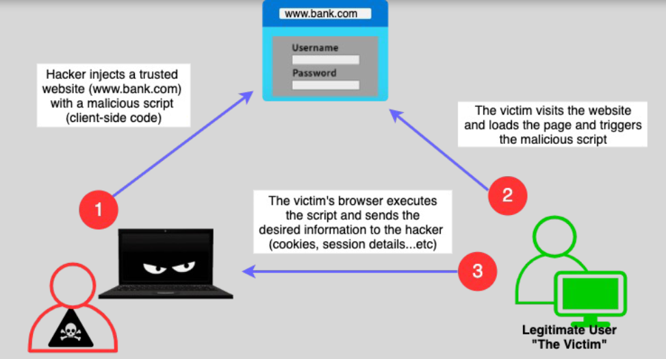
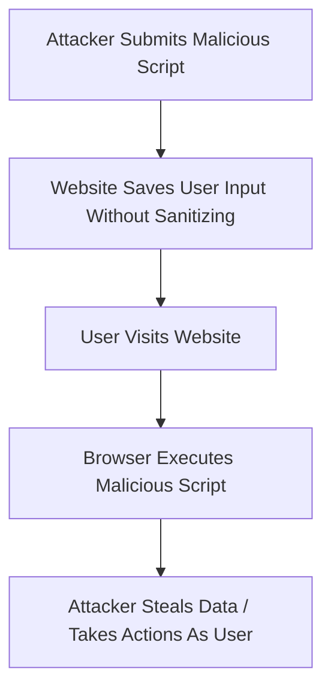

# 🚨 **What is an XSS Attack? (Cross-Site Scripting Explained)**

> _A sneaky trick where attackers inject malicious code into trusted websites — and make it run inside users' browsers._

---

<div align="center">
  
</div>

---

## 🌟 **Simple Definition**

A **Cross-Site Scripting (XSS) attack** happens when an attacker **injects malicious JavaScript code** into a trusted website — and when other users visit the site, the malicious code **executes in their browsers**.

✅ **Think of it like this:**

> You trust a bakery 🍰. Someone sneaks in poison inside cakes 🍰 — you eat it because you trust the bakery.

---

## 🧠 **How XSS Works**



✅ **Website shows the attacker's script as if it were part of its own trusted content.**

---

## 🔥 **What Attackers Can Do with XSS**

| 🎯 Goal                            | 💬 Real Impact                                      |
| :--------------------------------- | :-------------------------------------------------- |
| 📋 **Steal cookies**               | Gain access to users' sessions (steal logins)       |
| 🛠️ **Modify website content**      | Trick users into fake forms, phishing               |
| 🎣 **Keylogging**                  | Capture users' keystrokes (passwords, credit cards) |
| 🚀 **Spread malware**              | Redirect users to malicious websites                |
| 🔥 **Perform actions as the user** | Post, delete, transfer money, etc.                  |

---

## 🔎 **Types of XSS Attacks**

| Type                 | Description                                                                                                     | Example                                    |
| :------------------- | :-------------------------------------------------------------------------------------------------------------- | :----------------------------------------- |
| 🧪 **Stored XSS**    | Malicious script is **saved on the server** (e.g., in comments, user profiles) and shown to many users          | Dangerous because it spreads automatically |
| ✉️ **Reflected XSS** | Malicious script is **immediately reflected** back from the server in error messages, search results, etc.      | Often delivered via a **malicious link**   |
| 📋 **DOM-Based XSS** | Malicious changes happen **directly in the user's browser** via unsafe JavaScript handling (no server involved) | Harder to detect, happens on client-side   |

---

## 🛡️ **Real Example of a Simple XSS Attack**

Imagine a site shows your name after you login:

```html
Welcome, <span id="username">[YOUR NAME]</span>
```

But the website **doesn’t sanitize inputs**.  
So an attacker enters:

```html
<script>
  alert("Hacked!");
</script>
```

✅ Every user visiting the page **runs the attacker's script**.

---

## 🚨 **Why XSS is Dangerous**

| ❗ Danger                                 | 💬 Why it Matters                                                                |
| :---------------------------------------- | :------------------------------------------------------------------------------- |
| 🔓 **Breaks Trust**                       | The browser trusts the website, and therefore runs whatever code it delivers.    |
| 🕵️‍♂️ **Invisible**                          | Most users **won’t notice** anything weird happening.                            |
| 🔥 **Critical in Modern Web Apps**        | Apps that allow user input (comments, profiles, search bars) are always at risk. |
| 💰 **Can Cause Serious Financial Losses** | If user sessions (cookies) or credentials are stolen.                            |

---

## 🔧 **How to Prevent XSS**

| 🛡️ Method                                   | 💬 What to Do                                                                   |
| :------------------------------------------ | :------------------------------------------------------------------------------ |
| 🧹 **Input Sanitization**                   | Clean all user inputs to remove dangerous content                               |
| 🚫 **Output Escaping**                      | Escape characters like `< > &` before displaying input                          |
| 🏷️ **Use CSP (Content Security Policy)**    | Restrict what scripts can run on your page                                      |
| 📋 **Validate Inputs on Server and Client** | Always double-check inputs on both sides                                        |
| 🛠️ **Use Secure Frameworks**                | Angular, React, Django templates automatically escape outputs if used correctly |

✅ **Best defense = sanitize, validate, and escape!**

---

## 📚 **Real-World Example**

> A popular news site allowed users to comment without input sanitization.  
> An attacker posted a comment with malicious `<script>` tags.  
> Thousands of users loaded the page → their sessions were hijacked → attacker logged into their accounts.

✅ This caused **data breaches**, **account takeovers**, and **brand reputation damage**.

---

## 🧠 **Summary: How to Think About XSS**

| Question             | Answer                                                             |
| :------------------- | :----------------------------------------------------------------- |
| What is XSS?         | Injecting malicious code into trusted websites                     |
| Why is it dangerous? | Runs in users' browsers **without their permission**               |
| How to prevent it?   | Sanitize input + Escape output + Use Content Security Policy (CSP) |

---

## 🏆 **Final Smart Pro Tip**

> 🧠 **Always treat any user input — no matter how simple — as untrusted.**  
> Never directly insert user input into your web pages without cleaning and escaping it!

✅ **Defense-in-depth = sanitize → validate → escape → apply Content Security Policy.**
