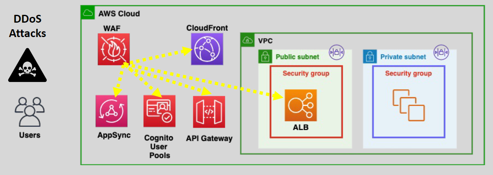
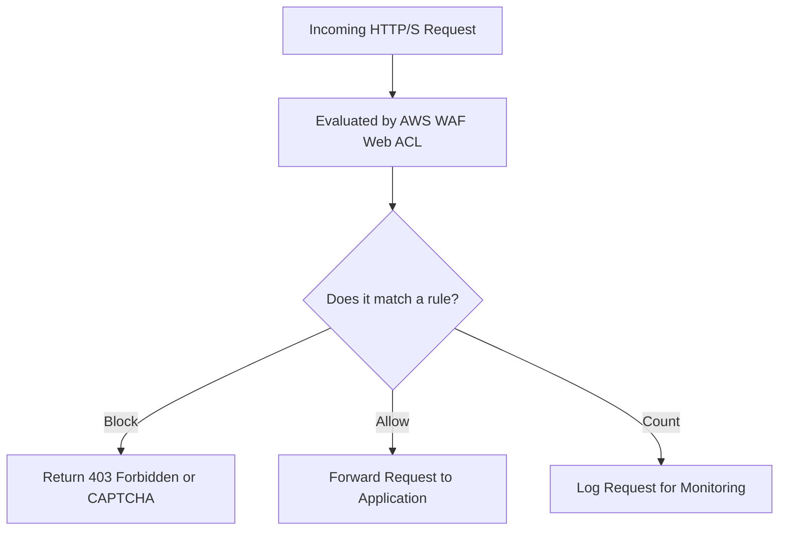
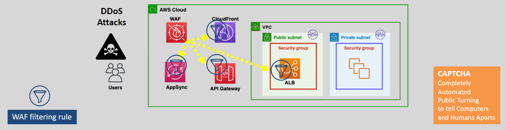

# 🧱 **AWS WAF: Web Application Firewall for Cloud-First Security**

> _Filter, monitor, and protect your web applications and APIs — in real-time — against evolving online threats._

---

  

---

## 🌟 **What is AWS WAF?**

**AWS WAF (Web Application Firewall)** is a **managed security service** that:

- 🛡️ Protects **web applications** and **APIs** against common web exploits.
- 🔍 Analyzes **HTTP/S requests** in real-time.
- ⚙️ Applies **customizable rules** to **allow**, **block**, **count**, or **challenge** (CAPTCHA) requests.

✅ Works seamlessly with:

- **Amazon CloudFront**
- **Application Load Balancer (ALB)**
- **API Gateway**
- **AWS AppSync**
- **Amazon Cognito user pools**

---

## 🧠 **How AWS WAF Works**

✅ Requests are **evaluated against Web ACLs** —  
✅ Based on matching rules, they are either **blocked, allowed, counted, or challenged**.

---

## ✨ **Key Features of AWS WAF**

| Feature                                 | Description                                                     |
| :-------------------------------------- | :-------------------------------------------------------------- |
| 📋 **Rule-Based Filtering**             | Define conditions based on IP, headers, body, URI, query string |
| 🛡️ **Managed Rules**                    | Pre-built rulesets for SQLi, XSS, bots, bad IP reputation       |
| ⚙️ **Custom Rules**                     | Build your own matching patterns (advanced control)             |
| 🚦 **Rate-Based Rules**                 | Block or limit excessive traffic from a source IP               |
| 🌍 **Geo-Location Filtering**           | Allow or block traffic based on country of origin               |
| 🎯 **Bot Control**                      | Identify and control bot traffic (good and bad bots)            |
| 🛠️ **Captcha & Challenge Actions**      | Challenge suspicious requests without full blocking             |
| 📊 **CloudWatch Metrics**               | Real-time monitoring and traffic insights                       |
| 💬 **Logging to S3/CloudWatch/Kinesis** | Full request logs for audit and security analysis               |

---

## 🧩 **AWS WAF Web ACLs (Access Control Lists)**

| Component          | Purpose                                            |
| :----------------- | :------------------------------------------------- |
| **Web ACL**        | The main container holding all your rules          |
| **Rules**          | Specific conditions to block/allow/count traffic   |
| **Rule Groups**    | Bundles of related rules (yours or AWS Managed)    |
| **Default Action** | Action to take if no rule matches (allow or block) |

✅ You assign Web ACLs to your resources: CloudFront, ALB, API Gateway, etc.

---

  

---

## 🚀 **AWS WAF Supported Integrations**

| Service                             | Purpose                                        |
| :---------------------------------- | :--------------------------------------------- |
| **Amazon CloudFront**               | Protect global CDN distributions               |
| **Application Load Balancer (ALB)** | Filter traffic before it hits your EC2 servers |
| **API Gateway**                     | Protect APIs directly from malicious payloads  |
| **AWS AppSync**                     | Secure GraphQL APIs                            |
| **Amazon Cognito User Pools**       | Protect user authentication endpoints          |

✅ **Flexible and consistent protection** across all AWS front-end services.

---

## 📚 **Common Use Cases for AWS WAF**

| Scenario                            | How AWS WAF Helps                                                          |
| :---------------------------------- | :------------------------------------------------------------------------- |
| 🔥 **Protect Against OWASP Top 10** | Blocks SQL Injection (SQLi), Cross-Site Scripting (XSS), and other attacks |
| 🛑 **Block Bad Bots**               | Identifies and filters bot traffic                                         |
| 🚀 **Rate Limiting APIs**           | Stops abuse by limiting requests from a single IP                          |
| 🌍 **Geo-Blocking**                 | Restrict traffic to/from specific countries                                |
| 📈 **Traffic Monitoring**           | Analyze requests for suspicious patterns without immediately blocking      |

---

## 💡 **AWS WAF vs Geo Features in Route 53 and CloudFront**

| Feature             | CloudFront                       | Route 53                                | AWS WAF                                                       |
| :------------------ | :------------------------------- | :-------------------------------------- | :------------------------------------------------------------ |
| **Geo Restriction** | ✅ Blocks countries at CDN level | ✅ Routes DNS queries based on location | ✅ Filters HTTP requests by geo, combined with other criteria |
| **Deep Inspection** | ❌ No                            | ❌ No                                   | ✅ Yes (query strings, headers, body inspection)              |
| **Bot Detection**   | ❌ No                            | ❌ No                                   | ✅ Yes                                                        |

✅ **Only WAF** combines **geo**, **content inspection**, and **attack signature matching**.

---

## 💰 **Pricing Overview**

| Item                    | Cost Basis                                             |
| :---------------------- | :----------------------------------------------------- |
| **Web ACL**             | Fixed monthly charge                                   |
| **Rules**               | Per rule added                                         |
| **Request Count**       | Cost based on number of requests inspected             |
| **Managed Rule Groups** | Additional charge for AWS-managed or marketplace rules |

✅ **Pay-as-you-go model** based on **usage**.

---

## 📋 **Summary: Why AWS WAF is Essential**

> _Modern web apps face modern attacks — AWS WAF gives you flexible, scalable, and deep web traffic protection._

✅ Protects APIs, websites, authentication systems  
✅ Blocks known vulnerabilities (SQLi, XSS, OWASP Top 10)  
✅ Integrates easily with CloudFront, ALB, API Gateway  
✅ Combines manual + managed rule options  
✅ Enables smart traffic management and attack visibility

---

## 🏆 **Final Smart Pro Tip**

> 🧠 **Always combine AWS WAF with AWS Shield Advanced** to get **full multi-layered protection** —  
> DDoS defense at network level (Shield) + HTTP traffic filtering at app level (WAF) = **total cloud defense**.

✅ Shield + WAF = **Security at L3 ➡️ L4 ➡️ L7**
