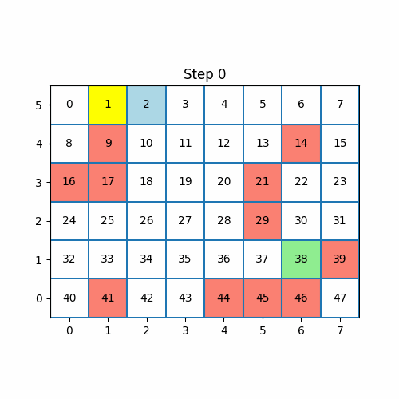
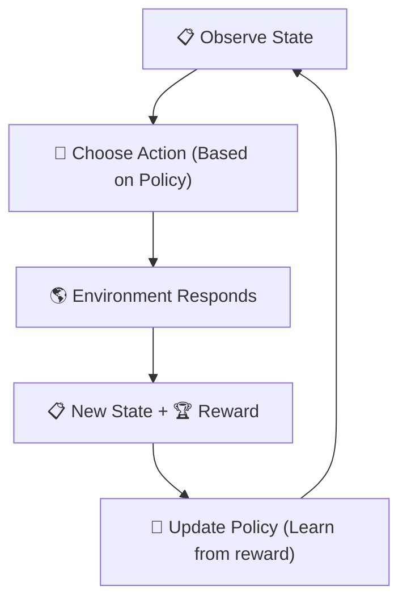
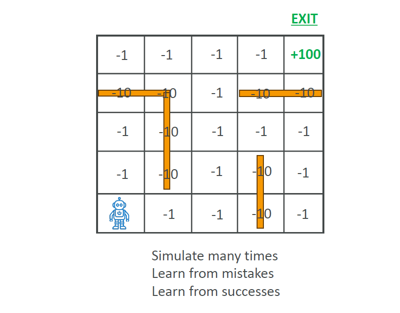
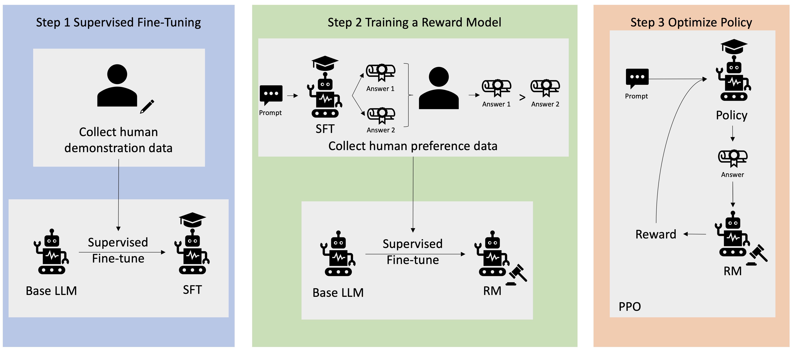
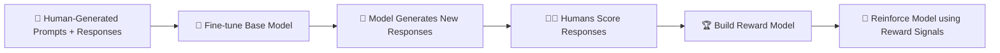

# 🎯 What is Reinforcement Learning (RL)?

## 🧠 What is Reinforcement Learning?

> **Official Definition**:  
> **Reinforcement Learning (RL)** is a type of Machine Learning where an **agent** learns to make **sequential decisions** by **performing actions** in an **environment** to **maximize cumulative rewards** over time.

---

    

---

📌 **In simpler words**:  
RL is like **training a puppy 🐶**:

- If it sits → give it a treat 🍖 (reward).
- If it chews your shoe → scold it ❌ (punishment).

Over time, the puppy **learns good behavior** by trying, failing, and adjusting — just like an RL agent!

---

## 🌍 Key Concepts in Reinforcement Learning

| Concept        | Meaning                                                          |
| :------------- | :--------------------------------------------------------------- |
| 🧑‍🎓 Agent    | The learner/decision maker (like the robot or AI player)         |
| 🌎 Environment | Where the agent operates and makes decisions (game, maze, world) |
| 🎯 Action      | A choice made by the agent (move left, pick up object)           |
| 📋 State       | The current situation/context of the environment                 |
| 🏆 Reward      | Feedback signal (good or bad) based on the action                |
| 🗺️ Policy      | The strategy the agent follows to pick actions                   |

📌 **Easy Tip**:

- **Agent** acts based on the **State**.
- Gets a **Reward**.
- Updates its **Policy** to act better next time!

---

## 🏗️ How Does Reinforcement Learning Work?

📌 The full loop:

📌 **Step-by-step**:

1. Agent **observes** the current **State**.
2. Agent **selects an Action** according to its **Policy**.
3. **Environment responds** with a **Reward** and a new **State**.
4. Agent **updates its Policy** based on the Reward.
5. Repeat ➡️ Agent gets smarter over time!

📌 **Goal**:  
**Maximize total reward** over the long term, not just immediate rewards.

---

## 🏃‍♂️ Real-World Example: Robot Navigating a Maze

  

---

📌 Scenario:

- Agent = Robot 🤖
- Environment = Maze 🧩
- Action = Move (up, down, left, right)
- State = Current position in maze
- Reward =
  - -1 for each move (to encourage quick solutions),
  - -10 for hitting a wall 🚧,
  - +100 for reaching the exit 🎯.

📌 Over time:

- The robot **learns** to reach the exit quickly
- **Avoids walls** to **maximize cumulative rewards**.

---

## 🎮 Applications of Reinforcement Learning

| Field                  | Example                                     |
| :--------------------- | :------------------------------------------ |
| 🕹️ Gaming              | Training AI to play Chess ♟️, Go, Dota 2 🎮 |
| 🤖 Robotics            | Navigation, object manipulation             |
| 💵 Finance             | Optimizing stock trading strategies 📈      |
| 🏥 Healthcare          | Optimizing personalized treatment plans 🧬  |
| 🚗 Autonomous Vehicles | Decision-making for safe driving 🛣️         |

---

## 🧠 What is RLHF (Reinforcement Learning from Human Feedback)?

> **Official Definition**:  
> **RLHF** uses **human feedback** to help train RL agents or models, ensuring they **align better** with **human goals, values, and preferences**.

📌 **Simple way to think about it**:

- Normally, RL agents are trained with a **predefined reward function**.
- In RLHF, **humans help define rewards** by judging outputs.

📌 **Real-world Example**:

- Fine-tuning ChatGPT 🧠:
  - Human reviewers grade model responses.
  - AI learns to **prefer human-preferred answers** over technical but robotic ones.

---

## 🏗️ How RLHF Works (Process)

    

---

---

📌 **Step-by-Step**:

1. **Collect human responses** to prompts.
2. **Fine-tune a model** on this dataset.
3. Model **generates its own answers**.
4. Humans **rate** which answers are better.
5. Build a **Reward Model** that mimics human judgments.
6. **Retrain the model** using this reward feedback.

---

## 🧩 Real-world Example: Internal Knowledge Chatbot

📌 Scenario:

- Build a chatbot for employees to answer company questions.

📌 Steps:

- Human-written Q&A examples (e.g., "Where is HR located?")
- Fine-tune the chatbot on this data.
- Let the chatbot generate answers.
- Humans rate which answers they prefer.
- Train a reward model.
- Optimize chatbot to maximize human preference ➡️ smarter, human-like answers!

---

## 🎯 Mini Recap: Key Points

📌 **Reinforcement Learning**:  
Agent learns by acting, getting rewards, adjusting actions over time.

📌 **RLHF**:  
Enhance RL with **human feedback** to make the model behave more **aligned with human expectations**.

📌 **Core of GenAI today**:  
LLMs (like ChatGPT) use RLHF to sound natural and helpful!

---

## ✍️ Smart Cheatsheet

| Term        | Meaning                                       |
| :---------- | :-------------------------------------------- |
| RL          | Learn by trying, receiving rewards            |
| Agent       | Decision maker (robot, AI, chatbot)           |
| Environment | Where the agent acts (maze, game, real world) |
| Reward      | Positive or negative feedback                 |
| Policy      | Strategy to pick next action                  |
| RLHF        | Humans guide the rewards for better alignment |

## Extra knowledge

- [Example of RH ”AI Learns to Escape”](https://youtu.be/2tamH76Tjvw)
- [AI Warehouse](https://www.youtube.com/@aiwarehouse)
- [Reinforcement Learning](https://www.kaggle.com/learn/machine-learning/reinforcement-learning)
- [RLHF](https://www.kaggle.com/learn/machine-learning/rlhf)
