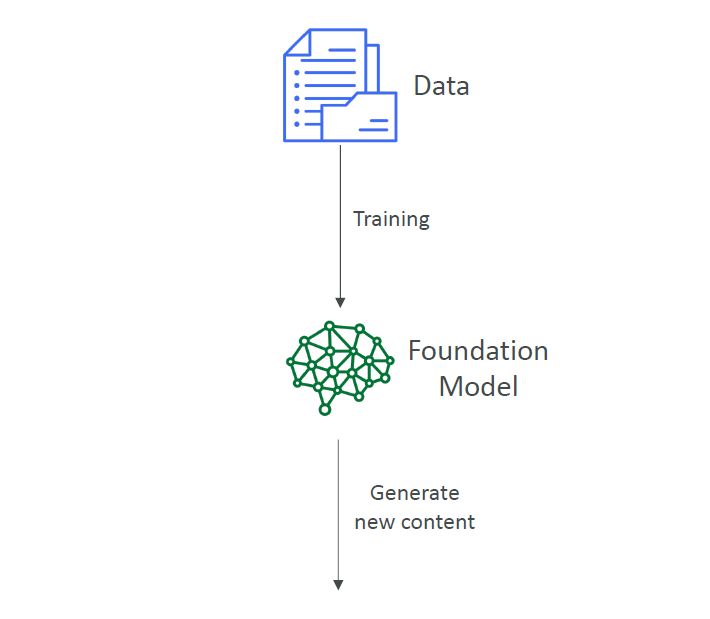
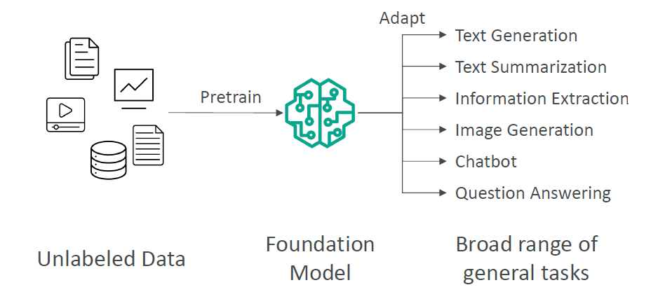
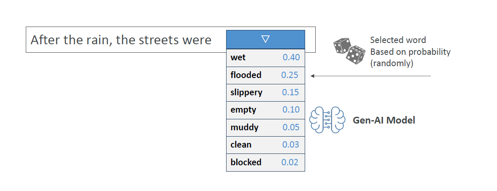
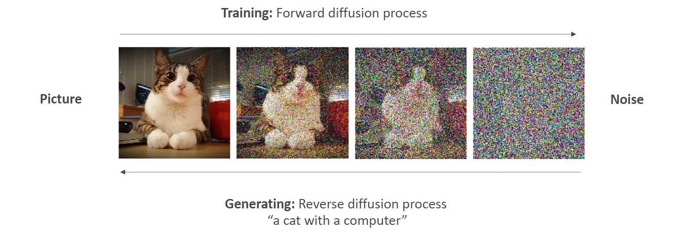
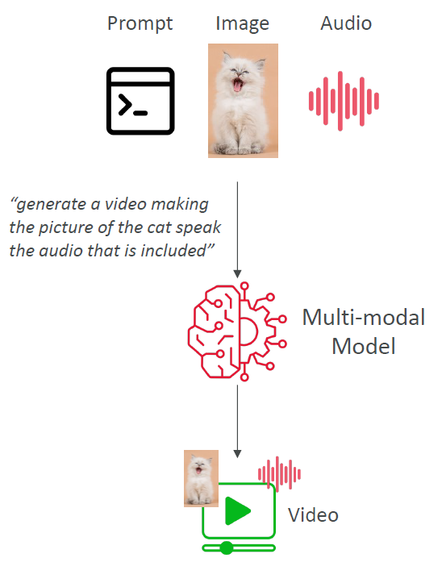
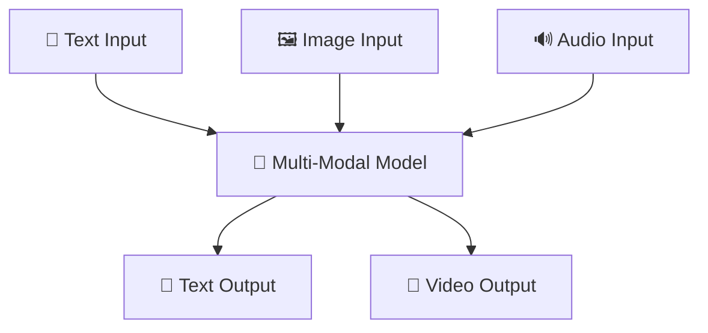

# 🤖 **What is Generative AI (Gen-AI)?**

## 📌 **What is Generative AI (Gen-AI)?**

> **Official Definition:**  
> **Generative AI** is a **subset of Deep Learning** focused on creating **new content** like **text, images, music, or even videos**, based on what it learned from existing data.

✅ **Key Points**:

- Part of the **Deep Learning** family 🧠.
- Built on **multi-purpose foundation models** backed by **neural networks** 🔗.
- Can be **fine-tuned** to adapt better to specific use cases 🎯.
- Works mainly with **unlabeled data** during pretraining (no manual labeling needed!).
- Powers tasks like:
  - Text generation ✍️
  - Text summarization 📝
  - Information extraction 📚
  - Image generation 🖼️
  - Chatbots 🤖
  - Question answering ❓

---

## 🧠 **Foundation Models**

> A **Foundation Model** is a **large machine learning model** trained on **massive, diverse datasets** that serves as the **base** for building specialized AI systems, like Chatbots, Image Generators, and more.

---

    

---

### 🛠️ Core Characteristics of Foundation Models

| Feature                | Description                                                                                  |
| :--------------------- | :------------------------------------------------------------------------------------------- |
| 📦 Broad Training Data | Trained on text, images, code, and more — **general-purpose** knowledge.                     |
| 💸 Expensive to Train  | Costs **tens of millions of dollars** and massive computational power to build from scratch. |
| 🏛️ Reusable Base       | Once trained, they can **power many different AI applications** through fine-tuning.         |

---

### 📈 Examples of Foundation Models

| Company             | Example Models          | Notes                                                   |
| :------------------ | :---------------------- | :------------------------------------------------------ |
| **OpenAI**          | GPT-3.5, GPT-4, GPT-4o  | Commercial license (ChatGPT runs on them)               |
| **Meta (Facebook)** | LLaMA, LLaMA 2, LLaMA 3 | **Open-source** models, free to use                     |
| **Amazon**          | Titan Models            | Foundation models accessible via Amazon Bedrock         |
| **Google**          | PaLM 2, Gemini, BERT    | BERT is **open-source**, PaLM and Gemini are commercial |
| **Anthropic**       | Claude 2, Claude 3      | Commercial foundation models focused on safe AI         |

---

### 🛡️ Open-Source vs. Commercial Foundation Models

| Type            | Details                                                               |
| :-------------- | :-------------------------------------------------------------------- |
| **Open-Source** | Free to use and modify (e.g., Meta’s LLaMA, Google’s BERT)            |
| **Commercial**  | Licensed, controlled usage (e.g., OpenAI’s GPT-4, Anthropic’s Claude) |

---

📌 **Big Picture Rule**:

> "**Foundation Models = Huge Base + Train Once + Reuse Everywhere**" 🌍🔁  
> "**Foundation Models are the starting point for almost everything in Generative AI today!**" 🧠✨

---

## 🧩 **How Gen-AI Works: Foundation Model Pretraining**

    

---

✅ **Simple idea**:

- Train a **huge model** once on **general data**.
- Then **specialize** it later if needed by fine-tuning.

---

## 🎨 **Real-World Applications of Gen-AI**

| Field                     | Example                                                      |
| :------------------------ | :----------------------------------------------------------- |
| ✍️ Text Generation        | Writing stories, blogs (like ChatGPT)                        |
| 📚 Text Summarization     | Summarizing books or news                                    |
| 📄 Information Extraction | Extracting important details from legal docs                 |
| 🖼️ Image Generation       | Creating pictures from text (e.g., DALL·E, Stable Diffusion) |
| 🤖 Chatbots               | Conversational agents (e.g., ChatGPT, Bard)                  |
| ❓ Question Answering     | AI answering your questions (search engines, assistants)     |

✅ **Notice**:  
Today’s Gen-AI is not only smart — it’s **creative** too! 🌟

---

## 🧠 **Large Language Models (LLMs)**

> **Large Language Models (LLMs)** are a type of AI system specifically trained to **understand** and **generate** human-like text.

---

### 🚀 Key Characteristics

| Feature                     | Description                                                                        |
| :-------------------------- | :--------------------------------------------------------------------------------- |
| 📚 Trained on Large Texts   | Books, articles, websites, and more.                                               |
| 🧠 Massive Size             | Billions of parameters for deep understanding and generation.                      |
| 🛠️ Specialized for Language | Built to handle **translation**, **summarization**, **Q&A**, **content creation**. |

---

## 🎲 **How Text is generated in an LLM**

    

---

### 🌟 Famous Example

| LLM Model | Creator | Notes                         |
| :-------- | :------ | :---------------------------- |
| GPT-4     | OpenAI  | Powers ChatGPT and many apps. |

---

📌 **Simple Memory Tip**:

> "**LLMs = Big AI brains trained to speak, understand, and create like humans.**" 🧠💬

---

## ⚡ **What is the Transformer Model?**

✅ Transformers are **the backbone** of most Generative AI models today, including **Large Language Models (LLMs)** like ChatGPT.

✅ **Key Innovations**:

- Processes a **whole sentence at once**, **not word-by-word** 🧠 → Faster & more coherent.
- Understands **which words are important** to each other using **Self-Attention** 🔍.
- **Massively parallelizable** → Trains much faster than old methods.

✅ **How Transformers Work (Simplified)**:

```mermaid
flowchart LR
    InputText[📝 Input Text] --> Embedding[🔡 Input Embedding]
    Embedding --> SelfAttention[👀 Self Attention]
    SelfAttention --> FeedForward[🔁 Feed Forward Network]
    FeedForward --> Encoder[🛠️ Encoder]
    Encoder --> Decoder[🛠️ Decoder]
    Decoder --> OutputEmbedding[🔡 Output Embedding]
    OutputEmbedding --> OutputSoftmax[🎯 Output Probabilities]
    OutputSoftmax --> FinalOutput[📝 Final Output]
```

✅ **Examples of Transformer-Based LLMs**:

- **Google BERT** 📖
- **OpenAI GPT models (GPT-3, GPT-4, GPT-4o)** 🚀
- **ChatGPT** stands for:  
  🧠 **Chat Generative Pretrained Transformer**

---

## 🌀 **Diffusion Models (for Image Generation)**

  

---

✅ **Diffusion Models** work differently than LLMs:

| Stage              | Explanation                                                       |
| :----------------- | :---------------------------------------------------------------- |
| 🌀 Forward Process | Gradually **adds noise** to an image (destroying it)              |
| 🔄 Reverse Process | **Learns how to "undo" noise** and recreate an image from scratch |

✅ **Simple Idea**:

- At training: Take a picture → add random noise → repeat until it’s all noise.
- At generation: Start from pure noise → reverse the noise → generate a **brand new image**!

✅ **Example**:  
**Stable Diffusion** — create an image of **"a cat working on a laptop"** from just text!

---

## 🔊🎨 **What are Multi-modal Models?**

  

---

✅ **Multi-modal models** are even more **powerful**:

- They **accept multiple types of input**: text 📝, images 🖼️, audio 🔊.
- They **generate multiple types of output**: video 🎥, audio 🔊, text 📝.

✅ **Simple Example**:

- Upload a photo of a cat 🐱 + upload an audio clip 🗣️ → AI **generates a video** of the cat talking with the uploaded voice!

✅ **Examples**:

- **GPT-4o** → Understands text + images + audio → Outputs text, voice, or more!

---

## 🤯 **Diagram: How Multi-modal Models Work**

---

## 🧠 **Humans are a Mix of AI Types!**

✅ Fun fact: **Our brains actually work a bit like a mixture of AI concepts**:

| Situation                                  | Resembles           |
| :----------------------------------------- | :------------------ |
| "If this, then that" thinking              | 🧠 Traditional AI   |
| Recognizing things we've seen before       | 📚 Machine Learning |
| Making decisions based on complex patterns | 🧠 Deep Learning    |
| Creating new ideas                         | 🎨 Generative AI    |

✅ **Summary**:  
You are already a kind of "Generative AI" when you **create new ideas based on your experiences**! 🚀

---

## ✍️ **Mini Recap!**

| Question                                | Quick Answer                                   |
| :-------------------------------------- | :--------------------------------------------- |
| Is Generative AI part of Deep Learning? | Yes                                            |
| What is the key model behind LLMs?      | Transformer                                    |
| What do Diffusion Models do?            | Create images by reversing noise               |
| What does Multi-modal mean?             | Mix of input/output types (text, image, audio) |

---

## 🛣️ **What’s Next?**

👉 If you want, next we can start an even deeper topic:  
🔜 **"Inside the Transformer Architecture: Attention Mechanisms Explained Simply"**  
(so you can truly understand the magic behind models like GPT 🔥)
