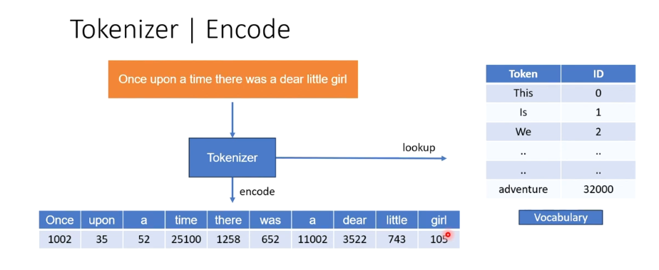
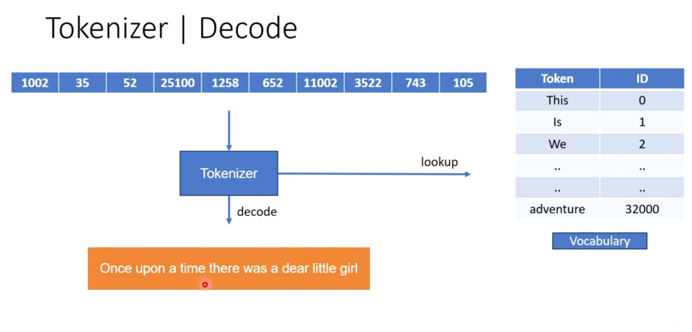
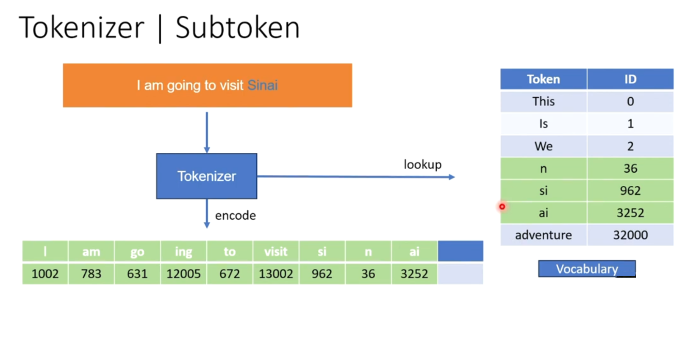

# 🔠 Tokenization in Generative AI: Full and Clear Guide

## 🧠 **What is Tokenization?**

> **Tokenization** = Converting raw human text into smaller pieces called **tokens** that a model can understand and process.

---

    

---

📌 In simple words:

- **Text ➔ Tokens ➔ Model processes tokens.**
- AI models don't "read" like humans — they read **tokens**!

---

## 📦 Two Main Types of Tokenization

| Type             | Description                                        | Example                                 |
| :--------------- | :------------------------------------------------- | :-------------------------------------- |
| 📝 Word-Based    | Split text into full words.                        | `"Hello world"` ➔ `["Hello", "world"]`  |
| 🔤 Subword-Based | Split inside words if necessary (smart splitting). | `"unhappiness"` ➔ `["un", "happiness"]` |

---

## 🛠️ **How Tokenization Actually Works**

### **1️⃣ Encoding (Text ➔ Tokens)**

- When you **input text**, the tokenizer **splits** it according to its vocabulary rules.
- Every **token gets assigned a unique integer ID**.

---

    

---

Example:

| Text          | Tokens             | IDs           |
| :------------ | :----------------- | :------------ |
| "Hello world" | ["Hello", "world"] | [15496, 2159] |

✅ Models **don't see text**, only the list of token IDs!

---

### **2️⃣ Decoding (Tokens ➔ Text)**

- When the model **outputs predictions**, it produces **IDs**.
- The tokenizer **decodes** these IDs back into readable human text.

---

    

---

Example:

| IDs           | Tokens             | Text          |
| :------------ | :----------------- | :------------ |
| [15496, 2159] | ["Hello", "world"] | "Hello world" |

✅ Decoding = **reconstructing the original (or very close) sentence.**

---

## **🔍 How/When Subword Tokenization Works**

- If a word **isn't fully in the vocabulary**, the tokenizer **splits it into smaller parts (subwords)**.
- These subwords are then tokenized separately.

---

    

---

Example:

| Word            | Subword Tokens        |
| :-------------- | :-------------------- |
| "unhappiness"   | ["un", "happiness"]   |
| "autogenerated" | ["auto", "generated"] |

### 🚨 **When Subword Tokenization Happens?**

| Scenario                      | What Happens                                      |
| :---------------------------- | :------------------------------------------------ |
| Word **exists** in vocabulary | Directly map to one token.                        |
| Word **not found** as whole   | Break into subwords to find parts.                |
| Completely unknown parts      | Use fallback subwords or unknown token (`<unk>`). |

✅ This is **super important** for **handling typos**, **rare words**, **technical terms**, and **different languages**!

---

## 🎯 **Practical Tip**

> You can **experiment with tokenization** and **see subtokens** live at:  
> [👉 OpenAI Tokenizer Tool](https://platform.openai.com/tokenizer)

✅ Try writing weird or long words — you'll notice when the model breaks them into subwords!

---

## 🧠 **Quick Summary**

| Concept              | What It Means                        |
| :------------------- | :----------------------------------- |
| Tokenization         | Break text into units (tokens).      |
| Encoding             | Text ➔ Token IDs.                    |
| Decoding             | Token IDs ➔ Text.                    |
| Subword Tokenization | Splitting rare/unseen words smartly. |

---

📌 **Smart Memory Tip**:

> "**Tokenization = Splitting and Rebuilding Language for AI.**" 🛠️  
> "**Subword Tokenization = AI’s backup plan when words get complicated!**" 🔥
