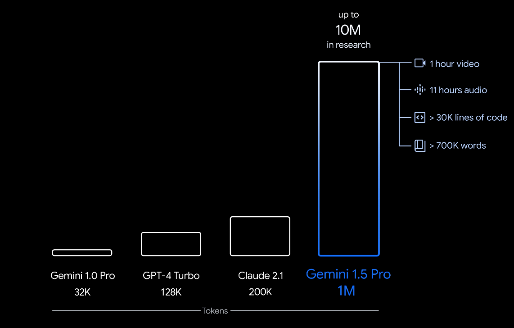

# 🧠 Context Window in Generative AI: Full, Clear Guide

## 📚 What is a Context Window?

> **Context Window** = The **maximum amount of information** (tokens) a Generative AI model can "remember" and "work with" at once during a conversation or task.

---

<div style="text-align: center;">
    
</div>

---

✅ Simply:

- It’s like the **short-term memory** of the AI model.
- Once the limit is reached, the **oldest information** is **forgotten** to make room for **new** input!

---

## 🔢 How It Works

- Every word, punctuation mark, and part of words are **tokenized** into **tokens**.
- The model **processes** and **predicts** based only on the current active tokens — **inside** its context window.

| Step         | What Happens                                 |
| ------------ | -------------------------------------------- |
| Input Text   | Split into tokens.                           |
| Context Size | If tokens fit the window, model uses all.    |
| Overflow     | If too many tokens, oldest ones are dropped. |

---

## 🎯 Real-World Example

Imagine a model has a **context window** of **8,000 tokens**:

- ✅ You send a prompt with 7,900 tokens ➔ All good, model understands everything.
- ⚠️ You send a prompt with 8,100 tokens ➔ The **first 100 tokens are discarded** (forgotten) — only the most recent 8,000 tokens are kept.

---

## 🧩 Why Context Window Matters?

| Reason           | Explanation                                                                                |
| ---------------- | ------------------------------------------------------------------------------------------ |
| Memory Limit     | Model **cannot remember** everything forever.                                              |
| Response Quality | If important information is **too far back**, the model may **lose track** of it.          |
| Summarization    | Long chats often need the model to **summarize** previous messages to keep memory compact. |
| Pricing          | Using a bigger context window **costs more** in tokens and computation time.               |

---

## 📏 Typical Context Window Sizes

| Model              | Context Window Size          |
| :----------------- | :--------------------------- |
| GPT-3              | ~2,048 tokens                |
| GPT-3.5-turbo      | ~4,096 tokens                |
| GPT-4 (Standard)   | ~8,000 tokens                |
| GPT-4o (Optimized) | up to **128,000 tokens**! 🚀 |

✅ **Newer models** like GPT-4o, Claude 3, Gemini 1.5, and others support **huge context windows** now.

---

## ⚡ Simple Visual

```ini
User Text ➔ [ Token 1 | Token 2 | Token 3 | ... | Token N ]

If (N < Context Window Size) ➔ All fit!

If (N > Context Window Size) ➔ Oldest tokens are dropped.
```

---

## 🧠 Smart Memory Tip

> "**Context Window = Model’s working memory space.**" 🧠🗂️  
> "**Big Window = Model can think longer and remember more!**" 🔥

---

## ✍️ Quick Summary Table

| Concept        | Meaning                                       |
| -------------- | --------------------------------------------- |
| Context Window | Max tokens model can use at once              |
| Overflow       | Old tokens are discarded                      |
| Bigger Window  | More memory, better for long tasks            |
| Important For  | Long chats, summarization, memory-based tasks |
