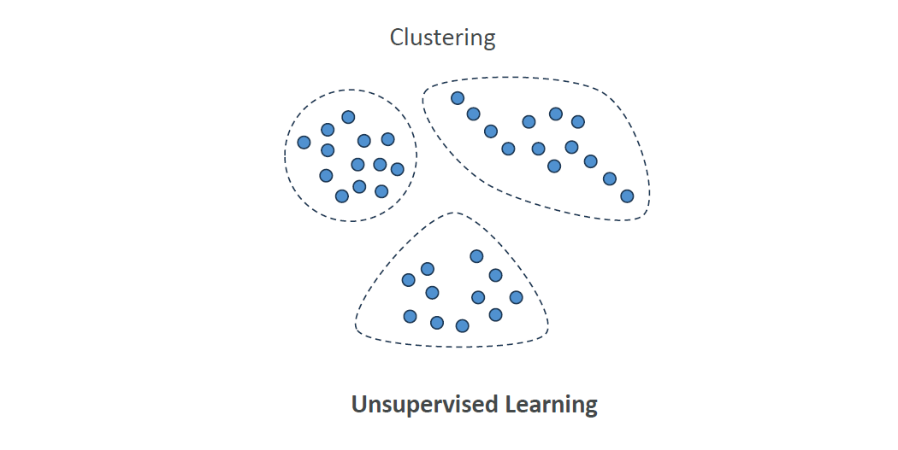
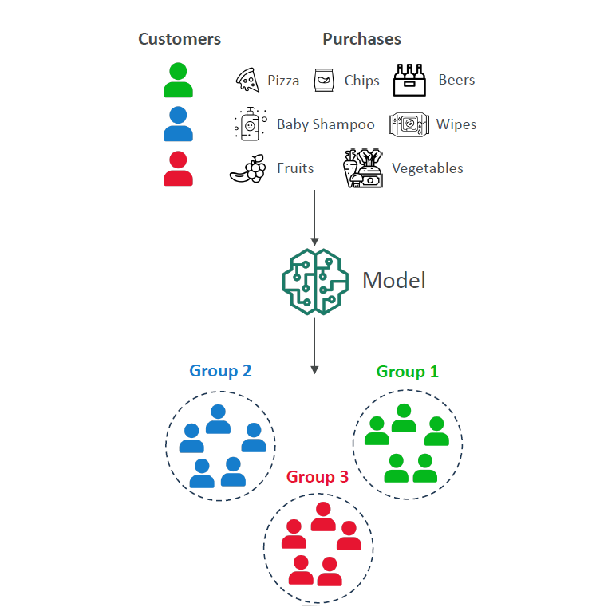
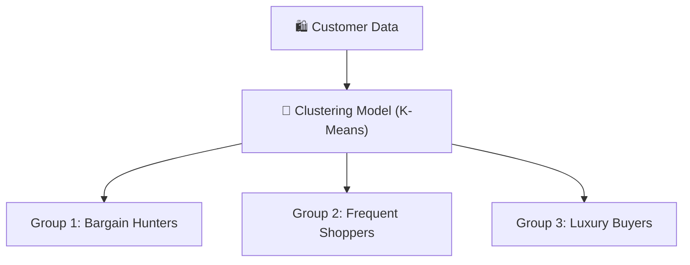
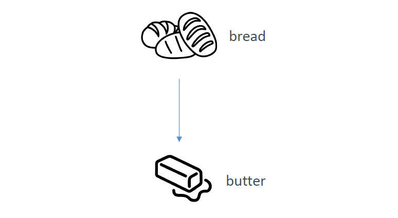
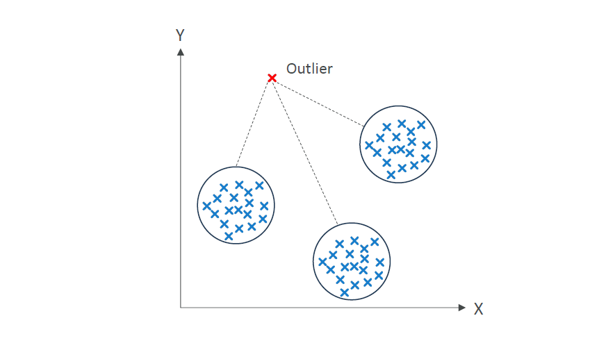

# 📚 ML Algorithms – Unsupervised Learning

## 🧠 What is Unsupervised Learning?

> **Official Definition**:  
> **Unsupervised Learning** is a type of Machine Learning where the model **analyzes input data without labeled outputs** and tries to **discover patterns, structures, or relationships** hidden inside the data.

---

    

---

📌 **In simpler words**:  
Unsupervised learning is like **exploring a new jungle 🐒🌳 without a map** —  
The machine **groups or finds insights** from the data **without being told what's what**.

📌 **Key Characteristics**:

- No output labels during training ❌.
- Model **groups, detects, or summarizes** the data.
- Humans may later **analyze and label the discovered groups**.

---

## 🌟 Why Do We Need Unsupervised Learning?

📌 **Because**:

- In real life, most data is **unlabeled** 📦.
- It's **expensive and time-consuming** to label everything manually 🕰️💰.
- Machines can **spot hidden patterns** we might miss! 🔍

📌 **Common Goals**:

- Discover customer segments.
- Find unusual behaviors (like fraud).
- Recommend products or content.

---

## 🏛️ Major Techniques in Unsupervised Learning

| Technique                    | Purpose                           |
| :--------------------------- | :-------------------------------- |
| 🧩 Clustering                | Group similar data points         |
| 🔗 Association Rule Learning | Find relationships between items  |
| 🚨 Anomaly Detection         | Spot unusual patterns or outliers |

---

## 🧩 Clustering Technique

> **Definition**:  
> **Clustering** is the process of **grouping similar data points** together based on their features.

---

    

---

---

📌 **Real-World Use Cases**:

- **Customer Segmentation** → Group customers based on purchasing behavior 🛒.
- **Targeted Marketing** → Different ads for different groups 📣.
- **Recommender Systems** → Suggest similar movies/products 🎬🛍️.

📌 **Example Scenario**:

- 🛍️ **Company**: E-commerce store.
- 📊 **Data**: Customer purchase frequency, average order value.
- 🎯 **Goal**: Group customers by buying patterns.
- 🛠️ **Technique**: K-Means Clustering.
- ✅ **Outcome**: Tailored marketing for each group → Higher sales 🚀.

## 🔗 Association Rule Learning Technique

> **Definition**:  
> **Association Rule Learning** finds **relationships or correlations** between different items in a dataset.

---

    

---

📌 **Real-World Use Cases**:

- **Market Basket Analysis** 🛒 → Find which products are often bought together.
- **Recommendation Engines** → "Customers who bought X also bought Y."

📌 **Example Scenario**:

- 🛒 **Company**: Supermarket.
- 📊 **Data**: Transaction records.
- 🎯 **Goal**: Understand buying habits.
- 🛠️ **Technique**: Apriori Algorithm.
- ✅ **Outcome**:  
  Place bread 🥖 and butter 🧈 closer → Boost sales 🚀.

📌 **Simple Visualization**:

- Bread[🍞 Bread] --> Butter[🧈 Butter]
- Milk[🥛 Milk] --> Cereal[🥣 Cereal]

---

## 🚨 Anomaly Detection Technique

> **Definition**:  
> **Anomaly Detection** identifies **data points that are significantly different** from the norm (outliers).

---

    

---

📌 **Real-World Use Cases**:

- **Fraud Detection** 💳 → Find suspicious transactions.
- **Network Security** 🛡️ → Detect intrusions.
- **Manufacturing** 🏭 → Identify faulty products.

📌 **Example Scenario**:

- 💳 **Company**: Credit card provider.
- 📊 **Data**: Transaction amount, time, location.
- 🎯 **Goal**: Spot fraudulent activities.
- 🛠️ **Technique**: Isolation Forest.
- ✅ **Outcome**:  
  Flag abnormal transactions → Investigate → Save \$\$\$ 💰.

## 🛠️ Feature Engineering in Unsupervised Learning

📌 Even in Unsupervised Learning, **Feature Engineering** is **super important** to improve results!

📌 **Examples**:

| Data Type           | Feature Engineering                                             |
| :------------------ | :-------------------------------------------------------------- |
| Structured (Tables) | - Normalize values - Create ratios like "purchase frequency" |
| Text                | - Extract keywords using TF-IDF 📚                              |
| Images              | - Extract patterns like edges using CNNs 🖼️                     |

📌 **Why?**  
Better features → Better groupings and insights 🔥.

---

## ✍️ Mini Smart Recap

📌 **🔍 Unsupervised Learning** = No labels → Find hidden patterns .  
📌 **🏘️ Clustering** = Group similar things .  
📌 **🛒 Association Rule Learning** = Find items often together .  
📌 **🚨 Anomaly Detection** = Catch the weird stuff .  
📌 **🎯 Feature Engineering** = Boost pattern-finding power .
