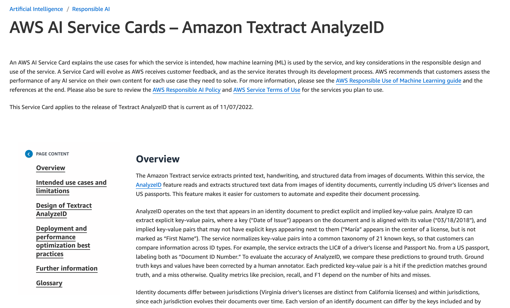
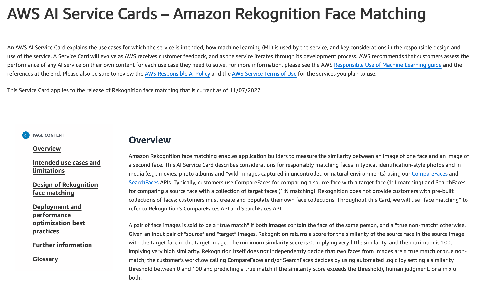
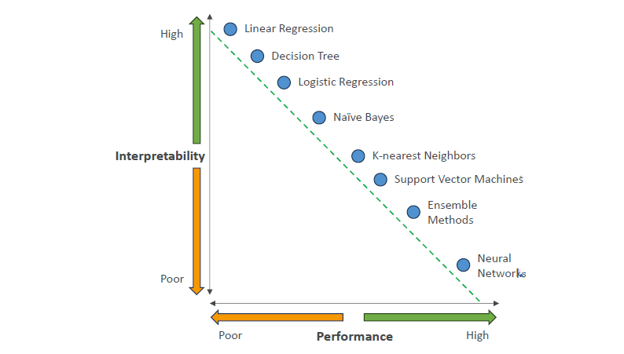
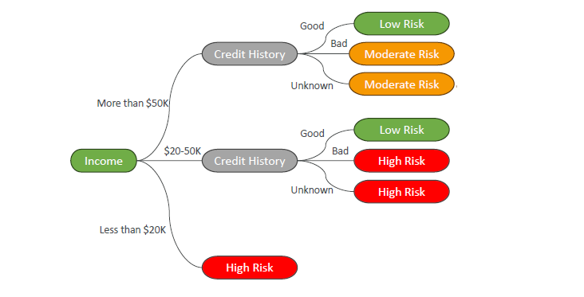
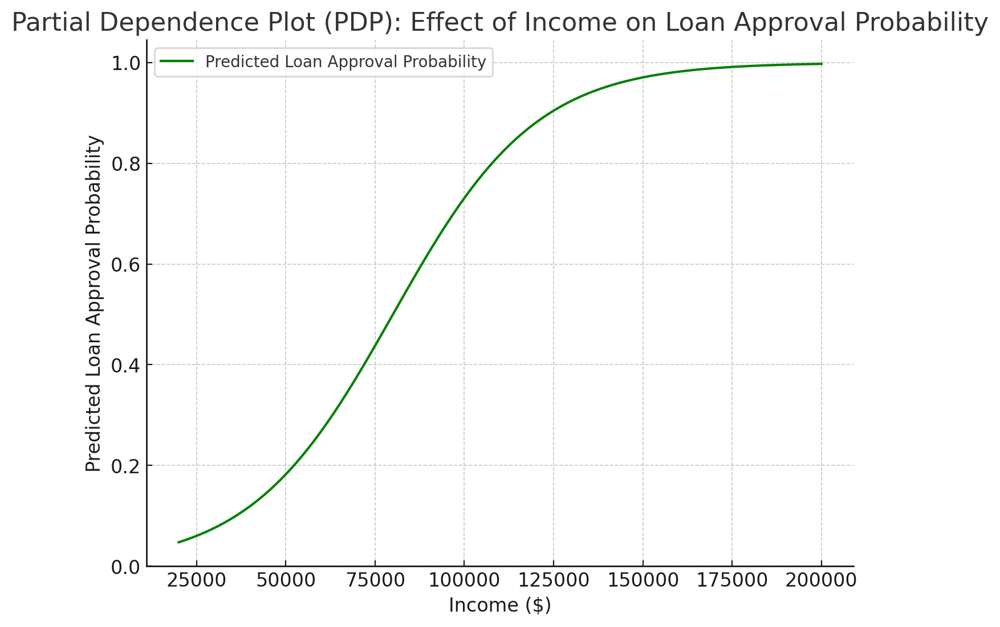

# 🛡️ Responsible AI: Full, Detailed, and Smart Guide

## 🧠 What is Responsible AI?

> **Responsible AI** means designing, building, and using AI systems that are **safe**, **fair**, **transparent**, and **aligned with human values**.

📌 **Simply**:

- AI should **help**, **not harm**.
- It should be **fair**, **explainable**, **safe**, and **trustworthy**.

---

## 🌟 Core Dimensions of Responsible AI

Let's break down the **pillars** you must **always** keep in mind:

| Dimension                | What it Means                                                            |
| :----------------------- | :----------------------------------------------------------------------- |
| 🎯 Fairness              | No bias, no discrimination. Everyone treated equally.                    |
| 🔍 Explainability        | Humans can understand _why_ and _how_ decisions are made.                |
| 🔒 Privacy & Security    | Users control their data. Protect data during use and storage.           |
| 🪟 Transparency           | Clear information about how AI works, what it does, and its limitations. |
| 🛡️ Veracity & Robustness | AI must stay reliable even when facing unexpected data.                  |
| 🏛️ Governance            | Set up rules and oversight to ensure AI behaves responsibly.             |
| 🛑 Safety                | AI should be beneficial, not cause harm.                                 |
| 🎮 Controllability       | Humans should always stay in control — AI should align with human goals. |

📌 **Smart Memory Tip**:

> "**Fair, Explain, Protect, Show, Stay Strong, Rule, Protect People, Stay in Control.**" 🧠✅

---

## 🛠️ AWS Services for Responsible AI

AWS provides powerful tools to help you **build and manage Responsible AI systems**:

| Service                                              | Role in Responsible AI                                                                    |
| :--------------------------------------------------- | :---------------------------------------------------------------------------------------- |
| Amazon Bedrock + Guardrails                          | Human/auto model evaluation, filter harmful content, redact PII, block undesirable topics |
| SageMaker Clarify                                    | Detect biases, explain predictions, measure robustness, evaluate toxicity                 |
| SageMaker Data Wrangler                              | Fix biases in datasets by augmenting underrepresented data                                |
| SageMaker Model Monitor                              | Watch models during production for quality and fairness issues                            |
| Amazon Augmented AI (A2I)                            | Add human review for critical predictions (human-in-the-loop)                             |
| SageMaker Role Manager, Model Cards, Model Dashboard | Document models, assign roles, manage governance centrally                                |

📌 **Simple Rule**:

> "**AWS helps you build not just powerful, but responsible AI.**" 🛡️

---

## 📋 AWS AI Service Cards

> **AI Service Cards** = **Mini documents** that explain:
>
> - Intended use cases.
> - Known limitations.
> - Responsible AI design decisions.
> - Best practices for deployment and optimization.

---

  

  

---

📌 **Purpose**:  
Make sure users **understand** what each AI service can and **can't** do.

## 🔎 Interpretability vs Explainability

| Term             | Meaning                                                                                  |
| :--------------- | :--------------------------------------------------------------------------------------- |
| Interpretability | Deep understanding: see exactly _how_ the AI made its decision (e.g., tracing all logic) |
| Explainability   | General understanding: explain outputs _without fully seeing inside_ the model           |

📌 **Trade-Off**:

|       | High Interpretability | High Performance                |
| :---- | :-------------------- | :------------------------------ |
| Model | Easy to understand    | Complex, powerful but black-box |

---

---

📌 **Simple Rule**:

> `High transparency` => `High interpretability` => `Poor performance`  
> "**You may lose some performance for better human understanding.**" ⚖️

---

## 🌳 High Interpretability Example: Decision Trees

> Decision Trees = Supervised Learning Algorithm used for Classification and Regression tasks

  

---

📌 **How Decision Trees Work**:

- **Split data into branches** based on questions like:
  > "Is income > \$50,000?"  
  > "Is credit history good?"
- **Each branch leads to a prediction** (e.g., Low Risk, High Risk).
- **Easy to read**, like a flowchart! 📈

📌 **Drawback**:

- Too many branches → Overfitting (memorizing instead of generalizing).

📌 **Use Case**:  
Good for when **explainability** is critical (e.g., credit approvals).

---

## 📈 Partial Dependence Plots (PDP)

    

---

📌 **What PDPs Show**:

- How **one feature** (e.g., income) affects the model’s prediction,
- **While holding other features constant**.

📌 **Use Case**:

- Helpful for explaining **black-box models** like Neural Networks.

📌 **Simple Rule**:

> "**PDP = Feature Influence Detective.**" 🕵️‍♂️

---

## 🧍‍♂️ Human-Centered Design (HCD) for Explainable AI

> **Human-Centered Design** = Approach to design AI systems with priorities for humans’ needs.

📌 **Key Principles**:

| Principle                | What It Means                                               |
| :----------------------- | :---------------------------------------------------------- |
| Amplify Decisions        | Help humans make better choices, not replace them.          |
| Reduce Risk              | Make AI usable even under pressure or stress.               |
| Simplicity & Usability   | AI must be clear and easy to interact with.                 |
| Reflexivity              | Help humans think about how/why they decide.                |
| Unbiased Design          | Train users and AI together to avoid bias.                  |
| Cognitive Apprenticeship | AI learns from humans and vice versa (teaching each other). |
| Personalization          | Adapt AI behavior to different human users and preferences. |

📌 **Simple Rule**:

> "**Design AI with humans at the center, not as an afterthought.**" ❤️🧠

---

## ✍️ Full Smart Recap

| Area                     | Quick Point                                                                                      |
| :----------------------- | :----------------------------------------------------------------------------------------------- |
| 🧠 Core Dimensions       | Fairness, Explainability, Privacy, Transparency, Robustness, Governance, Safety, Controllability |
| 🛠️ AWS Tools             | Bedrock Guardrails, Clarify, Data Wrangler, Model Monitor, A2I                                   |
| 📜 Service Cards         | Clarify responsible design and use cases                                                         |
| 🔎 Interpretability      | Deep inside (hard)                                                                               |
| 🔍 Explainability        | Surface understanding (easier)                                                                   |
| 🌳 Decision Trees        | Easy interpretability example                                                                    |
| 📈 PDP                   | Explain black-box models                                                                         |
| 🧍‍♂️ Human-Centered Design | Design AI for human benefit first                                                                |
