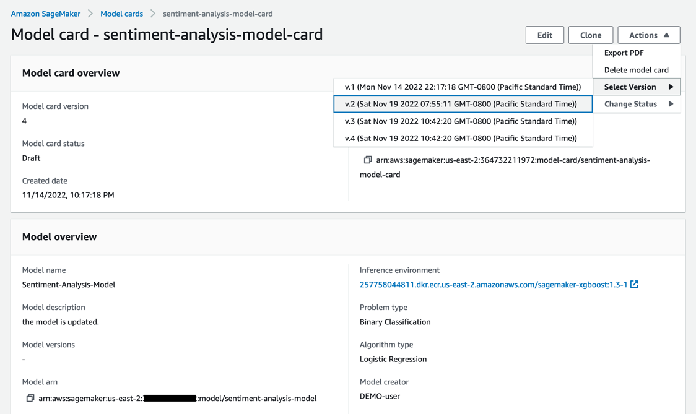

# 🛡️ AI Compliance: Full Guide to Doing AI the Right Way (Legally & Ethically)

## 🧠 What is AI Compliance?

> **AI Compliance** ensures that AI systems follow all relevant **laws**, **regulations**, **ethical principles**, and **industry standards** — protecting users, organizations, and society.

📌 **Simply**:

- **Follow the rules.**
- **Prove you followed them.**

---

## ⚖️ Why AI Compliance Matters

| Goal                    | Why It’s Important                                  |
| :---------------------- | :-------------------------------------------------- |
| 🧑‍⚖️ Legal Alignment   | Stay within national and international laws         |
| 🛡️ Risk Mitigation      | Avoid data breaches, bias, harm, or legal penalties |
| 🧠 Trust & Transparency | Help users trust your AI system                     |
| 🧾 Auditability         | Ensure you can prove what your AI does and why      |

---

## 🏛️ Regulated Workloads

> A **regulated workload** is any AI use case that falls under **strict legal or industry requirements**.

| Industry                       | Common Regulations & Risks                                 |
| :----------------------------- | :--------------------------------------------------------- |
| 💰 Financial Services          | Credit scoring, loan approvals (Fair Lending laws, audits) |
| 🏥 Healthcare                  | Diagnoses, patient data (HIPAA, EU MDR)                    |
| ✈️ Aerospace / Safety-Critical | Predictive maintenance, autonomous systems                 |

📌 **Key Signs You Have a Regulated Workload**:

- Must **report to a government agency** ✅
- Your decisions have **legal consequences** ✅
- Your industry has **compliance certifications** ✅

---

## ⚠️ Common AI Compliance Challenges

| Challenge                | Real-World Meaning                                     |
| :----------------------- | :----------------------------------------------------- |
| 🔍 Complexity & Opacity  | Black-box models make it hard to explain decisions     |
| 🔄 Dynamism              | AI changes as data changes (hard to freeze a snapshot) |
| ⚙️ Emergent Capabilities | AI may do things it wasn’t explicitly trained for      |
| ⚠️ Unique Risks          | Privacy leaks, unfair decisions, misinformation        |

📌 **Types of Bias**:

| Bias Type        | Description                                                   |
| :--------------- | :------------------------------------------------------------ |
| Algorithmic Bias | Model trained on biased data continues the bias               |
| Human Bias       | Developer unknowingly bakes personal bias into data or design |

📌 **Smart Rule**:

> "**Compliance isn’t just code — it's also people and data.**" 🧑‍💻📊

---

## 📜 Legal Frameworks to Know

| Region            | Regulation                                                            |
| :---------------- | :-------------------------------------------------------------------- |
| 🇪🇺 European Union | **AI Act** – strict rules on high-risk AI use cases                   |
| 🇺🇸 United States  | **State-by-state AI regulation** (NYC, CA, etc.)                      |
| 🌍 Global         | Trend toward **fairness, accountability, and human rights** in AI law |

📌 **Best Practices**:

- **Bias mitigation**
- **Explainability**
- **User control over data**

---

## 🛠️ AWS Compliance Capabilities

AWS helps you build **compliant AI** with **certified infrastructure**:

| Certification | Purpose                           |
| :------------ | :-------------------------------- |
| ✅ NIST       | U.S. cybersecurity & AI guidance  |
| ✅ ENISA      | EU cybersecurity agency           |
| ✅ ISO        | Global security standards         |
| ✅ SOC        | System & organization controls    |
| ✅ HIPAA      | U.S. patient health data law      |
| ✅ GDPR       | European privacy law              |
| ✅ PCI DSS    | Protects credit card transactions |

✅ AWS = **Over 140 compliance certifications** 😎

📌 **Simple Rule**:

> "**You bring the model. AWS brings the legal armor.**" 🛡️

---

## 📋 Model Cards: Document Everything

    

---

📌 **What are Model Cards?**

> Structured, transparent documents that describe:

| Section              | What It Includes                          |
| :------------------- | :---------------------------------------- |
| 📘 Purpose           | What is the model for? Who should use it? |
| 📊 Datasets          | What data was used? What are the risks?   |
| 🧪 Evaluation        | Accuracy, fairness, robustness tests      |
| ⚠️ Known Limitations | Biases, edge cases, or data gaps          |
| 📜 Legal Tags        | Licenses, consent, and use restrictions   |

📌 **Where They Help**:

- Model transparency 🪟
- Audit readiness ✅
- Regulatory review 📋

📌 **SageMaker Model Cards**:

- Built-in support to generate and manage them.
- Perfect for internal governance and external audits.

---

## 🧠 Bonus: AWS AI Service Cards

> Prebuilt, public documentation for AWS’s own AI services.

| What You Learn   | Why It’s Useful                         |
| :--------------- | :-------------------------------------- |
| Features         | What the service does (and doesn’t do)  |
| Limitations      | Where it may fail or be biased          |
| Design Decisions | How AWS ensured fairness, privacy, etc. |
| Deployment Tips  | Best practices for compliant usage      |

✅ Helps you **understand AWS AI responsibly** and stay **compliant out of the box**.

---

## ✍️ Smart Recap

| Category               | Key Points                                                |
| :--------------------- | :-------------------------------------------------------- |
| 🧠 What                | AI Compliance = legally responsible AI                    |
| ⚖️ Regulated Workloads | Common in finance, healthcare, aerospace                  |
| 🚨 Challenges          | Bias, opacity, fast model changes, unknown risks          |
| 📜 Legal Rules         | EU AI Act, US state regulations, global ethical standards |
| 🛠️ AWS Tools           | NIST, ISO, HIPAA, GDPR, SOC, PCI-DSS                      |
| 📘 Model Cards         | Document everything for trust & auditability              |

📌 **Final Smart Rule**:

> "**If your AI impacts lives or money, document it, explain it, and prove it's safe.**" ✅
