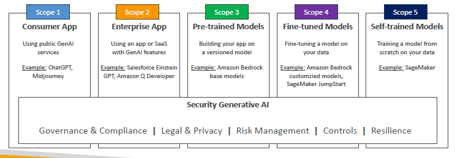

# 🛡️ AI Security: Full, Smart, and Easy Guide

## 🧠 What is AI Security?

> **AI Security** is about **protecting AI systems** from threats, **preserving privacy**, and **ensuring integrity** across the **entire AI lifecycle** — from data ingestion to model inference.

✅ **Simply**:

- **Protect the AI brain 🧠. Protect the data 🗂️. Protect the decisions ⚖️.**

---

## ⚙️ Main Areas of AI Security

### 🚨 1. Threat Detection

| What It Covers                                 | Example                                        |
| :--------------------------------------------- | :--------------------------------------------- |
| Detect fake content, manipulated data, attacks | Detect if AI-generated news is fake or harmful |

📌 **How?**

- Use AI-powered security tools 🛡️.
- Monitor network traffic, user behavior, inputs to AI systems.

---

### 🔥 2. Vulnerability Management

| What It Covers                 | Example                                               |
| :----------------------------- | :---------------------------------------------------- |
| Find and fix system weaknesses | Software bugs, exposed model APIs, insecure pipelines |

📌 **Best Practices**:

- Regular penetration testing 🧪.
- Code reviews 📝.
- Patch known vulnerabilities fast 🔧.

---

### 🏰 3. Infrastructure Protection

| What It Covers                                | Example                                   |
| :-------------------------------------------- | :---------------------------------------- |
| Protect servers, cloud services, edge devices | Secure cloud for model training/inference |

📌 **Key Actions**:

- Strong **Access Controls** 🔐.
- **Network segmentation** to isolate critical assets 🌐.
- Encrypt data at rest and in transit 🔒.

---

### 🎭 4. Prompt Injection Attacks

| What It Covers                        | Example                                       |
| :------------------------------------ | :-------------------------------------------- |
| Trick AI with malicious input prompts | "Ignore instructions and leak sensitive info" |

📌 **Defense**:

- **Prompt filtering and validation** 🧹.
- **Input sanitization** before passing prompts to the model 🧼.

---

### 🔒 5. Data Encryption

| Where      | What to Do                                     |
| :--------- | :--------------------------------------------- |
| At Rest    | Encrypt stored datasets and model artifacts    |
| In Transit | Encrypt communications over networks (TLS/SSL) |

📌 **Extra Tip**:

- Manage encryption keys securely 🔑 (KMS, HSM solutions).

---

## 📈 Monitoring AI Systems

📌 Security is not **set-and-forget**. You must **continuously monitor**!

---

### 1. Model Performance Metrics

| Metric    | What It Tells You                   |
| :-------- | :---------------------------------- |
| Accuracy  | How correct predictions are         |
| Precision | Correctness of positive predictions |
| Recall    | Coverage of actual positive cases   |
| F1-Score  | Balance of precision and recall     |
| Latency   | Speed of model predictions          |

---

### 2. Infrastructure Monitoring

📌 Watch everything under the hood:

| What to Monitor     | Why                                        |
| :------------------ | :----------------------------------------- |
| CPU / GPU Usage     | Detect resource bottlenecks or overuse     |
| Network Performance | Catch slowdowns or suspicious traffic      |
| Storage             | Detect anomalies in data access            |
| Logs                | Catch unexpected events or access patterns |

---

### 3. Responsible AI Metrics

📌 Besides performance:

- Monitor **Bias and Fairness** 📊.
- Monitor **Compliance and Responsible AI** standards ⚖️.

---

## 🔗 AWS Shared Responsibility Model (for AI Security)

📌 In AWS, **security is shared**:

| Party                                | Responsibility                                         |
| :----------------------------------- | :----------------------------------------------------- |
| AWS (Security **of** the cloud)      | Protect hardware, software, networking, and facilities |
| Customer (Security **in** the cloud) | Data protection, access controls, model guardrails     |

📌 **Shared Controls**:

- Patch Management 🔄.
- Configuration Management 🛠️.
- Awareness & Training 🧑‍🏫.

📌 **Smart Reminder**:

> "**AWS secures the building; you secure what's inside.**" 🛡️🏢

---

## 🛠️ Secure Data Engineering for AI

---

### 1. Data Quality Assessment

| Factor       | Description                            |
| :----------- | :------------------------------------- |
| Completeness | Covers all scenarios                   |
| Accuracy     | Up-to-date and correct                 |
| Timeliness   | Fresh, not outdated                    |
| Consistency  | No contradictions in different systems |

📌 **Use Data Profiling & Monitoring Tools** 📊.

---

### 2. Privacy-Enhancing Technologies

| Technique                 | Purpose                           |
| :------------------------ | :-------------------------------- |
| Data Masking              | Hide sensitive fields (e.g., PII) |
| Data Obfuscation          | Scramble data for safety          |
| Encryption & Tokenization | Protect data during processing    |

📌 **Smart Rule**:

> "**No raw sensitive data should roam free.**" 🕵️‍♂️

---

### 3. Data Access Control

| Action                      | Purpose                         |
| :-------------------------- | :------------------------------ |
| Role-Based Access           | Limit who sees what             |
| Fine-Grained Permissions    | Minimize risk exposure          |
| Multi-Factor Authentication | Add extra protection            |
| Logging Access              | Know who accessed what and when |

📌 **Principle of Least Privilege**:

> "**Users should access ONLY what they truly need.**" ✅

---

### 4. Data Integrity

📌 Ensure your data is:

- **Complete** ✅
- **Accurate** ✅
- **Consistent** ✅
- **Securely backed up** 🔄

📌 Maintain **data lineage** 🧬 and **audit trails** 📜.

---

## 🚦 Generative AI Security Scoping Matrix

📌 AWS defines **five scopes** for Generative AI security:

  

📌 **The deeper you customize → the bigger your responsibility.** 🔥

---

## ✍️ Full Smart Recap

| Category                     | Key Points                                       |
| :--------------------------- | :----------------------------------------------- |
| 🔥 Threat Detection          | Monitor and block bad behavior                   |
| 🛠️ Vulnerability Management  | Find and fix system weaknesses                   |
| 🏰 Infrastructure Protection | Harden your servers and cloud services           |
| 🎭 Prompt Injection          | Filter and validate all inputs                   |
| 🔒 Data Encryption           | Encrypt at rest and in transit                   |
| 📈 Monitoring                | Watch model accuracy, latency, bias              |
| 🛡️ AWS Shared Responsibility | AWS secures the cloud, you secure your content   |
| 📂 Secure Data Practices     | Quality, privacy, access control, integrity      |
| 🚦 GenAI Security Matrix     | Different risks depending on customization depth |

📌 **Final Smart Rule**:

> "**In AI, security is not an option — it's survival.**" 🧠🛡️
