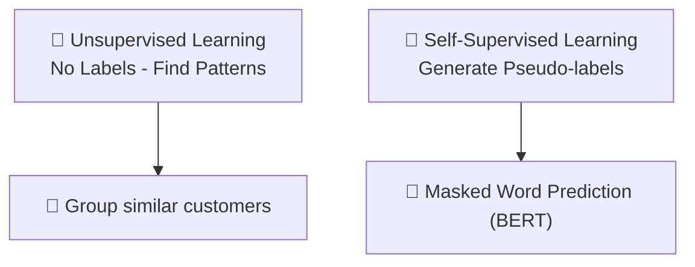

# 🧠 Difference Between Unsupervised Learning and Self-Supervised Learning

## 🧩 1. Unsupervised Learning

> **Official Definition**:  
> In **Unsupervised Learning**, the model is trained using **completely unlabeled data** to **find patterns, structures, or groupings** without any labels —  
> and **no labels are ever generated automatically** inside the model.

---

📌 **Simple way to understand**:

- Model **analyzes** the data.
- Model **discovers hidden structures** like **groups** (clusters) or **associations**.
- **No fake tasks** are created.

📌 **Real-world Example**:

- Grouping customers based on shopping behavior (clustering 🛍️).
- Discovering associations between bought products (market basket analysis 🛒).

📌 **Goal**:

> "Find groups or patterns in data where we don't know what the correct answer is."

---

## 🛠️ 2. Self-Supervised Learning

> **Official Definition**:  
> In **Self-Supervised Learning**, the model **creates its own pseudo-labels** internally from unlabeled data,  
> solves **artificial (pretext) tasks** based on them,  
> and **learns useful features** that can be transferred later to real tasks.

📌 **Simple way to understand**:

- Model **builds clever puzzles** out of the data (like hiding words or masking image parts).
- Model **learns by solving these puzzles**.
- After pretraining, the model **can be fine-tuned** for real downstream tasks (classification, etc.).

📌 **Real-world Example**:

- Masking words in a text (like BERT) and training the model to guess missing words 🧩📚.
- Masking part of an image and training the model to predict missing parts 🖼️.

📌 **Goal**:

> "Create fake tasks to learn good data representations without human labels."

---

## 🎯 Core Differences (Quick Summary)

| Aspect            | Unsupervised Learning                            | Self-Supervised Learning                                          |
| :---------------- | :----------------------------------------------- | :---------------------------------------------------------------- |
| Labels            | No labels used or created ❌                     | Model generates its own pseudo-labels 🏷️                          |
| Task              | Find hidden patterns, clusters, associations 🔎  | Create pretext tasks, solve them to learn good representations 🧩 |
| Examples          | Clustering, Anomaly Detection, Association Rules | BERT, GPT, SimCLR (text and vision models)                        |
| Goal              | Understand hidden structure                      | Learn useful features for downstream tasks                        |
| Human Involvement | None during training                             | None during pre-training                                          |

---

## 🧠 Easy to Remember Tip

📌 **Unsupervised Learning** → "**I don't label anything. I just find groups or patterns.**" 🔍

📌 **Self-Supervised Learning** → "**I invent puzzles from my data, solve them, and get smarter.**" 🧩🧠

---

## 🎉 Quick Visual to Remember

---
