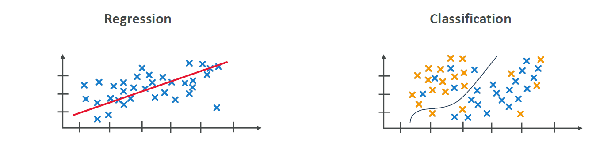
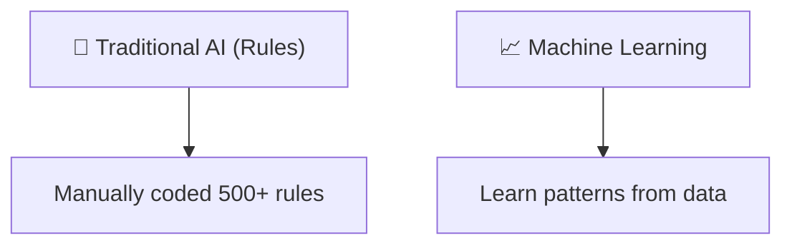

# 📚 What is Machine Learning (ML)? — Full Beginner Guide

## 🧠 What is Machine Learning (ML)?

> **Official Definition:**  
> **Machine Learning (ML)** is a **type of AI** that focuses on building **methods** that allow machines to **learn from data** instead of being **explicitly programmed** with rules.

✅ **Key Points**:

- Machines **learn patterns** from existing data.
- Machines **improve performance** on specific tasks **over time**.
- Machines can **make predictions** without being told every rule manually.

---

## 🛠️ Traditional Programming vs Machine Learning

| Traditional Programming                           | Machine Learning                                            |
| :------------------------------------------------ | :---------------------------------------------------------- |
| Humans write **explicit rules** 📜                | Machine **learns rules** from data 📈                       |
| Logic is **handcrafted**                          | Logic is **discovered automatically**                       |
| Example: "If email has the word FREE → spam" rule | Example: "Model learns 10+ patterns that usually mean spam" |

✅ **Easy Example**:

- Traditional: You manually code "If temperature > 30°C, turn AC ON."
- ML: You feed lots of weather + usage data, and the model **learns** when to turn AC ON by itself!

---

## 🔥 Why is ML Powerful?

✅ Instead of programming 500+ rules manually, you **just feed data** to a machine, and it figures out complex relationships **on its own**.

✅ It's like **hiring a genius intern** who reads your historical data 📚 and magically figures out the best decision logic ✨.

---

## 📈 Core ML Tasks

When you apply ML, there are two very common tasks:

### 1. 🔢 Regression

> **Goal:** Predict **continuous values** 📊

✅ Examples:

- Predicting house prices 🏠
- Forecasting temperatures 🌡️
- Estimating sales revenue 📈

✅ **Imagine**:  
You want to predict a house price based on its size.

- Inputs: Size (sq ft)
- Output: Price (\$)

✅ In short:  
**Regression** = Predict a **number**.

---

### 2. 🏷️ Classification

> **Goal:** Predict **categories** or **labels** 🏷️

✅ Examples:

- Is an email **spam** or **not spam**? 📧
- Is a tumor **malignant** or **benign**? 🧬
- Is the image a **dog** or a **cat**? 🐶🐱

✅ **Imagine**:  
You upload a photo and the AI tells you "It's a Cat!" — that's **classification**.

✅ In short:  
**Classification** = Predict a **class or label**.

---

  

---

## 🤔 Common Misunderstanding: AI ≠ ML

✅ **Important Note:**  
**ML is a part of AI, but not all AI is ML!**

✅ **Example of AI without ML**:

- In the 1970s, there was a system called **MYCIN Expert System**.

---

## 📜 Flashback: MYCIN Expert System (1970s)

> **What was it?**  
> A **medical diagnosis system** designed to help doctors diagnose **bacterial infections** based on symptoms and test results.

✅ **How it worked**:

- It had **500+ manually written rules** 📝.
- It asked the doctor simple **yes/no** or **textual** questions.
- After collecting answers, it:
  - Ranked possible bacteria 🦠 from most likely → least likely
  - Explained its reasoning 🧠
  - Suggested possible **treatments** 💊.

✅ **Important:**

- MYCIN **did NOT use Machine Learning**.
- It relied purely on **hand-coded rules**.
- **Why it failed?**
  - Personal computers were not widespread yet 💻🚫.
  - Too hard to deploy at the time.

✅ **Key Lesson**:  
AI can exist **without ML** (e.g., rule-based expert systems), but **ML made AI practical and scalable** later.

---

## 🎯 Visual: ML vs Traditional AI (like MYCIN)

---

✅ Summary:

- **Traditional AI** = "If this, then that" coding style 🧱
- **Machine Learning** = "Feed data, machine figures it out" 🔥

---

## 🧠 Smart Memory Tips

| Concept        | Quick Tip                                     |
| :------------- | :-------------------------------------------- |
| ML             | Machines learn from data, not manual rules 📚 |
| Regression     | Predict numbers 🔢                            |
| Classification | Predict categories 🏷️                         |
| MYCIN          | Old AI with manual rules 🧱                   |

---

## ✍️ **Mini-Recap!**

| Question                     | Quick Answer                    |
| :--------------------------- | :------------------------------ |
| What does ML aim to replace? | Manual rule programming         |
| What's Regression?           | Predicting continuous numbers   |
| What's Classification?       | Predicting labels or categories |
| Was MYCIN an ML system?      | No, it was rules-based          |

---

## 🔥 **What’s Next?**

👉 Up next (if you want):  
🔜 **"Types of Machine Learning: Supervised, Unsupervised, Reinforcement Learning"** —  
**a super important topic** that will open your eyes about **how machines actually learn**!

---

Would you like me to continue directly to this next smart topic? 🚀 (It will include cool diagrams and easy examples!)  
**Just say GO!** 🎯
