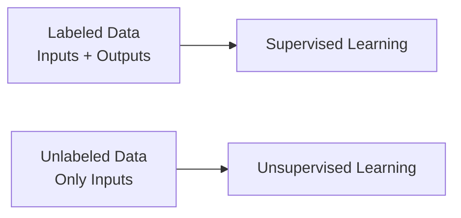
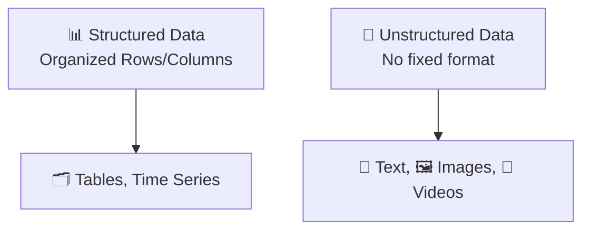

# 📚 Training Data — Foundation of Machine Learning Success

## 🧠 **What is Training Data?**

> **Official Definition:**  
> **Training Data** is the **collection of examples** that we feed into a machine learning model so that it can **learn patterns, relationships, and behaviors**.

✅ **Key Points**:

- **Garbage in → Garbage out** 🗑️: If your data is bad, your model will be bad, no matter how fancy your algorithms are!
- **Most critical stage** 🔥: A well-prepared dataset is **more important** than just building a complicated model.
- **Data modeling options** (how we organize the data) will **affect** what algorithms we can use.

✅ **Simple Thought**:  
You can’t teach a student to ace an exam with wrong or missing notes, right? 🧑‍🎓📚 Same with machines!

---

## 🛤️ **Two Major Ways to Organize Training Data**

| Option                         | What It Means                                                             |
| :----------------------------- | :------------------------------------------------------------------------ |
| 📛 Labeled vs. Unlabeled       | Does the data include answers (labels) or not?                            |
| 📊 Structured vs. Unstructured | Is the data neatly organized like a table or messy like free text/images? |

---

## 🏷️ **Labeled vs. Unlabeled Data**

---

### 🏷️ What is Labeled Data?

> **Labeled Data** contains both:
>
> - **Inputs** (features)
> - **Outputs** (correct answers / labels)

✅ **Example**:

| Image | Label |
| :---- | :---- |
| 🐶    | Dog   |
| 🐱    | Cat   |

✅ **Use Case**:

- Needed for **Supervised Learning** 🧑‍🏫
- Model learns: "When I see **this input**, I should predict **this output**."

✅ **Real Examples**:

- A dataset of emails marked "Spam" or "Not Spam" 📧.
- A medical dataset where each record is marked "Disease" or "Healthy" 🧬.

---

### ❔ What is Unlabeled Data?

> **Unlabeled Data** contains only:
>
> - **Inputs** (features)
> - ❌ No outputs provided.

✅ **Example**:

| Image | Label |
| :---- | :---- |
| 🐶    | ???   |
| 🐱    | ???   |

✅ **Use Case**:

- Needed for **Unsupervised Learning** 🧠
- Model tries to **find patterns, similarities, or groups** without knowing the correct answer.

✅ **Real Examples**:

- A pile of random news articles without topic tags 📰.
- A collection of customer photos without descriptions 🖼️.

---

### 🎯 Visual Summary: Labeled vs. Unlabeled

✅ **Quick Shortcut**:

- Labeled = Supervised
- Unlabeled = Unsupervised

---

## 🏛️ **Structured vs. Unstructured Data**

### 📊 What is Structured Data?

> **Structured Data** is **organized neatly** in a **fixed format** — usually **rows and columns** (like Excel sheets).

✅ **Types of Structured Data**:

- **Tabular Data** (tables 🗂️)
- **Time Series Data** (sequential over time 📈)

✅ **Examples**:

| Customer_ID | Name  | Age | Purchase_Amount |
| :---------- | :---- | :-- | :-------------- |
| 1           | Alice | 30  | \$200           |
| 2           | Bob   | 45  | \$300           |

| Date       | Stock Price |
| :--------- | :---------- |
| 01-07-2024 | \$197.20    |
| 02-07-2024 | \$200.00    |

✅ **Real Examples**:

- Bank transaction logs 🏦.
- Customer databases 🛍️.
- Stock price histories 📈.

---

### 🖼️ What is Unstructured Data?

> **Unstructured Data** has **no predefined format** — it’s messy, rich, and comes in many forms.

✅ **Types of Unstructured Data**:

- **Text** (articles, social media posts 📜)
- **Images** (photos, medical scans 🖼️)
- **Audio** (voice recordings 🎤)
- **Videos** (YouTube clips 🎥)

✅ **Examples**:

- Product reviews ✍️:
  > "Loved the yoga class! Instructor was amazing! 🚀"
- Cat images 🐱 (without any predefined labels).
- Recorded conversations 🎧.

✅ **Real Use Cases**:

- Sentiment analysis of customer reviews.
- Object recognition in images.
- Voice-to-text conversion for assistants.

---

### 🔥 Visual Summary: Structured vs. Unstructured Data

✅ **Quick Shortcut**:

- Structured = Tables 📊
- Unstructured = Free-form content 🎨

---

## ✍️ **Mini Recap!**

| Concept           | Quick Answer                          |
| :---------------- | :------------------------------------ |
| Labeled Data      | Inputs + Outputs, Supervised Learning |
| Unlabeled Data    | Inputs only, Unsupervised Learning    |
| Structured Data   | Organized into tables                 |
| Unstructured Data | Messy multimedia data                 |

---

## ⚡ **Quick Smart Tips to Memorize**

| If You See...                      | It Means...  |
| :--------------------------------- | :----------- |
| Rows and Columns                   | Structured   |
| Random Images, Articles, Audio     | Unstructured |
| Data with answers (dog, cat, spam) | Labeled      |
| Data without answers               | Unlabeled    |

---

## 🛣️ **What’s Next?**

👉 If you want, next we can dive deeper into:  
🔜 **"Data Preprocessing for ML: Cleaning, Feature Engineering, Normalization, and Splitting"** —  
which is **the secret sauce** behind getting top-performing models! 🍔✨

---

Would you like me to continue into that next super important and practical topic? 🚀  
**Just say GO!** 🎯  
(And I’ll make it super easy and smart again!)
